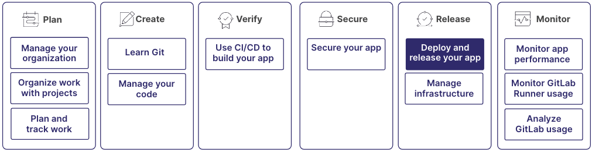

Start with previewing your application, and end with deploying
it to production in front of your users. Manage containers and packages, use
continuous integration to deliver your application, and use feature flags
and incremental rollouts to release the application in a controlled manner.

These processes are part of a larger workflow:

## Step 1: Store and access your project's artifacts

Use packages and registries to store and distribute your project's dependencies,
libraries, and other artifacts securely in GitLab.

The package registry supports various package formats, including Maven,
NPM, NuGet, PyPI, and Conan. It provides a centralized location to store
and distribute packages across your projects. Integrate the package registry
with GitLab CI/CD pipelines to automate package publishing and ensure smooth
development and deployment workflows.

The container registry serves as a private registry for Docker images.
Use it to store, manage, and distribute Docker and OCI images in your organization, or publicly.
Integrate the container registry with GitLab CI/CD to build, test, and deploy containerized
applications.

For more information, see:

- [Packages and registries](../packages/_index.md)

## Step 2: Deploy your application across environments

Use environments to manage and track your application's
deployments across different stages (for example, development, staging,
and production). Each environment can have its own unique configuration,
variables, and deployment settings.

After you set up your environments, you can monitor them. While you
primarily monitor your deployments in the location where you deployed them
(for example, in AWS), GitLab also provides dashboards.
You can monitor your live cluster state in the GitLab UI if you deploy to Kubernetes.

You can also create temporary environments as part of merge requests.
Team members can then review and test changes before committing changes to
the main branch. These temporary environments are called review apps.

For more information, see:

- [Environments](../../ci/environments/_index.md)
- [Deploy to AWS](../../ci/cloud_deployment/_index.md)
- [Deploy to Kubernetes](../clusters/agent/_index.md)
- [Dashboard for Kubernetes](../../ci/environments/kubernetes_dashboard.md)
- [Environments Dashboard](../../ci/environments/environments_dashboard.md)
- [Operations Dashboard](../operations_dashboard/_index.md)
- [Review apps](../../ci/review_apps/_index.md)

## Step 3: Stay compliant with continuous delivery features

To maintain the stability and integrity of your production systems by
preventing accidental or unauthorized deployments, use protected environments.
They provide a way to secure and control deployments to critical environments like production.
By defining protected environments, you can restrict access to specific users or roles,
ensuring that only those who are authorized can deploy changes.

Deployment safety is part of the continuous delivery pipeline and helps ensure the reliability
and security of your deployments. GitLab provides built-in safety mechanisms,
like automatic rollbacks in case of deployment failures, and the ability to define custom
health checks to verify the success of a deployment.

Deployment approvals add an extra layer of control and collaboration to your deployment process.
You can define approval rules that require designated approvers to review and approve deployments
before they can proceed. Approvals can be set up based on different criteria, like the environment,
the branch, or the specific changes being deployed.

For more information, see:

- [Protected environments](../../ci/environments/protected_environments.md)
- [Deployment safety](../../ci/environments/deployment_safety.md)
- [Deployment approvals](../../ci/environments/deployment_approvals.md)

## Step 4: Ship release artifacts to the public or internal users

Use releases to package and distribute your application to end users,
including release notes, binary assets, and other relevant information.
You can create a release from any branch.

Integrate releases with environments to automatically
create a release whenever you deploy to a specific environment (for example, production).
You can get notified each time a release occurs, and specify
permissions if you want to control who is allowed to create, update, and delete releases.

For more information, see:

- [Releases](../project/releases/_index.md)

## Step 5: Roll out changes safely

To gradually deploy your application to a subset of users or servers, use incremental rollouts.
You can monitor and assess the impact on a smaller scale before rolling out to the entire user base.

Feature flags in GitLab provide a way to enable or disable specific features in your application
without requiring a full deployment. You can use feature flags to safely test new features,
perform A/B testing, or gradually introduce changes to your users.

By using feature flags, you can decouple the deployment of code from the release of features,
giving you more control over the user experience and reducing the risk of introducing bugs
or unexpected behavior.

For more information, see:

- [Incremental rollouts](../../ci/environments/incremental_rollouts.md)
- [Feature flags](../../operations/feature_flags.md)

## Step 6: Deploy a static website

With GitLab Pages, you can showcase your project's documentation, demos, or marketing pages.
Create static websites directly from a repository in GitLab. GitLab Pages supports
static site generators like Jekyll, Hugo, and Middleman, as well as plain HTML,
CSS, and JavaScript. To get started, create a new project or use an existing one,
configure the GitLab Pages settings, and push your content to the repository.
GitLab automatically builds and deploys your website whenever you push changes to the designated branch.

For more information, see:

- [GitLab Pages](../project/pages/_index.md)

## Step 7: Go opinionated with Auto Deploy

Auto Deploy is an opinionated CI template that, among other things, takes care of building
and deploying your application. You can fine-tune the Auto DevOps pipeline with environment variables.

For more information, see:

- [Auto Deploy](../../topics/autodevops/stages.md#auto-deploy)
