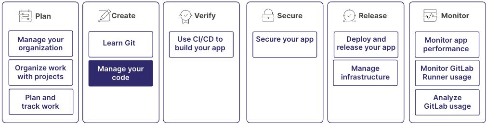

GitLab provides tools for the full software development lifecycle,
from code creation to delivery.

Learn more about creating and managing code in GitLab.
The process includes authoring your code, having it reviewed,
committing it with version control, and updating it over time.

This process is part of a larger workflow:

## Step 1: Create a repository

A project is a centralized location where you collaborate with others, track issues,
manage merge requests, and automate CI/CD pipelines, among many other things.

Each project contains a repository, where you can store your code, documentation,
and other files related to your software development work.
Changes made to files in the repository are tracked, so you can view a history.

While a repository focuses on version control for source code,
a project provides a comprehensive environment for the entire development lifecycle.

For details, see:

- [Create a repository](../project/repository/_index.md#create-a-repository)

## Step 2: Write your code

You have many options for how and where you write your code.

You can use the GitLab UI and develop right in your browser.
You have two options:

- The plain text editor, called the Web Editor, which you can use to edit a single file.
- A more full-featured editor, called the Web IDE, which you can use to edit multiple files.

Prefer to work locally? Use Git to clone the repository to your computer,
and develop in the IDE of your choice.
Then you can use one of the GitLab editor extensions to assist in interacting with GitLab.

Don't want to use either of the first two options?
Launch a remote development environment, and work from the cloud.

You can further split your development environment by creating separate workspaces.
Workspaces are separate development environments you use to ensure different projects
don't interfere with one another.

For details, see:

- [Create a file in the repository from the UI](../project/repository/_index.md#add-a-file-from-the-ui)
- [Open a file in the Web IDE](../project/web_ide/_index.md#from-a-file-or-directory)
- [Create a remote development environment with workspaces](../workspace/_index.md)
- [Available editor extensions](../../editor_extensions/_index.md)
- [Use Code Suggestions to write code more quickly](../project/repository/code_suggestions/_index.md)

## Step 3: Save changes and push to GitLab

When your changes are ready, you should commit them to GitLab,
where you can share them with others on your team.

To commit your changes, first copy them:

- From your local computer, in your own branch
- To GitLab, on a remote computer, to the `default branch`.

To copy files between branches, you create a merge request.
How you do this depends on where you authored the code and the tools you use to create it.
But the idea is to create a merge request that takes the contents of your source branch
and proposes combining it into the target branch.

For details, see:

- [Use Git to create a merge request](../../tutorials/make_first_git_commit/_index.md)
- [Use the UI to create a merge request when you add, edit, or upload a file](../project/merge_requests/creating_merge_requests.md)

## Step 4: Have the code reviewed

After you create a merge request that proposes changes to the codebase,
you can have your proposal reviewed.
Code reviews help maintain code quality and consistency.
It's also an opportunity for knowledge sharing among team members.

The merge request shows the difference between the proposed changes
and the branch you want to merge into.

Reviewers can see the changes and leave comments on specific lines of code.
Reviewers can also suggest changes directly in the diff.

Reviewers can approve the changes or request additional changes before merging.
GitLab tracks the review status and prevents merging until necessary approvals are obtained.

For details, see:

- [Request a review of your merge request](../project/merge_requests/reviews/_index.md#request-a-review)
- [Add suggestions to a merge request](../project/merge_requests/reviews/suggestions.md#create-suggestions)
- [Merge request approvals](../project/merge_requests/approvals/_index.md)

## Step 5: Merge the merge request

Before your changes can be merged, the merge request usually needs to be approved by other people,
and to have a passing CI/CD pipeline. The requirements are custom to your organization, but
usually they include ensuring:

- The code changes adhere to your organization's guidelines.
- The commit messages are clear, and link to related issues.

Merge conflicts can occur if someone else edits a file after you created your branch,
but before you merged it into the target branch. You must resolve any conflicts before you can merge.

For details, see:

- [Merge conflicts](../project/merge_requests/conflicts.md)
- [Merge methods](../project/merge_requests/methods/_index.md)
