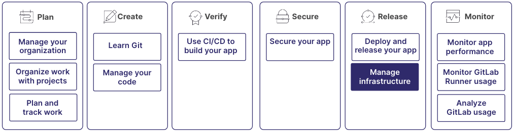

With the rise of DevOps and SRE approaches, infrastructure management has become
codified and automatable. You can now employ software development best practices
in your infrastructure management.

The daily tasks of a classical operations team
have changed and are more similar to traditional software development. At the same time, software engineers
are more likely to control their whole DevOps lifecycle, including deployments and delivery.

GitLab offers various features to speed up and simplify your infrastructure management practices.

Infrastructure management is part of a larger workflow:

## Step 1: Use code to manage your infrastructure

GitLab has deep integrations with Terraform to run Infrastructure as Code pipelines
and support various processes. Terraform is considered the standard in cloud infrastructure provisioning.
The various GitLab integrations help you:

- Get started quickly without any setup.
- Collaborate around infrastructure changes in merge requests the same as you might
  with code changes.
- Scale using a module registry.

For more information, see:

- [Infrastructure as Code](../infrastructure/iac/_index.md)

## Step 2: Interact with Kubernetes clusters

The GitLab integration with Kubernetes helps you to install, configure, manage, deploy, and troubleshoot
cluster applications. With the GitLab agent, you can connect clusters behind a firewall,
have real-time access to API endpoints, perform pull-based or push-based deployments for production
and non-production environments, and much more.

For more information, see:

- [Create Kubernetes clusters in the cloud](../clusters/create/_index.md)
- [Connect Kubernetes clusters with GitLab](../clusters/agent/_index.md)

## Step 3: Document procedures with runbooks

Runbooks are a collection of documented procedures that explain how to carry out a task,
like starting, stopping, debugging, or troubleshooting a system. In GitLab, runbooks are created
in Markdown. They can include a variety of elements, including text, code snippets, images, and links.

Runbook in GitLab integrate with other GitLab features, like CI/CD pipelines and issues.
You can trigger runbooks automatically based on specific events or conditions, like
when a pipeline is successful or an issue is created. In addition, users can link runbooks
to issues, merge requests, and other GitLab objects.

For more information, see:

- [How executable runbooks work in GitLab](../project/clusters/runbooks/_index.md)
