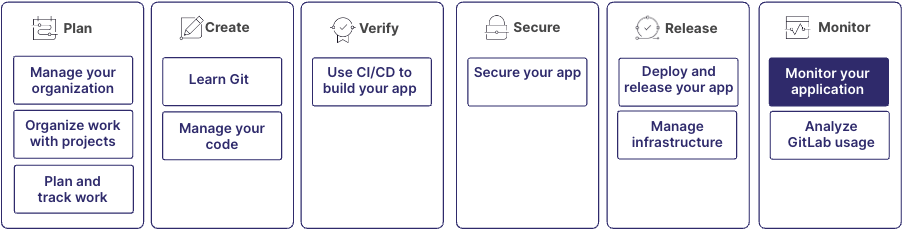

Monitoring is a crucial part of maintaining and optimizing your applications.
GitLab observability features help you track errors, analyze application performance, and respond to incidents.

These capabilities are part of the larger DevOps workflow:

All of these features can be used independently. For example, you can use
tracing or incidents without using error tracking. However, for the best experience,
use all of these features together.

## Step 1: Determine which project to use

You can use the same project for monitoring that you already use to store your application's source code.

For large applications with multiple services and repositories, you should create a dedicated project
to centralize all telemetry data collected from the different components of the system.
This approach offers several benefits:

- Data is accessible to all development and operations teams, which facilitates collaboration.
- Data from different sources can be queried and correlated in one place, which accelerates investigations.
- It provides a single source of truth for all observability data, making it easier to maintain and update.
- It simplifies access management for administrators by centralizing user permissions in a single project.

To enable observability features, you need administrator or the Owner role for the project.

For more information, see:

- [Create a project](../project/_index.md)

## Step 2: Track application errors with error tracking

Error tracking helps you identify, prioritize, and debug errors in your application.
Errors generated by your application are collected by the Sentry SDK,
then stored on either GitLab or Sentry back ends.

For more information, see:

- [How error tracking works](../../operations/error_tracking.md#how-error-tracking-works)

## Step 3: Manage alerts and incidents

Set up incident management features to troubleshoot issues and resolve incidents collaboratively.

For more information, see:

- [Incident Management](../../operations/incident_management/_index.md)

## Step 4: Analyze and improve

Use the data and insights gathered to continuously improve your application and the monitoring process:

1. Create insight dashboards to analyze issues
   or incidents created and closed, and assess the performance of your incident response.
1. Create executable runbooks to help engineers on-call remediate incidents autonomously.
1. Regularly review your monitoring setup and adjust sampling thresholds, or add new metrics as your application evolves.
1. Conduct post-incident reviews to identify areas for improvement in both your application and your incident response process.
1. Use the insights gained from monitoring to inform your development priorities and technical debt reduction efforts.

For more information, see:

- [Insight dashboards](../project/insights/_index.md)
- [Executable runbooks](../project/clusters/runbooks/_index.md)
