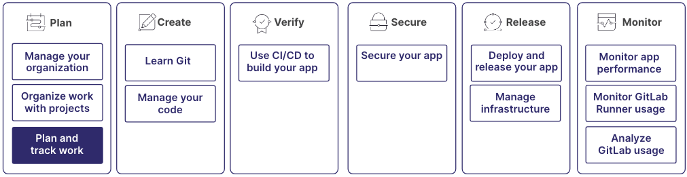

GitLab has tools to help you plan, execute, and track your work.
With planning, collaboration, documentation, time tracking, and reporting features,
you can create a workflow that promotes transparency, accountability, and efficient project management.

The process of planning work is part of a larger workflow:

## Step 1: Define timelines

Start by thinking about how your team wants to approach your project goals and tasks.

Define your releases by using milestones, like `1.0`, `2.0`, and `3.0`. Decide if you will release both major and minor
releases.

Then, if you want your team to use a standard cadence for planning, use iterations.
Iterations are time-boxed periods, similar to sprints. For example, you might want
to release every two weeks.

For more information, see:

- [Milestones](../project/milestones/_index.md)
- [Iterations](../group/iterations/_index.md)

## Step 2: Plan and organize work

After you've decided on a release cadence, you can start organizing your work.

Epics are at the highest level. They provide a broad overview of the project's major objectives
and help to align the team's efforts with the overall vision.

Then you can define issues and assign them to epics.
Issues represent specific bugs or user stories that you need to address.
Issues can be assigned to team members, labeled for categorization and prioritization,
and tracked through various stages of completion.

Then, in issues, you can use tasks to break down the work into smaller, actionable items.

And finally, to ensure that your project's objectives are aligned with the organization's goals,
you can create OKRs (objectives and key results) and associate them with epics.
By defining measurable key results, your team can track your progress
and evaluate the impact of your work on the broader organization's objectives.

For more information, see:

- [Epics](../group/epics/_index.md)
- [Issues](../project/issues/_index.md)
- [Tasks](../tasks.md)
- [OKRs](../okrs.md)

## Step 3: Visualize your workflow

Issue boards offer a visual representation of the project's workflow. They display
issues categorized by their status, such as "To Do," "In Progress," or "Done."
Use issue boards to quickly assess the current state of the project
and identify any bottlenecks or blockers.

For more information, see:

- [Issue boards](../project/issue_board.md)

## Step 4: Collaborate and communicate

To categorize and prioritize issues, making it easier for you to identify and focus
on specific areas of work, use labels. By assigning descriptive labels to issues,
like "bug," "enhancement," or "high priority," you can filter and find relevant tasks.

In issues, use comments and threads provide a centralized space for discussion,
feedback, and collaboration. Team members can ask questions, provide updates, share ideas,
and review each other's work in the context of an issue.

Also in comments, you can use mentions (`@username`) to notify others
that you'd like them involved in the discussion.
When you mention someone, they receive a notification.

For more information, see:

- [Labels](../project/labels.md)
- [Comments and threads](../discussions/_index.md)

## Step 5: Track progress

Tracking progress involves monitoring the status and completion of tasks, milestones, and overall project goals.

You can visualize the timeline and track progress of epics and milestones by using roadmaps.
Roadmaps show a strategic, long-term view of the project, so you can gauge when major
deliverables are planned and determine how they contribute to the overall project goals.

To log the time spent on each issue, helping to monitor progress and estimate future efforts,
use time tracking.

You can use milestone burndown charts to view a graphical overview of the progress towards a specific
milestone. The burndown chart shows the number of issues opened, closed, and remaining over time.
Use it to track your progress and adjust your efforts accordingly.

For more information, see:

- [Roadmaps](../group/roadmap/_index.md)
- [Time tracking](../project/time_tracking.md)
- [Milestone burnup and burndown charts](../project/milestones/burndown_and_burnup_charts.md)

## Step 6: Report and analyze

Over time, you can use analytics to gain insights into your team's performance and productivity.

Analyze issues by filtering by labels, milestones, and iterations.
Group issues by priority, category, or other custom criteria.

For more information, see:

- [Analyze GitLab usage](../analytics/_index.md)

## Step 7: Create documentation and share knowledge

Throughout the process, you can document your progress and procedures.

While you will add comments and notes in issues and merge requests,
requirements are another essential aspect of documentation in a GitLab workflow.
They define the expected outcomes, acceptance criteria, and constraints
for specific features or tasks. Requirements can be documented in issues or
wikis, providing a clear understanding of what needs to be delivered and how success is measured.

Wikis serve as the primary hub for project documentation and knowledge management.
They provide a collaborative space where team members can create, edit, and organize
content related to the project. Wikis can include a wide
range of information, like project guidelines, technical specifications, and best practices.

For more information, see:

- [Requirements](../project/requirements/_index.md)
- [Wikis](../project/wiki/_index.md)
