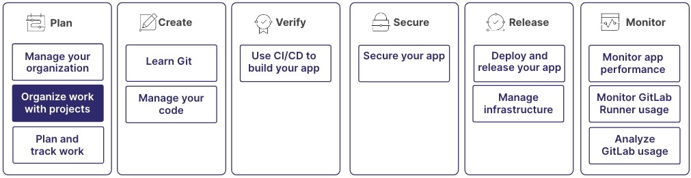

Projects in GitLab organize all the data for a specific development project.
A project is where you work with your team, store your files, and manage your tasks.

Use projects to:

- Write and save code
- Track issues and tasks
- Collaborate on code changes
- Test and deploy your app

Project creation and maintenance is part of a larger workflow:

## Step 1: Create a project

Start by creating a new project in GitLab to contain your codebase,
documentation, and related resources.

A project contains a repository. A repository contains all the files,
directories, and data related to your work.

When you create the project, review and configure the following settings to align with your development workflow and collaboration requirements:

- Visibility level
- Merge request approvals
- Issue tracking
- CI/CD pipelines
- Description templates for entities like issues or merge requests

For more information, see:

- [Create a project](../project/_index.md)
- [Manage projects](../project/working_with_projects.md)
- [Project visibility](../public_access.md)
- [Project settings](../project/settings/_index.md)
- [Description templates](../project/description_templates.md)

## Step 2: Secure and control access to projects

Use the following tools to manage secure access to your projects:

- Project access tokens: Grant specific access rights to automated tools or external systems for secure integration.
- Deploy keys: Grant read-only access to your repositories to securely deploy your project to external systems.
- Deploy tokens: Grant temporary, limited access to your project's repository and registry for secure deployments and automation.

For more information, see:

- [Project access tokens](../project/settings/project_access_tokens.md)
- [Deploy keys](../project/deploy_keys/_index.md)
- [Deploy tokens](../project/deploy_tokens/_index.md)

## Step 3: Collaborate and share projects

You can invite multiple projects to a group, sometimes called
`sharing a project with a group`. Each project has its own repository,
issues, merge requests, and other features.

With multiple projects in a group, team members can collaborate on individual
projects while having a high-level view of all the work done in the group.

To further refine access to your projects, you can add subgroups to
your group.

For more information, see:

- [Share projects](../project/members/sharing_projects_groups.md)
- [Subgroups](../group/subgroups/_index.md)

## Step 4: Enhance project discoverability and recognition

Use the search box to quickly find specific projects,
issues, merge requests, or code snippets across your GitLab instance.

To make projects easier to find:

- Create a consistent and recognizable naming scheme for your projects with reserved project and group names.
- Add badges to your project's `README` file. Badges can display important information,
like build status, project health, test coverage, or version number.
- Assign project topics. Topics are labels that help you organize and find projects.

For more information, see:

- [Reserved project and group names](../reserved_names.md)
- [Search](../search/_index.md)
- [Badges](../project/badges.md)
- [Project topics](../project/project_topics.md)

## Step 5: Boost development efficiency and maintain code quality

Use code intelligence features to enhance your productivity and
maintain a high-quality codebase, such as:

- Code navigation
- Hover information
- Auto-completion

Code intelligence is a range of tools
that help you efficiently explore, analyze, and maintain your codebase.

To quickly locate and go to specific files in your project,
use the file finder.

For more information, see:

- [Code intelligence](../project/code_intelligence.md)
- [Files](../project/repository/files/_index.md)

## Step 6: Migrate projects into GitLab

Use file exports to migrate projects to GitLab from other systems or GitLab instances.

When you migrate a frequently accessed repository to GitLab, you can use a project alias to
continue to access it by its original name.

On GitLab.com, you can transfer a project from one namespace to another.
A transfer essentially moves a project to another group
so its members have access or ownership.

For more information, see:

- [Migrate projects by using file exports](../project/import/_index.md)
- [Project aliases](../project/working_with_projects.md#project-aliases)
- [Transfer a project to another namespace](../project/settings/migrate_projects.md)
