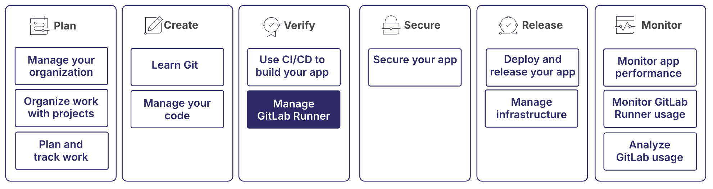

GitLab Runner administration encompasses the complete lifecycle of managing your CI/CD job execution infrastructure:

- Deploying and registering runners
- Configuring executors for specific workloads
- Scaling capacity to match organizational growth

The process of administering runners is part of a larger workflow:

You manage runner access through scopes and tags, monitor performance, and maintain the runner fleet.

## Step 1: Install runners

Install GitLab Runner to create the application that executes CI/CD jobs.

Installation involves downloading and setting up GitLab Runner on your target infrastructure.
The installation process varies depending on the target operating system. GitLab provides binaries
and installation instructions for Linux, Windows, macOS, and z/OS. Choose your installation method
based on your platform and requirements.

For more information, see [install GitLab Runner](https://docs.gitlab.com/runner/install/).

## Step 2: Register runners

Register your runners to establish authenticated communication between your
GitLab instance and the machine where GitLab Runner is installed.
Registration connects individual runners to your GitLab instance using authentication tokens.
During registration, you specify the runner's scope, executor type, and other configuration
parameters that determine how the runner operates.

Before you register a runner, you should determine if you want to limit it to a specific GitLab group or project.
You can configure self-managed runners with different access scopes during registration to determine which projects they're available for:

- Instance runners: Available to all projects on your GitLab instance
- Group runners: Available to all projects in a specific group and its subgroups
- Project runners: Available only to a specific project

When you register a runner, add tags to it
to route jobs to appropriate runners. Assign meaningful tags and reference them
in your `.gitlab-ci.yml` files to ensure jobs run on runners with the required capabilities.

When a CI/CD job runs, it knows which runner to use by looking at the assigned tags.
Tags are the only way to filter the list of available runners for a job.

For more information, see:

- [Register a runner](https://docs.gitlab.com/runner/register/)
- [Migrate to the new runner registration workflow](../../ci/runners/new_creation_workflow.md)
- [Instance runners](../../ci/runners/runners_scope.md#instance-runners)
- [Group runners](../../ci/runners/runners_scope.md#group-runners)
- [Project runners](../../ci/runners/runners_scope.md#project-runners)
- [Tags](../../ci/yaml/_index.md#tags)

## Step 3: Choose executors

GitLab Runner executors are the different environments and methods that GitLab Runner can use to execute CI/CD jobs.
They determine how and where your pipeline jobs actually run. Proper configuration ensures jobs run in appropriate
environments with correct security boundaries.

When you register a runner, you must choose an executor.
GitLab Runner uses an executor system to determine where and how jobs run.
An executor determines the environment each job runs in.
Select executors that match your infrastructure and job requirements.

For example:

- If you want your CI/CD job to run PowerShell commands, you might install GitLab
  Runner on a Windows server and then register a runner that uses the shell executor.
- If you want your CI/CD job to run commands in a custom Docker container,
  you might install GitLab Runner on a Linux server and register a runner that uses
  the Docker executor.

These examples are only a couple of possible configurations. You can install GitLab Runner
on a virtual machine and have it use another virtual machine as an executor.

For more information, see [executors](https://docs.gitlab.com/runner/executors/).

## Step 4: Configure runners and start running jobs

You can configure GitLab Runners by editing the `config.toml` file,
which is automatically generated when you install and register a runner.
In this file you can edit settings for a specific runner, or for all runners.
Configure it to set concurrency limits, logging levels, cache settings, CPU limits, and executor-specific parameters.
Use consistent configurations across your runner fleet.

After a runner is configured and available for your project, your CI/CD jobs can use the runner.

Runners usually process jobs on the same machine where you installed GitLab Runner.
However, you can also have a runner process jobs in a container,
in a Kubernetes cluster, or in auto-scaled instances in the cloud.

For more information, see:

- [Configure GitLab Runners](https://docs.gitlab.com/runner/configuration/advanced-configuration/)
- [CI/CD jobs](../../ci/jobs/_index.md)

## Step 5: Continue to configure, scale, and optimize your runners

Advanced runner features improve job execution efficiency and provide specialized capabilities for complex CI/CD workflows.
These optimizations reduce job runtime and enhance the developer experience through autoscaling, performance monitoring,
fleet management, and specialized configurations.

Autoscaling adjusts runner capacity automatically based on job demand, while performance optimization ensures efficient resource utilization.
These capabilities help you handle variable workloads while controlling infrastructure costs.

Fleet management provides centralized control and monitoring for multiple runners, enabling enterprise-scale runner deployments. Fleet scaling involves coordinating capacity across multiple runners and implementing operational best practices.

Use built-in Prometheus metrics to help you monitor runner health and performance.
You can track key metrics like active job count, CPU utilization, memory usage, job success rates,
and queue lengths to ensure your runners operate efficiently.

For more information, see:

- [Autoscale configuration](https://docs.gitlab.com/runner/runner_autoscale/)
- [Fleet scaling](https://docs.gitlab.com/runner/fleet_scaling/)
- [Runner fleet configuration and best practices](../../topics/runner_fleet_design_guides/_index.md)
- [Monitor runner performance](https://docs.gitlab.com/runner/monitoring/)
- [Runner fleet dashboard](../../ci/runners/runner_fleet_dashboard.md)
- [Long polling](../../ci/runners/long_polling.md)
- [Docker-in-Docker configuration](https://docs.gitlab.com/runner/executors/docker/)
- [GitLab Runner Infrastructure Toolkit (GRIT)](https://gitlab.com/gitlab-org/ci-cd/runner-tools/grit)
