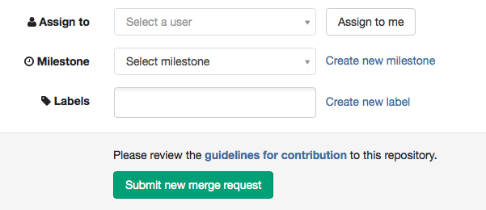

# How to create a merge request

Merge Requests are useful to integrate separate changes that you've made to a project, on different branches.

To create a new Merge Request, sign in to GitLab.

Go to the project where you'd like to merge your changes:

Click on "Merge Requests" on the left side of your screen:

Click on "+ new Merge Request" on the right side of the screen:

Select a source branch or branch:

Click on the "compare branches" button:

Add a title and a description to your Merge Request:

Select a user to review your Merge Request and to accept or close it. You may also select milestones and labels (they are optional). Then click on the "submit new Merge Request" button:

Your Merge Request will be ready to be approved and published.

### Note

After you created a new branch, you'll immediately find a "create a Merge Request" button at the top of your screen.
You may automatically create a Merge Request from your recently created branch when clicking on this button:

