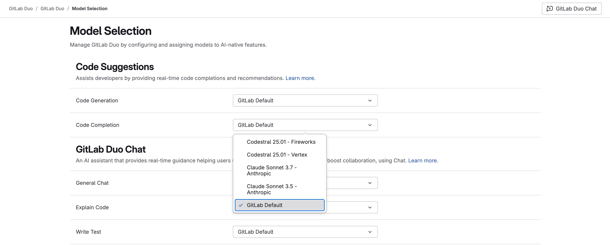



- Tier: Premium, Ultimate
- Add-on: GitLab Duo Core, Pro or Enterprise
- Offering: GitLab.com



Every GitLab Duo feature has a pre-selected default large language model (LLM), chosen by GitLab.

GitLab can update this default LLM to optimize feature performance. Therefore, a feature's LLM might change without you taking any action.

If you do not want to use the default LLM for each feature, or have specific requirements, you can choose from an array of other available supported LLMs.

If you select a specific LLM for a feature, the feature uses that LLM until you select another.

## Select an LLM for a feature



- [Introduced](https://gitlab.com/groups/gitlab-org/-/epics/17570) for top-level groups in GitLab 18.1 with a [flag](../../administration/feature_flags/_index.md) named `ai_model_switching`. Disabled by default.
- [Changed](https://gitlab.com/gitlab-org/gitlab/-/issues/526307) to beta in GitLab 18.4.
- [Enabled](https://gitlab.com/gitlab-org/gitlab/-/issues/526307) in GitLab 18.4.
- [Introduced](https://gitlab.com/gitlab-org/gitlab/-/issues/568112) model selection for GitLab Duo Agent Platform in GitLab 18.4 with a [flag](../../administration/feature_flags/_index.md) called `duo_agent_platform_model_selection`. Disabled by default.





The availability of this feature is controlled by a feature flag.
For more information, see the history.



On GitLab.com, you can select a model for a feature in a top-level group. The model that you select
applies to that feature for all child groups and projects.

Prerequisites:

- The group that you want to select LLMs for must:
  - Be a top-level group or namespace on GitLab.com.
  - Have GitLab Duo Core, Pro, or Enterprise enabled.
- You must have the Owner role for the group or namespace.
- In GitLab 18.3 or later, you must [assign a default namespace](#assign-a-default-gitlab-duo-namespace) if you belong to multiple GitLab Duo namespaces.

To select a different LLM for a feature:

1. On the left sidebar, select **Search or go to** and find your group. If you've [turned on the new navigation](../interface_redesign.md#turn-new-navigation-on-or-off), this field is on the top bar.
1. Select **Settings** > **GitLab Duo**.

   If **GitLab Duo** is not visible, ensure you have GitLab Duo Core, Pro, or Enterprise turned on for the group.
1. Select **Configure features**.
1. For the feature you want to configure, select an LLM from the dropdown list.



- Model selection for GitLab Duo Agentic Chat is independent from GitLab Duo Chat (Classic). You must configure each feature separately — changes to one won't affect the other.

- In the IDE, model selection for Agentic Chat is applied only when the "Connection type" is set to websockets. The default connection type is gRPC.

- The OpenAI models used in Agentic Duo Chat have experimental support, specifically for GPT-5, GPT-5 mini, and GPT-5-Codex.
  Please leave your feedback about using OpenAI models in Agentic Duo Chat in this [issue](https://gitlab.com/gitlab-org/gitlab/-/issues/572864).



### Assign a default GitLab Duo namespace



- [Introduced](https://gitlab.com/gitlab-org/gitlab/-/issues/552081) in GitLab 18.3 with a [flag](../../administration/feature_flags/_index.md) named `ai_user_default_duo_namespace`. Disabled by default.
- [Enabled](https://gitlab.com/gitlab-org/gitlab/-/issues/560319) in GitLab 18.4.





The availability of this feature is controlled by a feature flag.
For more information, see the history.



If you belong to multiple GitLab Duo namespaces, you must choose one as your default namespace.

You must do this because GitLab Duo might not be able to automatically detect the namespace you are working from, and therefore the LLMs you want to use. For example, when:

- Using GitLab Duo in the CLI.
- A new project has not been initialized with Git, so the IDE cannot identify an associated namespace.

If this happens, GitLab Duo uses the LLMs you have selected in your default namespace.

To select a default namespace:

1. In GitLab.com, on the left sidebar, select your avatar. If you've [turned on the new navigation](../interface_redesign.md#turn-new-navigation-on-or-off), this button is in the upper-right corner.
1. Select **Preferences**.
1. Go to the **Behavior** section.
1. From the **Default GitLab Duo namespace** dropdown list, select the namespace to set as your default.
1. Select **Save changes**.

## Troubleshooting

When selecting models other than the default, you might encounter the following issues.

### LLM is not available

If you are using the GitLab Default LLM for a GitLab Duo AI-native feature, GitLab might change the default LLM without notifying the user to maintain optimal performance and reliability.

If you have selected a specific LLM for a GitLab Duo AI-native feature, and that LLM is not available, there is no automatic fallback, and the feature that uses this LLM is unavailable.

### Latency issues with code completion

If you are assigned a seat in a project that has a specific LLM selected for [code completion](../project/repository/code_suggestions/_index.md#code-completion-and-generation):

- Your IDE extension disables the [direct connection to the AI gateway](../../administration/gitlab_duo/gateway.md#region-support).
- Code completion requests go through the GitLab monolith, which then selects the specified model to respond to these requests.

This might cause increased latency with code completion requests.

### No default GitLab Duo namespace

When using a GitLab Duo feature with a selected LLM, you might get an error that states that you have not selected a default GitLab Duo namespace. For example, on:

- GitLab Duo Code Suggestions, you might get `Error 422: No default Duo group found. Select a default Duo group in your user preferences and try again.`
- GitLab Duo Chat, you might get `Error G3002: I'm sorry, you have not selected a default GitLab Duo namespace. Please go to GitLab and in user Preferences - Behavior, select a default namespace for GitLab Duo.`

This issue occurs when:

- The `ai_user_default_duo_namespace` feature flag is enabled.
- You belong to multiple GitLab Duo namespaces, but have not chosen one as your default namespace.

To resolve this, you can do either of the following:

- [Assign a default GitLab Duo namespace](#assign-a-default-gitlab-duo-namespace).
- To opt out of this requirement whilst the model selection feature is in beta, ask [GitLab Support](https://about.gitlab.com/support/) to disable the `ai_user_default_duo_namespace` feature flag.
