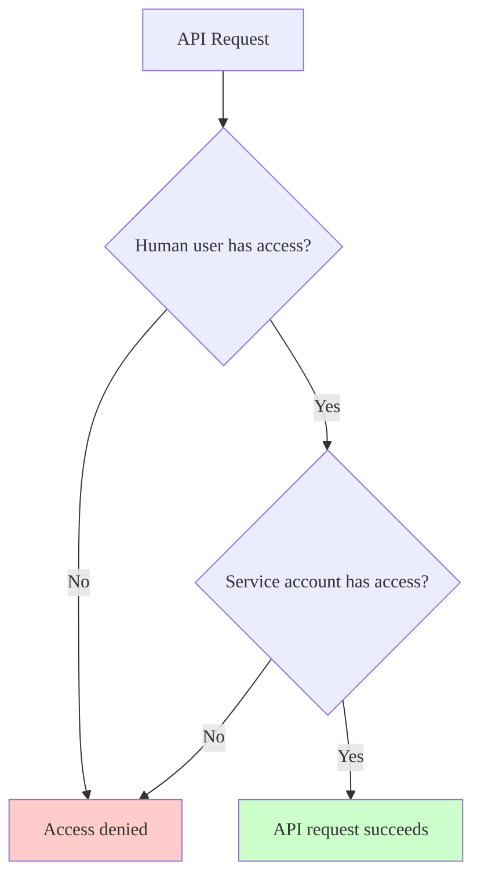

> - [Introduced](https://gitlab.com/gitlab-org/gitlab/-/issues/506641) in GitLab 17.9.

GitLab Duo with Amazon Q uses a composite identity to authenticate requests.

NOTE:
Support for a composite identity in other areas of the product
is proposed in [issue 511373](https://gitlab.com/gitlab-org/gitlab/-/issues/511373).

The token that authenticates requests is a composite of two identities:

- The primary author, which is the Amazon Q [service account](../profile/service_accounts.md).
  This service account is instance-wide and has the Developer role
  on the project where the Amazon Q quick action was used. The service account is the owner of the token.
- The secondary author, which is the human user who submitted the quick action.
  This user's `id` is included in the scopes of the token.

This composite identity ensures that any activities authored by Amazon Q are
correctly attributed to the Amazon Q service account.
At the same time, the composite identity ensures that there is no
[privilege escalation](https://en.wikipedia.org/wiki/Privilege_escalation) for the human user.

This [dynamic scope](https://github.com/doorkeeper-gem/doorkeeper/pull/1739)
is checked during the authorization of the API request.
When authorization is requested, GitLab validates that both the service account
and the user who originated the quick action have sufficient permissions.

