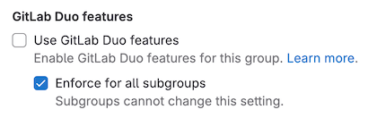

> - [Settings to turn off AI features introduced](https://gitlab.com/groups/gitlab-org/-/epics/12404) in GitLab 16.10.
> - [Settings to turn off AI features added to the UI](https://gitlab.com/gitlab-org/gitlab/-/issues/441489) in GitLab 16.11.

GitLab Duo features that are generally available are automatically turned on for all users that have access.

- You must have an [GitLab Duo Pro or Enterprise add-on subscription](../../subscriptions/subscription-add-ons.md).
- For some generally available features, like [Code Suggestions](../project/repository/code_suggestions/_index.md),
  [you must also assign seats](../../subscriptions/subscription-add-ons.md#assign-gitlab-duo-seats)
  to the users you want to have access.

## Turn off GitLab Duo features

You can turn off GitLab Duo for a group, project, or instance.

When GitLab Duo is turned off for a group, project, or instance:

- GitLab Duo features that access resources, like code, issues, and vulnerabilities, are not available.
- Code Suggestions is not available.
- GitLab Duo Chat is not available.

### Turn off for a group

::Tabs

:::TabTitle In 17.8 and later

In GitLab 17.8 and later, follow these instructions to turn off GitLab Duo
for a group, including its subgroups and projects.

Prerequisites:

- You must have the Owner role for the group.

To turn off GitLab Duo for a group:

1. On the left sidebar, select **Search or go to** and find your subgroup.
1. Go to the settings:
   - For GitLab.com, select **Settings > General** and expand **GitLab Duo features**.
   - For GitLab Self-Managed, select **Settings > GitLab Duo** and select **Change configuration**.
1. Choose an option:
   - To turn off GitLab Duo for the group, but let other groups or projects turn it on, select **Off by default**.
   - To turn off GitLab Duo for the group, and to prevent other groups or projects from turning it on, select **Always off**.
1. Select **Save changes**.

:::TabTitle In 17.7

In GitLab 17.7, follow these instructions to turn off GitLab Duo
for a group, including its subgroups and projects.

NOTE:
In GitLab 17.7, you cannot turn off GitLab Duo for groups or subgroups on GitLab Self-Managed, or for subgroups on GitLab.com.

Prerequisites:

- You must have the Owner role for the group.

To turn off GitLab Duo for a group:

1. On the left sidebar, select **Search or go to** and find your group.
1. Select **Settings > GitLab Duo**.
1. Select **Change configuration**.
1. Choose an option:
   - To turn off GitLab Duo for the group, but let other projects turn it on, select **Off by default**.
   - To turn off GitLab Duo for the group, and to prevent projects from turning it on, select **Always off**.
1. Select **Save changes**.

:::TabTitle In 17.4 to 17.6

In GitLab 17.4 to 17.6, follow these instructions to turn off GitLab Duo
for a group and its subgroups and projects.

Prerequisites:

- You must have the Owner role for the group.

To turn off GitLab Duo for a group:

1. On the left sidebar, select **Search or go to** and find your group.
1. Select **Settings > General**.
1. Expand **GitLab Duo features**.
1. Choose an option:
   - To turn off GitLab Duo for the group, but let other groups or projects turn it on, select **Off by default**.
   - To turn off GitLab Duo for the group, and to prevent other groups or projects from turning it on, select **Never on**.
1. Select **Save changes**.

:::TabTitle In 17.3 and earlier

In GitLab 17.3 and earlier, follow these instructions to turn off GitLab Duo for a group
and its subgroups and projects.

Prerequisites:

- You must have the Owner role for the group.

1. On the left sidebar, select **Search or go to** and find your group.
1. Select **Settings > General**.
1. Expand **Permissions and group features**.
1. Clear the **Use GitLab Duo features** checkbox.
1. Optional. Select the **Enforce for all subgroups** checkbox to cascade the setting to
   all subgroups.

   

::EndTabs

### Turn off for a project

::Tabs

:::TabTitle In 17.4 and later

In GitLab 17.4 and later, follow these instructions to turn off GitLab Duo for a project.

Prerequisites:

- You must have the Owner role for the project.

To turn off GitLab Duo for a project:

1. On the left sidebar, select **Search or go to** and find your project.
1. Select **Settings > General**.
1. Expand **Visibility, project features, permissions**.
1. Under **GitLab Duo**, turn the toggle off.
1. Select **Save changes**.

:::TabTitle In 17.3 and earlier

In GitLab 17.3 and earlier, follow these instructions to turn off GitLab Duo for a project.

1. Use the GitLab GraphQL API
   [`projectSettingsUpdate`](../../api/graphql/reference/_index.md#mutationprojectsettingsupdate)
   mutation.
1. Set the
   [`duo_features_enabled`](../../api/graphql/getting_started.md#update-project-settings)
   setting to `false`. (The default is `true`.)

::EndTabs

### Turn off for an instance

DETAILS:
**Offering:** GitLab Self-Managed

::Tabs

:::TabTitle In 17.7 and later

In GitLab 17.7 and later, follow these instructions to turn off GitLab Duo for the instance.

Prerequisites:

- You must be an administrator.

To turn off GitLab Duo for an instance:

1. On the left sidebar, at the bottom, select **Admin area**.
1. On the left sidebar, select **GitLab Duo**.
1. Select **Change configuration**.
1. Choose an option:
   - To turn off GitLab Duo for the instance, but let groups and projects turn it on, select **Off by default**.
   - To turn off GitLab Duo for the instance, and to prevent groups or projects from ever turning it on, select **Always off**.
1. Select **Save changes**.

:::TabTitle In 17.4 to 17.6

In GitLab 17.4 to 17.6, follow these instructions to turn off GitLab Duo for the instance.

Prerequisites:

- You must be an administrator.

To turn off GitLab Duo for an instance:

1. On the left sidebar, at the bottom, select **Admin area**.
1. Select **Settings > General**.
1. Expand **GitLab Duo features**.
1. Choose an option:
   - To turn off GitLab Duo for the instance, but let groups and projects turn it on, select **Off by default**.
   - To turn off GitLab Duo for the instance, and to prevent groups or projects from ever turning it on, select **Never on**.
1. Select **Save changes**.

:::TabTitle In 17.3 and earlier

In GitLab 17.3 and earlier, follow these instructions to turn off GitLab Duo for an instance.

Prerequisites:

- You must be an administrator.

To turn off GitLab Duo for an instance:

1. On the left sidebar, at the bottom, select **Admin**.
1. Select **Settings > General**
1. Expand **AI-powered features**.
1. Clear the **Use Duo features** checkbox.
1. Optional. Select the **Enforce for all subgroups** checkbox to cascade
   the setting to all groups in the instance.

::EndTabs

NOTE:
An [issue exists](https://gitlab.com/gitlab-org/gitlab/-/issues/441532) to allow administrators
to override the setting for specific groups or projects.

## Turn on beta and experimental features

GitLab Duo features that are experimental and beta are turned off by default.
These features are subject to the [Testing Agreement](https://handbook.gitlab.com/handbook/legal/testing-agreement/).

### On GitLab.com

DETAILS:
**Tier:** Premium, Ultimate
**Offering:** GitLab.com, GitLab Self-Managed

::Tabs

:::TabTitle In 17.4 and later

In GitLab 17.4 and later, follow these instructions to
turn on GitLab Duo experimental and beta features for your group on GitLab.com.

Prerequisites:

- You must have the Owner role for the top-level group.

To turn on GitLab Duo experiment and beta features for a top-level group:

1. On the left sidebar, select **Search or go to** and find your group.
1. Select **Settings > General**.
1. Expand **GitLab Duo features**.
1. Under **GitLab Duo preview features**, select **Use experiment and beta GitLab Duo features**.
1. Select **Save changes**.

:::TabTitle In 17.3 and earlier

In GitLab 17.3 and earlier, follow these instructions to
turn on GitLab Duo experimental and beta features for your group on GitLab.com.

1. On the left sidebar, select **Search or go to** and find your group.
1. Select **Settings > General**.
1. Expand **Permissions and group features**.
1. Under **GitLab Duo experiment and beta features**, select the **Use experiment and beta GitLab Duo features** checkbox.
1. Select **Save changes**.

::EndTabs

This setting [cascades to all projects](../project/merge_requests/approvals/settings.md#cascade-settings-from-the-instance-or-top-level-group)
that belong to the group.

### On self-managed

::Tabs

:::TabTitle In 17.4 and later

In GitLab 17.4 and later, follow these instructions to turn on GitLab Duo
experiment and beta features for your GitLab Self-Managed instance.

Prerequisites:

- You must be an administrator.

To turn on GitLab Duo experiment and beta features for an instance:

1. On the left sidebar, at the bottom, select **Admin area**.
1. Select **Settings > General**.
1. Expand **GitLab Duo features**.
1. Under **GitLab Duo preview features**, select **Use experiment and beta GitLab Duo features**.
1. Select **Save changes**.

:::TabTitle In 17.3 and earlier

To enable GitLab Duo beta and experimental features for GitLab versions
where GitLab Duo Chat is not yet generally available, see the
[GitLab Duo Chat documentation](../gitlab_duo_chat/turn_on_off.md#for-self-managed).

::EndTabs
