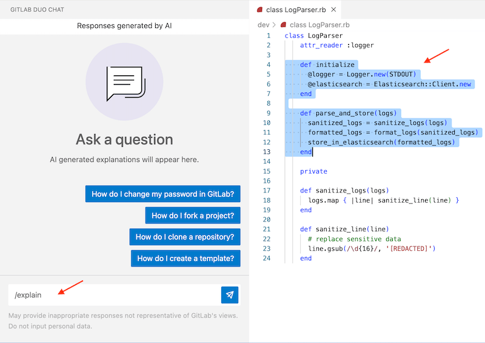

GitLab Duo Chat can help with a variety of questions. The following examples
represent some of the areas where GitLab Duo Chat can be the most helpful.

For additional practical examples, see the [GitLab Duo use cases](../gitlab_duo/use_cases.md).

## Ask about GitLab

DETAILS:
**Tier:** Premium with GitLab Duo Pro, Ultimate with GitLab Duo Pro or Enterprise - [Start a trial](https://about.gitlab.com/solutions/gitlab-duo-pro/sales/?type=free-trial)
**Offering:** GitLab.com, GitLab Self-Managed, GitLab Dedicated
**Editors:** GitLab UI, Web IDE, VS Code, and JetBrains IDEs
**LLMs:** Anthropic [Claude 3.5 Sonnet](https://console.cloud.google.com/vertex-ai/publishers/anthropic/model-garden/claude-3-5-sonnet), [Vertex AI Search](https://cloud.google.com/enterprise-search)

> - [Introduced](https://gitlab.com/gitlab-org/gitlab/-/merge_requests/117695) for GitLab.com in GitLab 16.0.
> - [Introduced](https://gitlab.com/gitlab-org/gitlab/-/issues/451215) ability to ask doc-related questions on GitLab Self-Managed in GitLab 17.0 [with a flag](../../administration/feature_flags.md) named `ai_gateway_docs_search`. Enabled by default.
> - [Generally available and feature flag removed](https://gitlab.com/gitlab-org/gitlab/-/merge_requests/154876) in GitLab 17.1.
> - Changed to require GitLab Duo add-on in GitLab 17.6 and later.

You can ask questions about how GitLab works. Things like:

- `Explain the concept of a 'fork' in a concise manner.`
- `Provide step-by-step instructions on how to reset a user's password.`

GitLab Duo Chat uses the GitLab documentation as source. To keep Chat up to date with the documentation,
its knowledge base is updated daily.

- On GitLab.com, the most recent version of the documentation is used.
- On Self-managed and GitLab Dedicated, the documentation for the version of the instance is used.

## Ask about a specific issue

DETAILS:
**Tier:** Ultimate with GitLab Duo Enterprise - [Start a trial](https://about.gitlab.com/solutions/gitlab-duo-pro/sales/?type=free-trial)
**Offering:** GitLab.com, GitLab Self-Managed, GitLab Dedicated
**Editors:** GitLab UI, Web IDE, VS Code, JetBrains IDEs
**LLM:** Anthropic [Claude 3 Haiku](https://docs.anthropic.com/en/docs/models-overview#claude-3-a-new-generation-of-ai)

> - [Introduced](https://gitlab.com/gitlab-org/gitlab/-/merge_requests/122235) for GitLab.com in GitLab 16.0.
> - [Introduced](https://gitlab.com/gitlab-org/gitlab/-/merge_requests/122235) for GitLab Self-Managed and GitLab Dedicated in GitLab 16.8.
> - Changed to require GitLab Duo add-on in GitLab 17.6 and later.

You can ask about a specific GitLab issue. For example:

- `Generate a summary for the issue identified via this link: <link to your issue>`
- When you are viewing an issue in GitLab, you can ask `Generate a concise summary of the current issue.`
- `How can I improve the description of <link to your issue> so that readers understand the value and problems to be solved?`

NOTE:
If the issue contains a large amount of text (more than 40,000 words), GitLab Duo Chat might not be able to consider every word. The AI model has a limit to the amount of input it can process at one time.

<i class="fa fa-youtube-play youtube" aria-hidden="true"></i>
For tips on how GitLab Duo Chat can improve your productivity with issues and epics, see [Boost your productivity with GitLab Duo Chat](https://youtu.be/RJezT5_V6dI).
<!-- Video published on 2024-04-17 -->

## Ask about a specific epic

DETAILS:
**Tier:** Ultimate with GitLab Duo Enterprise - [Start a trial](https://about.gitlab.com/solutions/gitlab-duo-pro/sales/?type=free-trial)
**Offering:** GitLab.com, GitLab Self-Managed, GitLab Dedicated
**Editors:** GitLab UI, Web IDE, VS Code, JetBrains IDEs
**LLM:** Anthropic [Claude 3 Haiku](https://docs.anthropic.com/en/docs/models-overview#claude-3-a-new-generation-of-ai)

> - [Introduced](https://gitlab.com/gitlab-org/gitlab/-/merge_requests/128487) for GitLab.com in GitLab 16.3.
> - [Introduced](https://gitlab.com/gitlab-org/gitlab/-/merge_requests/128487) for GitLab Self-Managed and GitLab Dedicated in GitLab 16.8.
> - Changed to require GitLab Duo add-on in GitLab 17.6 and later.

You can ask about a specific GitLab epic. For example:

- `Generate a summary for the epic identified via this link: <link to your epic>`
- When you are viewing an epic in GitLab, you can ask `Generate a concise summary of the opened epic.`
- `What are the unique use cases raised by commenters in <link to your epic>?`

NOTE:
If the epic contains a large amount of text (more than 40,000 words), GitLab Duo Chat might not be able to consider every word. The AI model has a limit to the amount of input it can process at one time.

## Ask about a specific merge request

DETAILS:
**Tier:** Ultimate with GitLab Duo Enterprise - [Start a trial](https://about.gitlab.com/solutions/gitlab-duo-pro/sales/?type=free-trial)
**Offering:** GitLab.com, GitLab Self-Managed, GitLab Dedicated
**Editors:** GitLab UI
**LLM:** Anthropic [Claude 3.5 Sonnet](https://console.cloud.google.com/vertex-ai/publishers/anthropic/model-garden/claude-3-5-sonnet)

> - [Introduced](https://gitlab.com/gitlab-org/gitlab/-/issues/464587) in GitLab 17.5.
> - Changed to require GitLab Duo add-on in GitLab 17.6 and later.

You can ask GitLab about the merge request you're viewing. You can ask about:

- The title or description.
- Comments and threads.
- The content on the **Changes** tab.
- Metadata, like labels, source branch, author, milestone, and more.

While in the merge request, open Chat and type your question. For example:

- `Why was the .vue file changed?`
- `What do the reviewers say about this merge request?`
- `How can this merge request be improved?`
- `Which files and changes should I review first?`

## Ask about a specific commit

DETAILS:
**Tier:** Ultimate with GitLab Duo Enterprise - [Start a trial](https://about.gitlab.com/solutions/gitlab-duo-pro/sales/?type=free-trial)
**Offering:** GitLab.com, GitLab Self-Managed, GitLab Dedicated
**Editors:** GitLab UI
**LLM:** Anthropic [Claude 3.5 Sonnet](https://console.cloud.google.com/vertex-ai/publishers/anthropic/model-garden/claude-3-5-sonnet)

> - [Introduced](https://gitlab.com/gitlab-org/gitlab/-/issues/468460) in GitLab 17.6.

You can ask about a specific GitLab commit. For example:

- `Generate a summary for the commit identified with this link: <link to your commit>`
- `How can I improve the description of this commit?`
- When you are viewing a commit in GitLab, you can ask `Generate a summary of the current commit.`

## Ask about a specific pipeline job

DETAILS:
**Tier:** Ultimate with GitLab Duo Enterprise - [Start a trial](https://about.gitlab.com/solutions/gitlab-duo-pro/sales/?type=free-trial)
**Offering:** GitLab.com, GitLab Self-Managed, GitLab Dedicated
**Editors:** GitLab UI
**LLM:** Anthropic [Claude 3.5 Sonnet](https://console.cloud.google.com/vertex-ai/publishers/anthropic/model-garden/claude-3-5-sonnet)

> - [Introduced](https://gitlab.com/gitlab-org/gitlab/-/issues/468461) in GitLab 17.6.

You can ask about a specific GitLab pipeline job. For example:

- `Generate a summary for the pipeline job identified via this link: <link to your pipeline job>`
- `Can you suggest ways to fix this failed pipeline job?`
- `What are the main steps executed in this pipeline job?`
- When you are viewing a pipeline job in GitLab, you can ask `Generate a summary of the current pipeline job.`

## Explain selected code

DETAILS:
**Tier:** Premium with GitLab Duo Pro, Ultimate with GitLab Duo Pro or Enterprise - [Start a trial](https://about.gitlab.com/solutions/gitlab-duo-pro/sales/?type=free-trial)
**Offering:** GitLab.com, GitLab Self-Managed, GitLab Dedicated
**Editors:** GitLab UI, Web IDE, VS Code, JetBrains IDEs
**LLM:** Anthropic [Claude 3.5 Sonnet](https://console.cloud.google.com/vertex-ai/publishers/anthropic/model-garden/claude-3-5-sonnet)

> - [Introduced](https://gitlab.com/gitlab-org/gitlab/-/issues/429915) for GitLab.com in GitLab 16.7.
> - [Introduced](https://gitlab.com/gitlab-org/gitlab/-/issues/429915) for GitLab Self-Managed and GitLab Dedicated in GitLab 16.8.
> - Changed to require GitLab Duo add-on in GitLab 17.6 and later.

You can ask GitLab Duo Chat to explain selected code:

1. Select some code in your IDE.
1. In Duo Chat, type `/explain`.

   

You can also add additional instructions to be considered. For example:

- `/explain the performance`
- `/explain focus on the algorithm`
- `/explain the performance gains or losses using this code`
- `/explain the object inheritance` (classes, object-oriented)
- `/explain why a static variable is used here` (C++)
- `/explain how this function would cause a segmentation fault` (C)
- `/explain how concurrency works in this context` (Go)
- `/explain how the request reaches the client` (REST API, database)

For more information, see [Use GitLab Duo Chat in VS Code](_index.md#use-gitlab-duo-chat-in-vs-code).

In the GitLab UI, you can also explain code in:

- A [file](../project/repository/code_explain.md).
- A [merge request](../project/merge_requests/changes.md#explain-code-in-a-merge-request).

## Ask about or generate code

DETAILS:
**Tier:** Premium with GitLab Duo Pro, Ultimate with GitLab Duo Pro or Enterprise - [Start a trial](https://about.gitlab.com/solutions/gitlab-duo-pro/sales/?type=free-trial)
**Offering:** GitLab.com, GitLab Self-Managed, GitLab Dedicated
**Editors:** GitLab UI, Web IDE, VS Code, JetBrains IDEs
**LLM:** Anthropic [Claude 3.5 Sonnet](https://console.cloud.google.com/vertex-ai/publishers/anthropic/model-garden/claude-3-5-sonnet)

> - [Introduced](https://gitlab.com/gitlab-org/gitlab/-/merge_requests/122235) for GitLab.com in GitLab 16.1.
> - [Introduced](https://gitlab.com/gitlab-org/gitlab/-/merge_requests/122235) for GitLab Self-Managed and GitLab Dedicated in GitLab 16.8.
> - Changed to require GitLab Duo add-on in GitLab 17.6 and later.

You can ask GitLab Duo Chat questions about code by pasting that code into
the Chat window. For example:

```plaintext
Provide a clear explanation of this Ruby code: def sum(a, b) a + b end.
Describe what this code does and how it works.
```

You can also ask Chat to generate code. For example:

- `Write a Ruby function that prints 'Hello, World!' when called.`
- `Develop a JavaScript program that simulates a two-player Tic-Tac-Toe game. Provide both game logic and user interface, if applicable.`
- `Create a regular expression for parsing IPv4 and IPv6 addresses in Python.`
- `Generate code for parsing a syslog log file in Java. Use regular expressions when possible, and store the results in a hash map.`
- `Create a product-consumer example with threads and shared memory in C++. Use atomic locks when possible.`
- `Generate Rust code for high performance gRPC calls. Provide a source code example for a server and client.`

## Ask follow up questions

You can ask follow-up questions to delve deeper into the topic or task at hand.
This helps you get more detailed and precise responses tailored to your specific needs,
whether it's for further clarification, elaboration, or additional assistance.

A follow-up to the question `Write a Ruby function that prints 'Hello, World!' when called` could be:

- `Can you also explain how I can call and execute this Ruby function in a typical Ruby environment, such as the command line?`

A follow-up to the question `How to start a C# project?` could be:

- `Can you also please explain how to add a .gitignore and .gitlab-ci.yml file for C#?`

## Ask about errors

Programming languages that require compiling the source code may throw cryptic error messages. Similarly, a script or a web application could throw a stack trace. You can ask GitLab Duo Chat by prefixing the copied error message with, for example, `Please explain this error message:`. Add the specific context, like the programming language.

- `Explain this error message in Java: Int and system cannot be resolved to a type`
- `Explain when this C function would cause a segmentation fault: sqlite3_prepare_v2()`
- `Explain what would cause this error in Python: ValueError: invalid literal for int()`
- `Why is "this" undefined in VueJS? Provide common error cases, and explain how to avoid them.`
- `How to debug a Ruby on Rails stacktrace? Share common strategies and an example exception.`

## Ask about specific files

DETAILS:
**Tier:** Premium with GitLab Duo Pro, Ultimate with GitLab Duo Pro or Enterprise - [Start a trial](https://about.gitlab.com/solutions/gitlab-duo-pro/sales/?type=free-trial)
**Offering:** GitLab.com, GitLab Self-Managed, GitLab Dedicated
**Editors:** VS Code, JetBrains IDEs
**LLM:** Anthropic [Claude 3.5 Sonnet](https://console.cloud.google.com/vertex-ai/publishers/anthropic/model-garden/claude-3-5-sonnet)

> - [Introduced](https://gitlab.com/gitlab-org/gitlab/-/issues/477258) in GitLab 17.7 [with flags](../../administration/feature_flags.md) named `duo_additional_context` and `duo_include_context_file`. Disabled by default.

FLAG:
The availability of this feature is controlled by a feature flag.
For more information, see the history.
GitLab.com customers must contact their Customer Success Manager to enable this feature.

Add repository files to your Duo Chat conversations in VS Code or JetBrains IDEs by
typing `/include` and choosing the files.

Prerequisites:

- You cannot add local files that are not part of a repository.
- Only text-based files can be included. Binary files (such as PDFs or images) are not supported.

To do this:

1. In your IDE, in GitLab Duo Chat, type `/include`.
1. To add files, you can either:
   - Select the files from the list.
   - Enter the file path.

For example, if you are developing an e-commerce app, you can add the `cart_service.py` and `checkout_flow.js` files to Chat's context and ask:

- `How does checkout_flow.js interact with cart_service.py? Please generate a sequence diagram using Mermaid.`
- `Thanks, that helps. I want to extend the checkout process by showing products related to the ones in the user's cart. I want to move the checkout logic to the backend before proceeding. Generate the Python backend code and change the frontend code to work with the new backend.`

NOTE:
You cannot use [Quick Chat](_index.md#in-gitlab-duo-quick-chat-in-the-editor-view) to add files or ask questions about files added for Chat's context.

## Refactor code in the IDE

DETAILS:
**Tier:** Premium with GitLab Duo Pro, Ultimate with GitLab Duo Pro or Enterprise - [Start a trial](https://about.gitlab.com/solutions/gitlab-duo-pro/sales/?type=free-trial)
**Offering:** GitLab.com, GitLab Self-Managed, GitLab Dedicated
**Editors:** Web IDE, VS Code, JetBrains IDEs
**LLM:** Anthropic [Claude 3.5 Sonnet](https://console.cloud.google.com/vertex-ai/publishers/anthropic/model-garden/claude-3-5-sonnet)

> - [Introduced](https://gitlab.com/gitlab-org/gitlab/-/issues/429915) for GitLab.com in GitLab 16.7.
> - [Introduced](https://gitlab.com/gitlab-org/gitlab/-/issues/429915) for GitLab Self-Managed and GitLab Dedicated in GitLab 16.8.
> - Changed to require GitLab Duo add-on in GitLab 17.6 and later.

You can ask GitLab Duo Chat to refactor selected code:

1. Select some code in your IDE.
1. In Duo Chat, type `/refactor`.

You can include additional instructions to be considered. For example:

- Use a specific coding pattern, for example `/refactor with ActiveRecord` or `/refactor into a class providing static functions`.
- Use a specific library, for example `/refactor using mysql`.
- Use a specific function/algorithm, for example `/refactor into a stringstream with multiple lines` in C++.
- Refactor to a different programming language, for example `/refactor to TypeScript`.
- Focus on performance, for example `/refactor improving performance`.
- Focus on potential vulnerabilities, for example `/refactor avoiding memory leaks and exploits`.

## Fix code in the IDE

DETAILS:
**Tier:** Premium with GitLab Duo Pro, Ultimate with GitLab Duo Pro or Enterprise - [Start a trial](https://about.gitlab.com/solutions/gitlab-duo-pro/sales/?type=free-trial)
**Offering:** GitLab.com, GitLab Self-Managed, GitLab Dedicated
**Editors:** Web IDE, VS Code, JetBrains IDEs
**LLM:** Anthropic [Claude 3.5 Sonnet](https://console.cloud.google.com/vertex-ai/publishers/anthropic/model-garden/claude-3-5-sonnet)

> - [Introduced](https://gitlab.com/gitlab-org/gitlab/-/issues/429915) for GitLab.com, GitLab Self-Managed and GitLab Dedicated in GitLab 17.3.
> - Changed to require GitLab Duo add-on in GitLab 17.6 and later.

You can ask GitLab Duo Chat to fix selected code:

1. Select some code in your IDE.
1. In Duo Chat, type `/fix`.

You can include additional instructions to be considered. For example:

- Focus on grammar and typos, for example, `/fix grammar mistakes and typos`.
- Focus on a concrete algorithm or problem description, for example, `/fix duplicate database inserts` or `/fix race conditions`.
- Focus on potential bugs that are not directly visible, for example, `/fix potential bugs`.
- Focus on code performance problems, for example, `/fix performance problems`.
- Focus on fixing the build when the code does not compile, for example, `/fix the build`.

## Write tests in the IDE

DETAILS:
**Tier:** Premium with GitLab Duo Pro, Ultimate with GitLab Duo Pro or Enterprise - [Start a trial](https://about.gitlab.com/solutions/gitlab-duo-pro/sales/?type=free-trial)
**Offering:** GitLab.com, GitLab Self-Managed, GitLab Dedicated
**Editors:** Web IDE, VS Code, JetBrains IDEs
**LLM:** Anthropic [Claude 3.5 Sonnet](https://console.cloud.google.com/vertex-ai/publishers/anthropic/model-garden/claude-3-5-sonnet)

> - [Introduced](https://gitlab.com/gitlab-org/gitlab/-/issues/429915) for GitLab.com in GitLab 16.7.
> - [Introduced](https://gitlab.com/gitlab-org/gitlab/-/issues/429915) for GitLab Self-Managed and GitLab Dedicated in GitLab 16.8.
> - Changed to require GitLab Duo add-on in GitLab 17.6 and later.

You can ask GitLab Duo Chat to create tests for the selected code:

1. Select some code in your IDE.
1. In Duo Chat, type `/tests`.

You can include additional instructions to be considered. For example:

- Use a specific test framework, for example `/tests using the Boost.test framework` (C++) or `/tests using Jest` (JavaScript).
- Focus on extreme test cases, for example `/tests focus on extreme cases, force regression testing`.
- Focus on performance, for example `/tests focus on performance`.
- Focus on regressions and potential exploits, for example `/tests focus on regressions and potential exploits`.

For more information, see [Use GitLab Duo Chat in VS Code](_index.md#use-gitlab-duo-chat-in-vs-code).

## Ask about CI/CD

DETAILS:
**Tier:** Premium with GitLab Duo Pro, Ultimate with GitLab Duo Pro or Enterprise - [Start a trial](https://about.gitlab.com/solutions/gitlab-duo-pro/sales/?type=free-trial)
**Offering:** GitLab.com, GitLab Self-Managed, GitLab Dedicated
**Editors:** GitLab UI, Web IDE, VS Code, JetBrains IDEs
**LLM:** Anthropic [Claude 3.5 Sonnet](https://console.cloud.google.com/vertex-ai/publishers/anthropic/model-garden/claude-3-5-sonnet)

> - [Introduced](https://gitlab.com/gitlab-org/gitlab/-/issues/423524) for GitLab.com in GitLab 16.7.
> - [Introduced](https://gitlab.com/gitlab-org/gitlab/-/issues/423524) for GitLab Self-Managed and GitLab Dedicated in GitLab 16.8.
> - [Updated LLM](https://gitlab.com/gitlab-org/gitlab/-/merge_requests/149619) from Claude 2.1 to Claude 3 Sonnet in GitLab 17.2.
> - [Updated LLM](https://gitlab.com/gitlab-org/gitlab/-/merge_requests/157696) from Claude 3 Sonnet to Claude 3.5 Sonnet in GitLab 17.2.
> - Changed to require GitLab Duo add-on in GitLab 17.6 and later.

You can ask GitLab Duo Chat to create a CI/CD configuration:

- `Create a .gitlab-ci.yml configuration file for testing and building a Ruby on Rails application in a GitLab CI/CD pipeline.`
- `Create a CI/CD configuration for building and linting a Python application.`
- `Create a CI/CD configuration to build and test Rust code.`
- `Create a CI/CD configuration for C++. Use gcc as compiler, and cmake as build tool.`
- `Create a CI/CD configuration for VueJS. Use npm, and add SAST security scanning.`
- `Generate a security scanning pipeline configuration, optimized for Java.`

You can also ask to explain specific job errors by copy-pasting the error message, prefixed with `Please explain this CI/CD job error message, in the context of <language>:`:

- `Please explain this CI/CD job error message in the context of a Go project: build.sh: line 14: go command not found`

Alternatively, you can use GitLab Duo Root Cause Analysis to [troubleshoot failed CI/CD jobs](#troubleshoot-failed-cicd-jobs-with-root-cause-analysis).

## Troubleshoot failed CI/CD jobs with Root Cause Analysis

DETAILS:
**Tier:** Ultimate with GitLab Duo Enterprise - [Start a trial](https://about.gitlab.com/solutions/gitlab-duo-pro/sales/?type=free-trial)
**Offering:** GitLab.com, GitLab Self-Managed, GitLab Dedicated
**Editors:** GitLab UI
**LLM:** Anthropic [Claude 3.5 Sonnet](https://console.cloud.google.com/vertex-ai/publishers/anthropic/model-garden/claude-3-5-sonnet)

> - [Introduced](https://gitlab.com/gitlab-org/gitlab/-/merge_requests/123692) in GitLab 16.2 as an [experiment](../../policy/development_stages_support.md#experiment) on GitLab.com.
> - [Generally available](https://gitlab.com/gitlab-org/gitlab/-/issues/441681) and moved to GitLab Duo Chat in GitLab 17.3.
> - Changed to require GitLab Duo add-on in GitLab 17.6 and later.
> - Failed jobs widget for merge requests [introduced](https://gitlab.com/gitlab-org/gitlab/-/merge_requests/174586) in GitLab 17.7.

You can use GitLab Duo Root Cause Analysis in GitLab Duo Chat to quickly identify and fix CI/CD job failures.
It analyzes the last 100,000 characters of the job log to determine the cause of failure and provides an example fix.

You can access this feature either from the **Pipelines** tab in merge requests or directly from the job log.

Root Cause Analysis does not support:

- Trigger jobs
- Downstream pipelines

Provide feedback on this feature in [epic 13872](https://gitlab.com/groups/gitlab-org/-/epics/13872).

Prerequisites:

- You must have permission to view the CI/CD job.
- You must have a paid GitLab Duo Enterprise seat.

### From a merge request

To troubleshoot a failed CI/CD job from a merge request:

1. On the left sidebar, select **Search or go to** and find your project.
1. Go to your merge request.
1. Select the **Pipelines** tab.
1. From the Failed jobs widget, either:
   - Select the job ID to go to the job log.
   - Select **Troubleshoot** to analyze the failure directly.

### From the job log

To troubleshoot a failed CI/CD job from the job log:

1. On the left sidebar, select **Search or go to** and find your project.
1. Select **Build > Jobs**.
1. Select the failed CI/CD job.
1. Below the job log, either:
   - Select **Troubleshoot**.
   - Open GitLab Duo Chat and type `/troubleshoot`.

## Explain a vulnerability

DETAILS:
**Tier:** Ultimate with GitLab Duo Enterprise - [Start a trial](https://about.gitlab.com/solutions/gitlab-duo-pro/sales/?type=free-trial)
**Offering:** GitLab.com, GitLab Self-Managed, GitLab Dedicated
**Editors:** GitLab UI
**LLM:** Anthropic [Claude 3 Haiku](https://docs.anthropic.com/en/docs/about-claude/models#claude-3-a-new-generation-of-ai)

> - Changed to require GitLab Duo add-on in GitLab 17.6 and later.

You can ask GitLab Duo Chat to explain a vulnerability when you are viewing a SAST vulnerability report.

For more information, see [Explaining a vulnerability](../application_security/vulnerabilities/_index.md#explaining-a-vulnerability).

## Delete or reset the conversation

To delete all conversations permanently and clear the chat window:

- In the text box, type `/clear` and select **Send**.

To start a new conversation, but keep the previous conversations visible in the chat window:

- In the text box, type `/reset` and select **Send**.

In both cases, the conversation history will not be considered when you ask new questions.
Deleting or resetting might help improve the answers when you switch contexts, because Duo Chat will not get confused by the unrelated conversations.

## GitLab Duo Chat slash commands

Duo Chat has a list of universal, GitLab UI, and IDE commands, each of which is preceded by a slash (`/`).

Use the commands to quickly accomplish specific tasks.

### Universal

DETAILS:
**Tier:** Premium with GitLab Duo Pro, Ultimate with GitLab Duo Pro or Enterprise - [Start a trial](https://about.gitlab.com/solutions/gitlab-duo-pro/sales/?type=free-trial)
**Offering:** GitLab.com, GitLab Self-Managed, GitLab Dedicated
**Editors:** GitLab UI, Web IDE, VS Code, JetBrains IDEs

These commands work in Duo Chat in all IDEs and in the GitLab UI:

| Command | Purpose                                                                                                                       |
|---------|-------------------------------------------------------------------------------------------------------------------------------|
| /clear  | [Delete all conversations permanently and clear the chat window](#delete-or-reset-the-conversation)                           |
| /reset  | [Start a new conversation, but keep the previous conversations visible in the chat window](#delete-or-reset-the-conversation) |
| /help   | Learn more about how Duo Chat works                                                                                           |

### GitLab UI

DETAILS:
**Tier:** Ultimate with GitLab Duo Enterprise- [Start a trial](https://about.gitlab.com/solutions/gitlab-duo-pro/sales/?type=free-trial)
**Offering:** GitLab.com, GitLab Self-Managed, GitLab Dedicated
**Editors:** GitLab UI

These commands are dynamic and are available only in the GitLab UI when using Duo Chat:

| Command                | Purpose                                                                                                            | Area |
| ---------------------- | ------------------------------------------------------------------------------------------------------------------ | ---- |
| /summarize_comments    | Generate a summary of all comments on the current issue                                                            | Issues |
| /troubleshoot          | [Troubleshoot failed CI/CD jobs with Root Cause Analysis](#troubleshoot-failed-cicd-jobs-with-root-cause-analysis) | Jobs |
| /vulnerability_explain | [Explain current vulnerability](../application_security/vulnerabilities/_index.md#explaining-a-vulnerability)       | Vulnerabilities |

### IDE

DETAILS:
**Tier:** Premium with GitLab Duo Pro, Ultimate with GitLab Duo Pro or Enterprise - [Start a trial](https://about.gitlab.com/solutions/gitlab-duo-pro/sales/?type=free-trial)
**Offering:** GitLab.com, GitLab Self-Managed, GitLab Dedicated
**Editors:** Web IDE, VS Code, JetBrains IDEs

These commands work only when using Duo Chat in supported IDEs:

| Command   | Purpose                                           |
|-----------|---------------------------------------------------|
| /tests    | [Write tests](#write-tests-in-the-ide)            |
| /explain  | [Explain code](#explain-selected-code)            |
| /refactor | [Refactor the code](#refactor-code-in-the-ide)    |
| /fix      | [Fix the code](#fix-code-in-the-ide)              |
| /include  | [Include file context](#ask-about-specific-files) |
