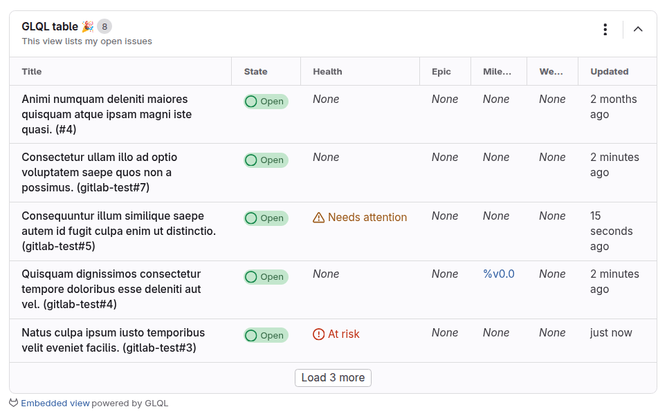
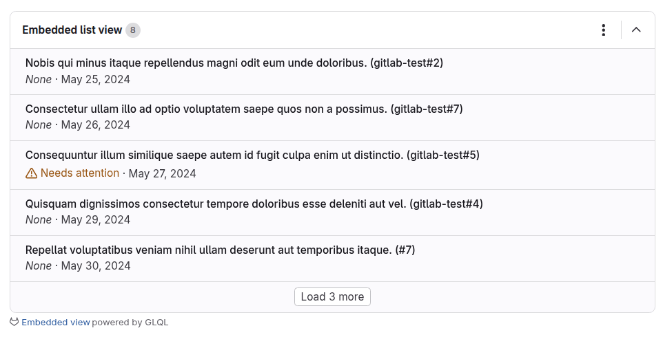



- Tier: Free, Premium, Ultimate
- Offering: GitLab.com, GitLab Self-Managed, GitLab Dedicated





- [Introduced](https://gitlab.com/groups/gitlab-org/-/epics/14767) in GitLab 17.4 [with a flag](../../administration/feature_flags/_index.md) named `glql_integration`. Disabled by default.
- Enabled on GitLab.com in GitLab 17.4 for a subset of groups and projects.
- [Changed](https://gitlab.com/gitlab-org/gitlab/-/issues/476990) from experiment to beta in GitLab 17.10.
- Enabled on GitLab.com, GitLab Self-Managed, and GitLab Dedicated in GitLab 17.10.
- [Generally available](https://gitlab.com/gitlab-org/gitlab/-/issues/554870) in GitLab 18.3. Feature flag `glql_integration` removed.



GitLab Query Language (GLQL) is an attempt to create a single query language for all of GitLab.
Use it to filter and embed content from anywhere in the platform, using familiar syntax.

Embed queries in Markdown code blocks.
An embedded view is the rendered output of a GLQL source code block.

Share your feedback in the [embedded views, powered by GLQL, feedback issue](https://gitlab.com/gitlab-org/gitlab/-/issues/509792).

## Advanced Search integration



- Tier: Premium, Ultimate
- Offering: GitLab.com, GitLab Self-Managed, GitLab Dedicated





- [Introduced](https://gitlab.com/gitlab-org/gitlab/-/merge_requests/210854) in GitLab 18.6 as a [beta](../../policy/development_stages_support.md#beta) with [feature flags](../../administration/feature_flags/_index.md) named `glql_work_items` and `glql_es_integration`. Enabled by default.





The availability of this feature is controlled by a feature flag.
For more information, see the history.



GLQL uses Advanced Search when available to speed up queries. Advanced Search
provides faster response times for complex queries across large datasets.

Advanced Search is:

- Enabled by default for GitLab.com and GitLab Dedicated paid subscriptions.
- Available for GitLab Self-Managed when an administrator
  [enables Advanced Search](../../integration/advanced_search/elasticsearch.md#enable-advanced-search).

If Advanced Search isn't available, GLQL uses PostgreSQL instead.

## Query syntax

The query syntax consists primarily of logical expressions. These expressions follow the
syntax of `<field> <operator> <value> and ...`.

### Fields

Field names can have values like `assignee`, `author`, `label`, and `milestone`.
A `type` field can be used to filter a query by the object type, like `Issue`, `MergeRequest`,
or work item types like `Task` or `Objective`.

For a full list of supported fields, supported operators, and value types, see [GLQL fields](fields.md).

### Operators

**Comparison operators**:

| GLQL operator | Description                             | Equivalent in search   |
|---------------|-----------------------------------------|------------------------|
| `=`           | Equals / Includes all in list           | `is` (equal to)        |
| `!=`          | Doesn't equal / Isn't contained in list | `is not` (equal to)    |
| `in`          | Contained in list                       | `or` / `is one of`     |
| `>`           | Greater than                            |  No |
| `<`           | Less than                               |  No |
| `>=`          | Greater than or equal to                |  No |
| `<=`          | Less than or equal to                   |  No |

**Logical operators**: Only `and` is supported.
`or` is indirectly supported for some fields by using the `in` comparison operator.

### Values

Values can include:

- Strings
- Numbers
- Relative dates (like `-1d`, `2w`, `-6m`, or `1y`)
- Absolute dates (in `YYYY-MM-DD` format, like `2025-01-01`)
- Functions (like `currentUser()` for user fields or `today()` for dates)
- Enum values (like `upcoming` or `started` for milestones)
- Booleans (`true` or `false`)
- Nullable values (like `null`, `none`, or `any`)
- GitLab references (like `~label` for a label, `%Backlog` for a milestone, or `@username` for a user)
- Lists containing any of the previous values (surrounded by parenthesis: `()` and delimited by commas: `,`)

## Embedded views

An embedded view is the output of a GLQL source code block in Markdown. The source includes YAML
attributes that describe how to display the GLQL query results, along with the query.

### Supported areas



- Embedded views in repository Markdown files [introduced](https://gitlab.com/gitlab-org/gitlab/-/merge_requests/197950) in GitLab 18.3.



Embedded views can be displayed in the following areas:

- Group and project wikis
- Descriptions and comments of:
  - Epics
  - Issues
  - Merge requests
  - Work items (tasks, OKRs, or epics)
- Repository Markdown files

### Syntax

The syntax of an embedded view's source is a superset of YAML that consists of:

- The `query` parameter: Expressions joined together with a logical operator, such as `and`.
- Parameters related to the presentation layer, like `display`, `limit`, or `fields`, `title`, and `description`
  represented as YAML.

A view is defined in Markdown as a code block, similar to other code blocks like Mermaid.

For example:

- Display a table of first 5 open issues assigned to the authenticated user in `gitlab-org/gitlab`.
- Display columns `title`, `state`, `health`, `description`, `epic`, `milestone`, `weight`, and `updated`.

````yaml
```glql
display: table
title: GLQL table 🎉
description: This view lists my open issues
fields: title, state, health, epic, milestone, weight, updated
limit: 5
query: group = "gitlab-org" AND assignee = currentUser() AND state = opened
```
````

This source should render a table like the one below:



#### Presentation syntax



- [Changed](https://gitlab.com/gitlab-org/gitlab/-/issues/508956) in GitLab 17.7: Configuring the presentation layer using YAML front matter is deprecated.
- `title` and `description` parameters [introduced](https://gitlab.com/gitlab-org/gitlab/-/merge_requests/183709) in GitLab 17.10.
- Sorting and pagination [introduced](https://gitlab.com/gitlab-org/gitlab/-/issues/502701) in GitLab 18.2.
- `collapsed` parameter [introduced](https://gitlab.com/gitlab-org/gitlab/-/merge_requests/197824) in GitLab 18.3.



Aside from the `query` parameter, you can configure presentation details for your view using some
more optional parameters.

Supported parameters:

| Parameter     | Default                                       | Description |
| ------------- | --------------------------------------------- | ----------- |
| `collapsed`   | `false`                                       | Whether to collapse or expand the view. |
| `description` | None                                          | An optional description to display below the title. |
| `display`     | `table`                                       | How to display the data. Supported options: `table`, `list`, or `orderedList`. |
| `fields`      | `title`                                       | A comma-separated list of [fields](fields.md#fields-in-embedded-views) to include in the view. |
| `limit`       | `100`                                         | How many items to display on the first page. The maximum value is `100`. |
| `sort`        | `updated desc`                                | The [field to sort the data by](fields.md#fields-to-sort-embedded-views-by) followed by a sort order (`asc` or `desc`). |
| `title`       | `Embedded table view` or `Embedded list view` | A title displayed at the top of the embedded view. |

For example, to display the first five issues assigned to the current user in the `gitlab-org/gitlab`
project as a list, sorted by due date (earliest first) and displaying the `title`, `health`, and `due` fields:

````yaml
```glql
display: list
fields: title, health, due
limit: 5
sort: due asc
query: group = "gitlab-org" AND assignee = currentUser() AND state = opened
```
````

This source should render a list like the one below:



#### Pagination



- [Introduced](https://gitlab.com/gitlab-org/gitlab/-/issues/502701) in GitLab 18.2.



Embedded views display the first page of results by default.
The `limit` parameter controls the number of items shown.

To load the next page, in the last row, select **Load more**.

#### Field functions

To create dynamically generated columns, use functions in the `fields` parameters in views.
For a full list, see [Functions in embedded views](functions.md#functions-in-embedded-views).

#### Custom field aliases



- [Introduced](https://gitlab.com/gitlab-org/gitlab/-/issues/535558) in GitLab 18.0.



To rename a table view's column to a custom value, use the `AS` syntax keyword to alias fields.

````yaml
```glql
display: list
fields: title, labels("workflow::*") AS "Workflow", labels("priority::*") AS "Priority"
limit: 5
query: project = "gitlab-org/gitlab" AND assignee = currentUser() AND state = opened
```
````

This source displays a view with columns `Title`, `Workflow` and `Priority`.

### View actions



- [Introduced](https://gitlab.com/gitlab-org/gitlab/-/merge_requests/184788) in GitLab 17.11.
- **Reload** action [introduced](https://gitlab.com/gitlab-org/gitlab/-/issues/537310) in GitLab 18.0.



When a view appears on a page, use the **View actions** () dropdown to take
an action on it.

Supported actions:

| Action        | Description                                                    |
| ------------- | -------------------------------------------------------------- |
| View source   | View the source of the view.                                   |
| Copy source   | Copy the source of the view to clipboard.                      |
| Copy contents | Copy the table or list contents to clipboard. |
| Reload        | Reload this view.                                              |
