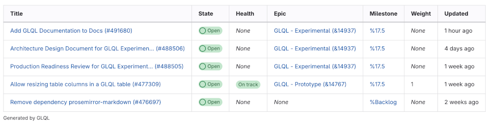

# GitLab Query Language (GLQL)

DETAILS:
**Tier:** Free, Premium, Ultimate
**Offering:** GitLab.com, Self-managed
**Status:** Experiment

> - [Introduced](https://gitlab.com/groups/gitlab-org/-/epics/14767) in GitLab 17.4 [with a flag](../../administration/feature_flags.md) named `glql_integration`. Disabled by default.
> - Enabled on GitLab.com in GitLab 17.4 for a subset of groups and projects.
> - `iteration` and `cadence` fields [introduced](https://gitlab.com/gitlab-org/gitlab-query-language/gitlab-query-language/-/issues/74) in GitLab 17.6.

FLAG:
The availability of this feature is controlled by a feature flag.
For more information, see the history.
This feature is available for testing, but not ready for production use.

GitLab Query Language (GLQL) is an experimental attempt to create a single query language for all of
GitLab.
Use it to filter and embed content from anywhere in the platform, using familiar syntax.
Embed queries in Markdown code blocks.

This feature is an [experiment](../../policy/development_stages_support.md).
Share your feedback in [epic 14939](https://gitlab.com/groups/gitlab-org/-/epics/14939),
either as a comment on the epic, or by creating a new issue under the epic with labels
`~"group::knowledge"` and `~"type::feature"` or `~"type::bug"`.

## Supported areas

GLQL blocks are rendered in the following areas:

- Wikis (group and project)
- Epics and epic comments
- Issue and issue comments
- Merge requests and merge request comments
- Work items (tasks, OKRs, epics [with the new look](../group/epics/epic_work_items.md)) and work item comments

### Supported objects to query

GLQL can only query issues under a project or group.

## Syntax

The syntax of GLQL is composed of two parts:

- The query: Expressions joined together with a logical operator, such as `AND`.
- The presentation layer: YAML front matter.

A GLQL block is defined in Markdown as a code block, similar to other code blocks like Mermaid.

For example:

> Display a table of first 5 open issues assigned to the authenticated user in `gitlab-org/gitlab`.
> Display columns `title`, `state`, `health`, `description`, `epic`, `milestone`, `weight`, and `updated`.

````markdown
```glql
---
display: table
fields: title, state, health, epic, milestone, weight, updated
limit: 5
---
project = "gitlab-org/gitlab" AND assignee = currentUser() AND opened = true
```
````

This query should render a table like the one below:



### Query syntax

GLQL syntax consists primarily of logical expressions.
These expressions follow the syntax of `<field name> [< | > | = | != | in] <value> [AND] ...`.

**Field names** include `assignee`, `author`, `label`, and `epic`.
For a full list of supported fields, see the table at the bottom of this section.

**Comparison operators**:

| GLQL operator | Description       | Equivalent in search |
| ------------- | ----------------- | -------------------- |
| `=`           | Equals            | `is` (equal to)      |
| `!=`          | Doesn't equal     | `is not` (equal to)  |
| `in`          | Contained in list | `or` / `is one of`   |
| `>`           | Greater than      | **{dotted-circle}** No |
| `<`           | Less than         | **{dotted-circle}** No |

**Logical operators**: Only `AND` is supported.
`OR` is indirectly supported for some fields by using the `IN` comparison operator.

**Values**: Values can include:

- Strings
- Numbers
- Dates (relative or absolute)
- Functions (like `currentUser()` for assignee or `today()` for dates)
- Special tokens (like `upcoming` or `started` for milestones)

The following table lists all supported fields and their value types:

| Field                                             | Operators                    | Values                                                                     | Examples |
| ------------------------------------------------- | ---------------------------- | -------------------------------------------------------------------------- | -------- |
| `assignee` <br>`author`                           | `=` <br>`!=` <br>`in`        | `String` <br>`Collection<String>` <br>`currentUser()` <br>`any` <br>`none` | `assignee = "foobar"` <br>`assignee in ("foobar", "baz")` <br>`author = currentUser()` <br>`author = any` <br>`assignee = none` |
| `epic` <br>`reaction`                             | `=` <br>`!=`                 | `String` <br>`any` <br>`none`                                              | `epic = any` <br>`reaction = ":thumbsup:"` |
| `project` <br>`group`                             | `=` <br>`!=`                 | `String`                                                                   | `project = "gitlab-org/gitlab"` <br>`group = "gitlab-org"` |
| `closed` <br>`opened` <br>`confidential`          | `=` <br>`!=`                 | `Boolean`                                                                  | `closed = true` <br>`opened = true` <br>`confidential = true` |
| `closed` <br>`opened` <br>`created` <br>`updated` | `=` <br>`!=` <br>`<` <br>`>` | `Date` <br>`String` <br>`today()`                                          | `updated = today()` <br>`created > -28d` (created in the last 28 days)<br>`created < -7d` (created at least a week ago)<br>`created > 2024-08-12` <br>`updated < "2024-08-12"` |
| `health`                                          | `=` <br>`!=`                 | `Enum(` <br>`"on track"` <br>`"needsAttention"` <br>`"at risk"` <br>`)`    | `health = "on track"` <br>`health != "on track"` <br>`health = "at risk"` |
| `milestone`                                       | `=` <br>`!=`                 | `String` <br>`any` <br>`none` <br>`started` <br>`upcoming`                 | `milestone = "17.4"` <br>`milestone = "Backlog"` <br>`milestone != none`                       |
| `iteration` <br>`cadence`                         | `=` <br>`!=`                 | `String` <br>`any` <br>`none` <br>`current`                                | `iteration = 123` <br>`cadence = 123` <br>`cadence = 123 and iteration = current`              |
| `label`                                           | `=` <br>`!=` <br>`in`        | `String` <br>`Collection<String>` <br>`any` <br>`none`                     | `label != none` <br>`label in ("feature", "bug")` (has the `feature` or `bug` label) <br>`label = ("bug", "priority::1")` (has both `bug` and `priority::1` labels)<br>`label = "bug"` |
| `weight`                                          | `=` <br>`!=`                 | `Number`                                                                   | `weight = 1` <br>`weight != 2 and weight != 1` |

#### Query shorthand syntax

When querying multiple labels and assignees, you can also use the shorthand syntax to simplify the query.

For example:

| Shorthand syntax                  | Full equivalent |
| --------------------------------- | --------------- |
| `label != ("label 1", "label 2")` | `label != "label 1" and label != "label 2"` |
| `label = ("label 1", "label 2")`  | `label = "label 1" and label = "label 2"` |
| `assignee != ("user1", "user2")`  | `assignee != "user1" and assignee != "user2"` |
| `assignee = ("user1", "user2")`   | `assignee = "user1" and assignee = "user2"` |

### Presentation syntax

GLQL presentation is configured in a YAML front matter block.
A YAML front matter block begins and ends with `---` and contains YAML.

Three options are supported:

| Option    | Default | Description |
| --------- | ------- | ----------- |
| `display` | `table` | How to display the data. Supported options: `table`, `list` or `orderedList`. |
| `limit`   | `100`   | How many items to display. The maximum value is `100`. |
| `fields`  | `title` | A comma-separated list of fields. |

Supported fields to display:

- `assignees`
- `author`
- `closed`
- `created`
- `description`
- `due`
- `epic`
- `health`
- `iteration`
- `cadence`
- `labels`
- `milestone`
- `state`
- `title`
- `type`
- `updated`
- `weight`

For example:

> Display first five issues assigned to current user in the `gitlab-org/gitlab` project as a list,
> displaying fields `title`, `health`, and `due`.

````markdown
```glql
---
display: list
fields: title, health, due
limit: 5
---
project = "gitlab-org/gitlab" AND assignee = currentUser() AND opened = true
```
````

#### Field functions

In the `fields` parameter, you can also include functions to derive a column from an existing field.

In the initial version, only the `labels` function is supported.

##### `labels`

- **Syntax**: `labels("field1", "field2")`

- **Description**: The `labels` function takes one or more label name string values as parameter,
  and creates a filtered column with only those labels on issues.
  The function also works as an extractor, so if a label has been extracted, it no longer shows up
  in the regular `labels` column, if you choose to display that column as well.

  By default, this function looks for an exact match to the label name. You can include `*` in the string to match one or more
  wildcard characters.

  The label names you pass are case-insensitive, so `Deliverable` and `deliverable` are equivalent.

- **Limits**: A minimum of 1 and maximum of 100 label names can be passed to the `labels` function.

- **Usage examples**:

  - `labels("workflow::*")`: Include all `workflow` scoped labels in the column.
  - `labels("Deliverable", "Stretch", "Spike")`: Include labels `Deliverable`, `Stretch`, and `Spike`.
  - `labels("*end")`: Include all labels like `backend`, `frontend`, and others that end with `end`.

  To include the function in the query, follow this example:

  ````markdown
  ```glql
  ---
  display: list
  fields: title, health, due, labels("workflow::*"), labels
  limit: 5
  ---
  project = "gitlab-org/gitlab" AND assignee = currentUser() AND opened = true
  ```
  ````

## Known issues

For a full list of known issues, see [epic 14437](https://gitlab.com/groups/gitlab-org/-/epics/14437 "GitLab Query Language (GLQL) | Strategy") and
[GLQL issues](https://gitlab.com/gitlab-org/gitlab-query-language/gitlab-query-language/-/issues/).
