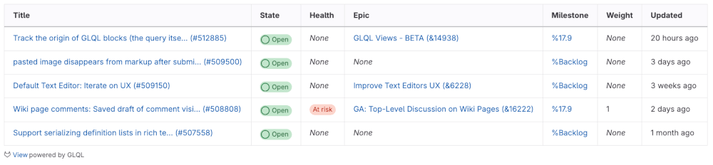

DETAILS:
**Tier:** Free, Premium, Ultimate
**Offering:** GitLab.com, GitLab Self-Managed
**Status:** Experiment

> - [Introduced](https://gitlab.com/groups/gitlab-org/-/epics/14767) in GitLab 17.4 [with a flag](../../administration/feature_flags.md) named `glql_integration`. Disabled by default.
> - Enabled on GitLab.com in GitLab 17.4 for a subset of groups and projects.
> - `iteration` and `cadence` fields [introduced](https://gitlab.com/gitlab-org/gitlab-query-language/gitlab-query-language/-/issues/74) in GitLab 17.6.

FLAG:
The availability of this feature is controlled by a feature flag.
For more information, see the history.
This feature is available for testing, but not ready for production use.

GitLab Query Language (GLQL) is an [experimental](../../policy/development_stages_support.md) attempt
to create a single query language for all of GitLab.
Use it to filter and embed content from anywhere in the platform, using familiar syntax.

Embed queries in Markdown code blocks.
The rendered output of this query is called a view.

To test GLQL views:

- On GitLab Self-Managed, ask your administrator to enable the `glql_integration` feature flag on your instance.
- On GitLab.com, contact your account representative.

Share your feedback in [epic 14939](https://gitlab.com/groups/gitlab-org/-/epics/14939).

## Query syntax

The query syntax consists primarily of logical expressions. These expressions follow the
syntax of `<field> <operator> <value> and ...`.

### Fields

Field names can have values like `assignee`, `author`, `label`, and `milestone`.
A `type` field can be used to filter a query by the object type, like `Issue`, `MergeRequest`,
or work item types like `Task` or `Objective`.

For a full list of supported fields, supported operators, and value types, see [GLQL fields](fields.md).

### Operators

**Comparison operators:**

| GLQL operator | Description                             | Equivalent in search   |
|---------------|-----------------------------------------|------------------------|
| `=`           | Equals / Includes all in list           | `is` (equal to)        |
| `!=`          | Doesn't equal / Isn't contained in list | `is not` (equal to)    |
| `in`          | Contained in list                       | `or` / `is one of`     |
| `>`           | Greater than                            | **{dotted-circle}** No |
| `<`           | Less than                               | **{dotted-circle}** No |

**Logical operators**: Only `and` is supported.
`or` is indirectly supported for some fields by using the `in` comparison operator.

### Values

Values can include:

- Strings
- Numbers
- Relative dates (like `-1d`, `2w`, `-6m`, or `1y`)
- Absolute dates (in `YYYY-MM-DD` format, like `2025-01-01`)
- Functions (like `currentUser()` for user fields or `today()` for dates)
- Enum values (like `upcoming` or `started` for milestones)
- Booleans (`true` or `false`)
- Nullable values (like `null`, `none`, or `any`)
- GitLab references (like `~label` for a label, `%Backlog` for a milestone, or `@username` for a user)
- Lists containing any of the above (surrounded by parenthesis: `()` and delimited by commas: `,`)

## GLQL views

> - [Changed](https://gitlab.com/gitlab-org/gitlab/-/issues/508956) in GitLab 17.7: Configuring the presentation layer using YAML front matter is deprecated.

A view created with GLQL is a display representation of a query that executes to
fetch the desired results.

### Supported areas

Views can be embedded in the following areas:

- Group and project wikis
- Descriptions and comments of:
  - Epics
  - Issues
  - Merge requests
  - Work items (tasks, OKRs, epics [with the new look](../group/epics/epic_work_items.md))

### Syntax

The syntax of views is a superset of YAML that consists of:

- The `query` parameter: Expressions joined together with a logical operator, such as `and`.
- Parameters related to the presentation layer, like `display`, `limit`, or `fields`.

A GLQL view is defined in Markdown as a code block, similar to other code blocks like Mermaid.

For example:

> Display a table of first 5 open issues assigned to the authenticated user in `gitlab-org/gitlab`.
> Display columns `title`, `state`, `health`, `description`, `epic`, `milestone`, `weight`, and `updated`.

````yaml
```glql
display: table
fields: title, state, health, epic, milestone, weight, updated
limit: 5
query: project = "gitlab-org/gitlab" AND assignee = currentUser() AND opened = true
```
````

This query should render a table like the one below:



#### Presentation syntax

Aside from the `query` parameter, you can configure presentation details for your GLQL query using some
more parameters.

Supported parameters:

| Parameter | Default | Description |
| --------- | ------- | ----------- |
| `display` | `table` | How to display the data. Supported options: `table`, `list`, or `orderedList`. |
| `limit`   | `100`   | How many items to display. The maximum value is `100`. |
| `fields`  | `title` | A comma-separated list of [fields](fields.md). All fields allowed in columns of a GLQL view are supported. |

For example, to display first five issues assigned to current user in the `gitlab-org/gitlab`
project as a list, displaying fields `title`, `health`, and `due`:

````yaml
```glql
display: list
fields: title, health, due
limit: 5
query: project = "gitlab-org/gitlab" AND assignee = currentUser() AND opened = true
```
````

#### Field functions

To create dynamically generated columns, use functions in the `fields` parameters in views.
For a full list, see [Functions in GLQL views](functions.md#functions-in-glql-views).
