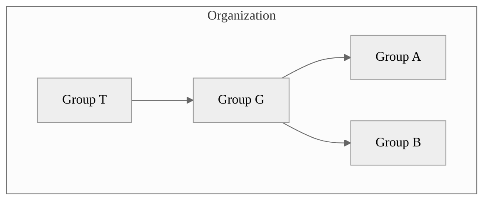



- Tier: Free, Premium, Ultimate
- Offering: GitLab.com, GitLab Self-Managed, GitLab Dedicated



In GitLab, you use groups to manage one or more related projects at the same time.

You can use groups to communicate with all group members and manage permissions for your projects.
If someone has access to the group, they get access to all the projects in the group.

You can also view all of the issues and merge requests for the projects in the group,
and analytics about the group's activity.

For larger organizations, you can also create [subgroups](subgroups/_index.md).

For more information about creating and managing your groups, see [Manage groups](manage.md).

## Group hierarchy

Groups are organized in a tree structure:

- A **top-level group** is a group created at the "root" of the organization. An organization can have one or more top-level groups. A top-level group can contain one or more subgroups.
- A **parent group** is a group that contains one or more subgroups.
- A **subgroup** is a group that is part of another group.

For example, in the following diagram:

- The organization has four groups: one top-level group (T), which contains one subgroup (G), and two subgroups within G (A and B).
- T is a top-level group and the parent group of G.
- G is a subgroup (child) of T and the parent group of A and B.
- A and B are subgroups (children) of G.

## Group structure

The way to set up a group depends on your use cases, team size, and access requirements.
The following table describes the most common models of structuring groups.

<!-- vale gitlab_base.Simplicity = NO -->

| Model | Structure | Use cases |
| ----- | --------- | --------- |
| Simple | One group for all your projects. | Work in a small team or on specific solutions (for example, a marketing website) that require seamless collaboration and access to resources. |
| Team | Different groups or subgroups for different types of teams (for example, product and engineering). | Work in a large organization where some teams work autonomously or require centralized resources and limited access from external team members. |
| Client | One group for each client. | Provide custom solutions for multiple clients that require different resources and access levels. |
| Functionality | One group or subgroup for one type of functionality (for example, AI/ML). | Develop complex products where one functionality requires specific resources and collaboration of subject-matter experts. |

<!-- vale gitlab_base.Simplicity = YES -->



On GitLab Self-Managed, if you want to see an overview of your entire organization, you should create one top-level group.
For more information about efforts to create an organization view of all groups,
[see epic 9266](https://gitlab.com/groups/gitlab-org/-/epics/9266).
A top-level group offers insights in your entire organization through a complete
[Security Dashboard and Center](../application_security/security_dashboard/_index.md),
[Vulnerability report](../application_security/vulnerability_report/_index.md),
[compliance center](../compliance/compliance_center/_index.md), and
[value stream analytics](value_stream_analytics/_index.md).



## Group visibility

Like projects, a group can be configured to be visible to:

- Anonymous users.
- All authenticated users.
- Only explicit group members.

The restriction for [visibility levels](../../administration/settings/visibility_and_access_controls.md#restrict-visibility-levels)
on the application setting level also applies to groups. If set to internal, the explore page is
empty for anonymous users. The group page has a visibility level icon.

Users cannot create a subgroup or project with a higher visibility level than that of
the immediate parent group.

## View groups

To explore all public or internal groups:

1. On the left sidebar, select **Search or go to**.
1. Select **View all my groups**.
1. In the upper right, select **Explore groups**.

## View groups you are a member of



- **Member** tab [introduced](https://gitlab.com/groups/gitlab-org/-/epics/13781) in GitLab 18.2 [with a flag](../../administration/feature_flags/_index.md) named `your_work_groups_vue`. Disabled by default.
- [Generally available](https://gitlab.com/gitlab-org/gitlab/-/issues/542790) in GitLab 18.3. Feature flag `your_work_groups_vue` removed.



To view groups where you have direct or indirect membership:

1. On the left sidebar, select **Search or go to**.
1. Select **View all my groups**.

This page shows groups that you are a member of through:

- Membership of a subgroup's parent group.
- Direct or inherited membership of a project in the group or subgroup.

### View inactive groups



- **Inactive** tab [introduced](https://gitlab.com/groups/gitlab-org/-/epics/13781) in GitLab 18.2 [with a flag](../../administration/feature_flags/_index.md) named `your_work_groups_vue`. Disabled by default.
- [Generally available](https://gitlab.com/gitlab-org/gitlab/-/issues/542790) in GitLab 18.3. Feature flag `your_work_groups_vue` removed.



A group is inactive when it is either pending deletion or it has been archived.

To view all inactive groups:

1. On the left sidebar, select **Search or go to** and find your group.
1. Select **View all my groups**.
1. Select the **Inactive** tab.

Each inactive group in the list displays a badge to indicate that the group is either 
archived or pending deletion.

If the group is pending deletion, the list also shows:

- The time the group is scheduled for final deletion.
- A **Restore** action. When you restore a group:
  - The **Pending deletion** label is removed. The group is no longer scheduled for deletion.
  - The group is removed from the **Inactive** tab.

## View a group



- Accessing the group with the group ID was [Introduced](https://gitlab.com/gitlab-org/gitlab/-/merge_requests/165889) in GitLab 17.5.



The group overview page displays information about the group and its members, subgroups, and projects, such as:

- Group description
- Recent activity
- Number of merge requests and issues created
- Number of members added
- Subgroups and projects
- Shared projects
- Archived projects

To view a group:

- On the left sidebar, select **Search or go to** and find your group.

You can search for the subgroups and projects of the group
and sort them in ascending or descending order.

You can access a group by using its ID instead of its name at `https://gitlab.example.com/-/g/<id>`.
For example, if your group `example-group` has an ID `123456`, you can access the group either at
`https://gitlab.example.com/example-group` or `https://gitlab.example.com/-/g/123456`.

## Find the Group ID

You might need the group ID if you want to interact with it using the [GitLab API](../../api/_index.md).

To find the Group ID:

1. On the left sidebar, select **Search or go to** and find your Group.
1. On the Group overview page, in the upper-right corner, select **Actions** ().
1. Select **Copy Group ID**.

## View group activity

To view the activity of a group:

1. On the left sidebar, select **Search or go to** and find your group.
1. Select **Manage** > **Activity**.
1. Optional. To filter activity by contribution type, select a tab:

   - **All**: All contributions by group members in the group and group's projects.
   - **Push events**: Push events in the group's projects.
   - **Merge events**: Accepted merge requests in the group's projects.
   - **Issue events**: Issues opened and closed in the group's projects.
   - **Comments**: Comments posted by group members in the group's projects.
   - **Wiki**: Updates to wiki pages in the group.
   - **Designs**: Designs added, updated, and removed in the group's projects.
   - **Team**: Group members who joined and left the group's projects.

## Create a group

To create a group:

<!-- vale gitlab_base.FutureTense = NO -->

1. On the left sidebar, at the top, select **Create new** () and **New group**.
1. Select **Create group**.
1. In the **Group name** text box, enter the name of the group. For a list of words that cannot be used as group names, see
   [reserved names](../reserved_names.md).
1. In the **Group URL** text box, enter the path for the group used for the [namespace](../namespace/_index.md).
1. Select the [**Visibility level**](../public_access.md) of the group.
1. Optional. To personalize your GitLab experience:
   - For **Who will be using this group?**, select an option.
   - From the **What will you use this group for?** dropdown list, select an option.
1. Optional. To invite members to the group, in the **Email 1** text box, enter the email address of the user you want to invite. To invite more users, select **Invite another member** and enter the user's email address.
1. Select **Create group**.

<!-- vale gitlab_base.FutureTense = YES -->

<i class="fa fa-youtube-play youtube" aria-hidden="true"></i>
For details about groups, watch [GitLab Namespaces (users, groups and subgroups)](https://youtu.be/r0sJgjR2f5A).

## Edit group name, description, and avatar

You can edit your group details from the group general settings.

Prerequisites:

- You must have the Owner role for the group.

To edit group details:

1. On the left sidebar, select **Search or go to** and find your group.
1. Select **Settings** > **General**.
1. In the **Group name** text box, enter your group name. See the [limitations on group names](../reserved_names.md).
1. Optional. In the **Group description (optional)** text box, enter your group description.
   The description is limited to 500 characters.
1. Optional. Under **Group avatar**, select **Choose file**, then select an image. The ideal image size is 192 x 192 pixels, and the maximum file size allowed is 200 KB.
1. Select **Save changes**.

## Leave a group



- The button to leave a group [moved](https://gitlab.com/gitlab-org/gitlab/-/issues/431539) to the Actions menu in GitLab 16.7.



When you leave a group:

- You are no longer a member of the group, its subgroups, and projects, and cannot contribute.
- All the issues and merge requests that were assigned to you are unassigned.

To leave a group:

1. On the left sidebar, select **Search or go to** and find your group.
1. On the group overview page, in the upper-right corner, select **Actions** ().
1. Select **Leave group**, then **Leave group** again.

## Delete a group



- Enabled delayed deletion by default and removed the option to delete immediately [on GitLab.com](https://gitlab.com/gitlab-org/gitlab/-/issues/393622) and [on GitLab Self-Managed](https://gitlab.com/gitlab-org/gitlab/-/merge_requests/119606) in GitLab 16.0.
- [Moved](https://gitlab.com/groups/gitlab-org/-/epics/17208) from GitLab Premium to GitLab Free in 18.0.



By default, when you delete a group for the first time, it enters a pending deletion state.
Delete a group again to remove it immediately.

Prerequisites:

- You must have the Owner role for a group.
- If the groups contains any project, owners must be [allowed to delete projects](../../administration/settings/visibility_and_access_controls.md#restrict-project-deletion-to-administrators).

To delete a group and its contents:

1. On the left sidebar, select **Search or go to** and find your group.
1. Select **Settings** > **General**.
1. Expand the **Advanced** section.
1. In the **Delete group** section, select **Delete**.
1. On the confirmation dialog, enter the group name and select **Confirm**.

You can also delete a group from the groups dashboard:

1. On the left sidebar, select **Search or go to**.
1. Select **View all my groups**.
1. Select () for the group you want to delete.
1. Select **Delete**.
1. On the confirmation dialog, enter the group name and select **Confirm**.

This action adds a background job to mark a group for deletion. On GitLab.com, the group is deleted after 30 days. On GitLab Self-Managed,
you can modify the retention period through the [instance settings](../../administration/settings/visibility_and_access_controls.md#deletion-protection).

If the user who scheduled the group deletion loses access to the group (for example, by leaving the group, having their role downgraded, or being banned from the group) before the deletion occurs,
the deletion job instead restores the group, and the group is no longer scheduled for deletion.



If the user who scheduled the group deletion regains Owner role or administrator access before the job runs, then the job removes the group permanently.



## Delete a group immediately



- Enabled delayed deletion by default [on GitLab.com](https://gitlab.com/gitlab-org/gitlab/-/issues/393622) and [on GitLab Self-Managed](https://gitlab.com/gitlab-org/gitlab/-/merge_requests/119606) in GitLab 16.0.
- [Introduced](https://gitlab.com/gitlab-org/gitlab/-/issues/561680) in GitLab 18.4 [with a flag](../../administration/feature_flags/_index.md) named `disallow_immediate_deletion`. Disabled by default.
- [Replaced](https://gitlab.com/gitlab-org/gitlab/-/issues/569453) in GitLab 18.5 by an instance setting to allow immediate deletion of groups and projects scheduled for deletion. [Controlled by a flag](../../administration/feature_flags/_index.md) named `allow_immediate_namespaces_deletion`. Feature flag is disabled by default.





On GitLab.com and GitLab Dedicated, after a group is deleted, its data is retained for 30 days, and immediate deletion is not available.
If you must delete a group immediately on GitLab.com, you can open a [support ticket](https://about.gitlab.com/support/).



If you don't want to wait, you can delete a group immediately.

Prerequisites:

- You must have the Owner role for a group.
- You have [marked the group for deletion](#delete-a-group).

To immediately delete a group marked for deletion:

1. On the left sidebar, select **Search or go to** and find your group.
1. Select **Settings** > **General**.
1. Expand **Advanced**.
1. In the **Delete group** section, select **Delete immediately**.
1. Confirm the action when asked to.

This action deletes the group, its subgroups, projects, and all related resources, including issues and merge requests.

## Restore a group

To restore a group that is marked for deletion:

1. On the left sidebar, select **Search or go to** and find your group.
1. Select **Settings** > **General**.
1. Expand the **Advanced** section.
1. In the **Restore group** section, select **Restore group**.

## Manage groups with the Actions menu

You can view a list of all your groups
and manage them with the **Actions** menu.

Prerequisites:

- All of the available actions, except leaving a group, require the Owner role.

To access the **Actions** menu for groups:

1. On the left sidebar, select **Search or go to** > **View all my groups**.
1. On the **Groups** page, find your group and select the **Actions** menu ().
1. Select an action.

The following actions are available, depending on the state of the group:

| Group state      | Actions available       |
| ---------------- | ----------------------- |
| Active           | **Edit**, **Archive**, **Transfer**, **Leave group**, **Delete** |
| Archived         | **Unarchive**, **Leave group**, **Delete** |
| Pending deletion | **Restore**, **Leave group** |

## Request access to a group

As a user, you can request to be a member of a group, if an administrator allows it.

1. On the left sidebar, select **Search or go to**.
1. Select **View all my groups**.
1. In the upper right, select **Explore groups**.
1. In the **Search by name** text box, enter the name of the group you want to join.
1. In the search results, select the name of the group.
1. On the group page, under the group name, select **Request Access**.

Up to ten of the most recently active group owners receive an email with your request.
Any group owner can approve or decline the request.

If you change your mind before your request is approved, select
**Withdraw Access Request**.

## View group members

To view members of a group:

1. On the left sidebar, select **Search or go to** and find your group.
1. Select **Manage** > **Members**.

A table displays the member's:

- **Account** name and username.
- **Source** of their [membership](../project/members/_index.md#membership-types).
  For transparency, GitLab displays all membership sources of group members.
  Members who have multiple membership sources are displayed and counted as separate members.
  For example, if a member has been added to the group both directly and through inheritance,
  the member is displayed twice in the **Members** table, with different sources,
  and is counted as two individual members of the group.
- [**Role**](../project/members/_index.md#which-roles-you-can-assign) in the group.
- **Expiration** date of their group membership.
- **Activity** related to their account.



The display of group members' **Source** might be inconsistent.
For more information, see [issue 23020](https://gitlab.com/gitlab-org/gitlab/-/issues/23020).



To view all namespace members (and their respective occupied seats), in the top-level namespace, [view the **Usage quotas** page](../../subscriptions/manage_users_and_seats.md#view-seat-usage).

## Filter and sort members in a group

To find members in a group, you can sort, filter, or search.

### Filter a group

Filter a group to find members. By default, all members in the group and subgroups are displayed.

In lists of group members, entries can display the following badges:

- **SAML**, to indicate the member has a [SAML account](saml_sso/_index.md) connected to them.
- **Enterprise**, to indicate that the member of the top-level group is an [enterprise user](../enterprise_user/_index.md).

1. On the left sidebar, select **Search or go to** and find your group.
1. Select **Manage** > **Members**.
1. Above the list of members, in the **Filter members** text box, enter your search criteria. To view:
   - Direct members of the group, select **Membership = Direct**.
   - Inherited, shared, and inherited shared members of the group, select **Membership = Indirect**.
   - Members with two-factor authentication enabled or disabled, select **2FA = Enabled** or **2FA = Disabled**.
   - Members of the top-level group who are [enterprise users](../enterprise_user/_index.md), select **Enterprise = true**.

### Search a group

You can search for members by name, username, or [public email](../profile/_index.md#set-your-public-email).

1. On the left sidebar, select **Search or go to** and find your group.
1. Select **Manage** > **Members**.
1. Above the list of members, in the **Filter members** box, enter search criteria.
1. To the right of the **Filter members** box, select the magnifying glass ().

### Sort members in a group

You can sort members by **Account**, **Access granted**, **Role**, or **Last sign-in**.

1. On the left sidebar, select **Search or go to** and find your group.
1. Select **Manage** > **Members**.
1. Above the list of members, in the upper-right corner, from the **Account** list, select
   the criteria to filter by.
1. To switch the sort between ascending and descending, to the right of the **Account** list, select the
   arrow ( or ).

## Add users to a group



- Expiring access email notification [introduced](https://gitlab.com/gitlab-org/gitlab/-/issues/12704) in GitLab 16.2.
- Access expiration date for direct members of subgroups and projects [removed](https://gitlab.com/gitlab-org/gitlab/-/issues/471051) in GitLab 17.4.



You can give a user access to all projects in a group.

Prerequisites:

- You must have the Owner role for the group.
- For GitLab Self-Managed instances:
  - If [new sign-ups are disabled](../../administration/settings/sign_up_restrictions.md#disable-new-sign-ups), an administrator must add the user.
  - If [user invitations are not allowed](../../administration/settings/visibility_and_access_controls.md#prevent-invitations-to-groups-and-projects), an administrator must add the user.
  - If [administrator approval is enabled](../../administration/settings/sign_up_restrictions.md#turn-on-administrator-approval-for-role-promotions), an administrator must approve the invitation.

1. On the left sidebar, select **Search or go to** and find your group.
1. Select **Manage** > **Members**.
1. Select **Invite members**.
1. If the user:

   - Has a GitLab account, enter the user's username.
   - Doesn't have a GitLab account, enter the user's email address.

1. Select a [default role](../permissions.md) or [custom role](../custom_roles/_index.md).
1. Optional. For **Access expiration date**, enter or select a date.
   From that date onward, the user can no longer access the project.

   If you enter an access expiration date, the group member gets an email notification
   seven days before their access expires.

   

   Maintainers have full permissions until their role expires, including the ability to
   extend their own access expiration date.

   

1. Select **Invite**.
   If you invite the user by their:

   - GitLab username, the user is added to the member list.
   - Email address, the user receives an email invitation and is prompted to create an account.
     If the invitation is not accepted, GitLab sends reminder emails two, five, and ten days later.
     Unaccepted invites are automatically deleted after 90 days.

Members that are not automatically added are displayed on the **Invited** tab.
This tab includes users who:

- Have not yet accepted the invitation.
- Are waiting for [approval from an administrator](../../administration/moderate_users.md).
- [Exceed the group user cap](manage.md#user-cap-for-groups).

### View users pending promotion

If [administrator approval for role promotions](../../administration/settings/sign_up_restrictions.md#turn-on-administrator-approval-for-role-promotions) is turned on, membership requests that promote existing users into a billable role require administrator approval.

To view users pending promotion:

1. On the left sidebar, select **Search or go to** and find your group.
1. Select **Manage** > **Members**.
1. Select the **Role promotions** tab.

If the **Role promotions** tab is not displayed, the group has no pending promotions.

## Remove a member from the group

Prerequisites:

- You must have the Owner role.
- The member must have direct membership in the group. If
  membership is inherited from a parent group, then the member can be removed
  from the parent group only.

To remove a member from a group:

1. On the left sidebar, select **Search or go to** and find your group.
1. Select **Manage** > **Members**.
1. Next to the member you want to remove, select the vertical ellipsis ().
1. Select **Remove member**.
1. Optional. On the **Remove member** confirmation dialog, select one or both checkboxes:
   - **Also remove direct user membership from subgroups and projects**
   - **Also unassign this user from linked issues and merge requests**
1. Select **Remove member**.

GitLab administrators can also [ensure removed users cannot invite themselves back](../project/members/_index.md#ensure-removed-users-cannot-invite-themselves-back).

## Add projects to a group

You can add a new project to a group in two ways:

- Select a group, and then select **New project**. You can then continue [creating your project](../project/_index.md).
- While you are creating a project, select a group from the dropdown list.

  

### Specify who can add projects to a group

By default, users with at least the:

- Developer role can create projects under a group. This default can be changed.
- Maintainer role can fork projects into a group. This default prevents users with the Developer role from forking projects that
  contain protected branches and cannot be changed.

To specify which roles can create projects in a group:

1. On the left sidebar, select **Search or go to** and find your group.
1. Select **Settings** > **General**.
1. Expand the **Permissions and group features** section.
1. From **Minimum role required to create projects**, select an option.
1. Select **Save changes**.

For more information about changing this setting globally, see [default minimum role required to create projects](../../administration/settings/visibility_and_access_controls.md#define-which-roles-can-create-projects).
