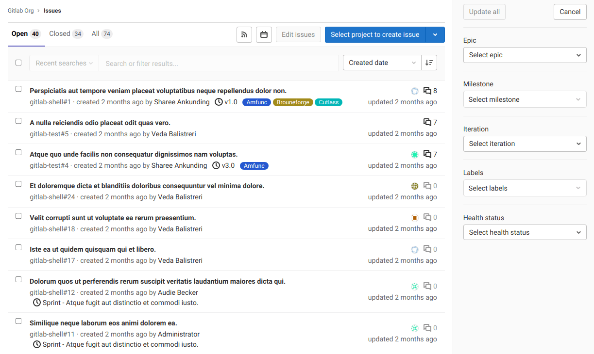

# Bulk editing issues, epics, and merge requests at the group level **(PREMIUM)**

NOTE:
Bulk editing issues and merge requests is also available at the **project level**.
For more details, see [Bulk editing issues and merge requests at the project level](../../project/bulk_editing.md).

If you want to update attributes across multiple issues, epics, or merge requests in a group, you
can do it by bulk editing them, that is, editing them together.

Only the items visible on the current page are selected for bulk editing (up to 20).

## Bulk edit issues at the group level

> - [Introduced](https://gitlab.com/gitlab-org/gitlab/-/issues/7249) in GitLab 12.1.
> - Assigning epic ([introduced](https://gitlab.com/gitlab-org/gitlab/-/issues/210470) in GitLab 13.2.
> - Editing health status [introduced](https://gitlab.com/gitlab-org/gitlab/-/issues/218395) in GitLab 13.2.
> - Editing iteration [introduced](https://gitlab.com/gitlab-org/gitlab/-/issues/196806) in GitLab 13.9.

Users with permission level of [Reporter or higher](../../permissions.md) can manage issues.

When bulk editing issues in a group, you can edit the following attributes:

- [Epic](../epics/index.md)
- [Milestone](../../project/milestones/index.md)
- [Labels](../../project/labels.md)
- [Health status](../../project/issues/managing_issues.md#health-status)
- [Iteration](../iterations/index.md)

To update multiple project issues at the same time:

1. In a group, go to **{issues}** **Issues > List**.
1. Click **Edit issues**. A sidebar on the right-hand side of your screen appears with editable fields.
1. Select the checkboxes next to each issue you want to edit.
1. Select the appropriate fields and their values from the sidebar.
1. Click **Update all**.

## Bulk edit epics

> [Introduced](https://gitlab.com/gitlab-org/gitlab/-/issues/7250) in [GitLab Premium](https://about.gitlab.com/pricing/) 12.2.

Users with permission level of [Reporter or higher](../../permissions.md) can manage epics.

When bulk editing epics in a group, you can edit their labels.

To update multiple epics at the same time:

1. In a group, go to **{epic}** **Epics > List**.
1. Click **Edit epics**. A sidebar on the right-hand side of your screen appears with editable fields.
1. Check the checkboxes next to each epic you want to edit.
1. Select the appropriate fields and their values from the sidebar.
1. Click **Update all**.

## Bulk edit merge requests at the group level

> [Introduced](https://gitlab.com/gitlab-org/gitlab/-/issues/12719) in [GitLab Premium](https://about.gitlab.com/pricing/) 12.2.

Users with permission level of [Developer or higher](../../permissions.md) can manage merge requests.

When bulk editing merge requests in a group, you can edit the following attributes:

- Milestone
- Labels

To update multiple group merge requests at the same time:

1. In a group, go to **{merge-request}** **Merge Requests**.
1. Click **Edit merge requests**. A sidebar on the right-hand side of your screen appears with
   editable fields.
1. Select the checkboxes next to each merge request you want to edit.
1. Select the appropriate fields and their values from the sidebar.
1. Click **Update all**.
