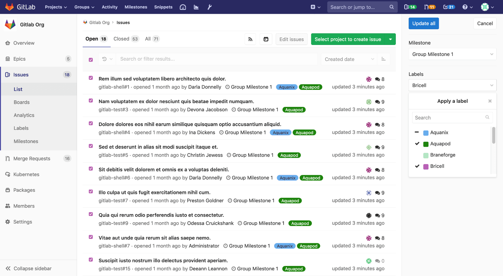

# Bulk editing issue and merge request milestones **(PREMIUM)**

> - [Introduced](https://gitlab.com/gitlab-org/gitlab-ee/issues/7249) for issues in
  [GitLab Premium](https://about.gitlab.com/pricing/) 12.1.
> - [Introduced](https://gitlab.com/gitlab-org/gitlab-ee/issues/12719) for merge
  requests in GitLab [GitLab Premium](https://about.gitlab.com/pricing/) 12.2.

> NOTE: **Note:**
>
> - A permission level of `Reporter` or higher is required in order to manage issues.
> - A permission level of `Developer` or higher is required in order to manage merge requests.

Milestones can be updated simultaneously across multiple issues or merge requests by using the bulk editing feature.

To bulk update group issue or merge request milestones:

1. Navigate to the issues or merge requests list.
1. Click the **Edit issues** or **Edit merge requests** button.
    - This will open a sidebar on the right-hand side of your screen where an editable field
  for milestones will be displayed.
    - Checkboxes will also appear beside each issue or merge request.
1. Check the checkbox beside each issue to be edited.
1. Select the desired milestone from the sidebar.
1. Click **Update all**.
