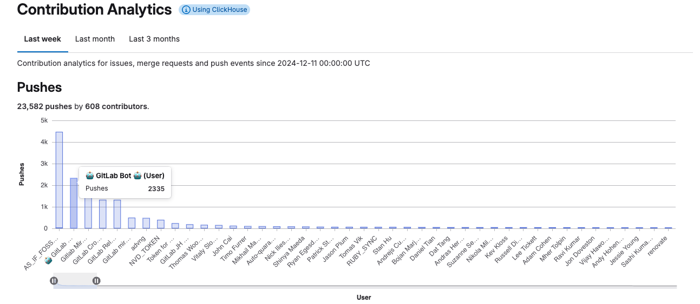

# Contribution analytics

DETAILS:
**Tier:** Premium, Ultimate
**Offering:** GitLab.com, GitLab Self-Managed, GitLab Dedicated

Contribution analytics provide an overview of the
[contribution events](../../profile/contributions_calendar.md#user-contribution-events) made by your group's members.

Contribution analytics provides an overview of the contribution events made by the group's members, offering valuable insights into team activity and individual performance.
This report includes visualizations like bar charts and a detailed table that breaks down contribution types (such as push events, issues, and merge requests) by group member.

Use contribution analytics data visualizations for:

- Workload balancing: Analyze your group's contributions over a period of time, and identify group members who are high performers or may benefit from additional support.
- Team collaboration: Evaluate the balance of contributions, such as code pushes versus reviews or approvals, to ensure collaborative development practices.
- Training opportunities: Identify areas where team members may benefit from mentorship or training, such as low merge request approval or issue resolution rates.
- Retrospective evaluation: Incorporate contribution analytics into retrospectives to assess how effectively the team met objectives and where adjustments may be needed.

## View contribution analytics

To view contribution analytics:

1. On the left sidebar, select **Search or go to** and find your group.
1. Select **Analyze > Contribution analytics**.

Three bar charts and a table illustrate the number of contributions made by each group member:

- Push events
- Created, merged, and closed merge requests
- Created and closed issues

To retrieve metrics for user contributions, you can also use the [GraphQL API](../../../api/graphql/reference/_index.md#groupcontributions).

### View a member's contributions

You can view the number of events associated with a specific group member.

To do this, hover over the bar with the member's name.

### Zoom in on a chart

You can zoom in on a bar chart to display only a subset of group members.

To do this, select the sliders (**{status-paused}**) below the chart and slide them along the axis.

### Sort contributions

Contributions per group member are also displayed in tabular format.
The table columns include the members' names and the number of contributions for different events.

To sort the table by a column, select the column header or the chevron (**{chevron-lg-down}**
for descending order, **{chevron-lg-up}** for ascending order).

## Change the time period

You can display contribution analytics over different time periods:

- Last week (default)
- Last month
- Last three months

To change the time period of the contribution analytics, select one of the three tabs
under **Contribution Analytics**.

The selected time period applies to all charts and the table.

## Contribution analytics with ClickHouse

On GitLab.com, contribution analytics run through the ClickHouse Cloud cluster.
On GitLab Self-Managed, when you configure the ClickHouse integration, the ClickHouse `events` table is automatically populated from the PostgreSQL `events` table. This process might take some time for large installations. After the table is fully synchronized, new events become available in ClickHouse with a delay of about three minutes.

For more information, see:

- [ClickHouse integration guidelines](../../../integration/clickhouse.md)
- [ClickHouse usage at GitLab](https://handbook.gitlab.com/handbook/engineering/architecture/design-documents/clickhouse_usage/)

<!-- ## Troubleshooting

Include any troubleshooting steps that you can foresee. If you know beforehand what issues
one might have when setting this up, or when something is changed, or on upgrading, it's
important to describe those, too. Think of things that may go wrong and include them here.
This is important to minimize requests for support, and to avoid doc comments with
questions that you know someone might ask.

Each scenario can be a third-level heading, for example `### Getting error message X`.
If you have none to add when creating a doc, leave this section in place
but commented out to help encourage others to add to it in the future. -->
