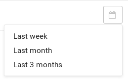
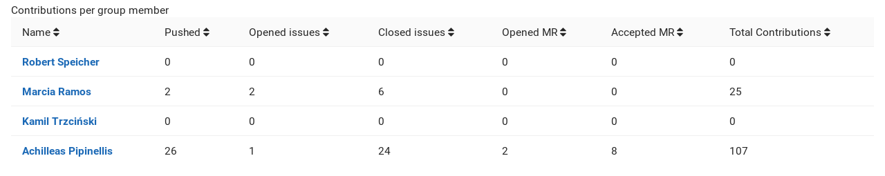

# Contribution Analytics **(PREMIUM)**

> [Introduced](https://gitlab.com/gitlab-org/gitlab/-/issues/3090) in GitLab 12.2 for subgroups.

With Contribution Analytics you can get an overview of the [contribution actions](../../../api/events.md#action-types) in your
group.

To view the Contribution Analytics, go to your group and select **Analytics > Contribution**.

## Use cases

- Analyze your team's contributions over a period of time, and offer a bonus for the top
  contributors.
- Identify opportunities for improvement with group members who may benefit from additional
  support.

## Using Contribution Analytics

There are three main bar graphs that illustrate the number of contributions per group
member for the following:

- Push events
- Merge requests
- Closed issues

Hover over each bar to display the number of events for a specific group member.

## Changing the period time

You can choose from the following three periods:

- Last week (default)
- Last month
- Last three months

Select the desired period from the calendar dropdown.

## Sorting by different factors

Contributions per group member are also presented in tabular format. Click a column header to sort the table by that column:

- Member name
- Number of pushed events
- Number of opened issues
- Number of closed issues
- Number of opened MRs
- Number of merged MRs
- Number of closed MRs
- Number of total contributions

<!-- ## Troubleshooting

Include any troubleshooting steps that you can foresee. If you know beforehand what issues
one might have when setting this up, or when something is changed, or on upgrading, it's
important to describe those, too. Think of things that may go wrong and include them here.
This is important to minimize requests for support, and to avoid doc comments with
questions that you know someone might ask.

Each scenario can be a third-level heading, e.g. `### Getting error message X`.
If you have none to add when creating a doc, leave this section in place
but commented out to help encourage others to add to it in the future. -->
