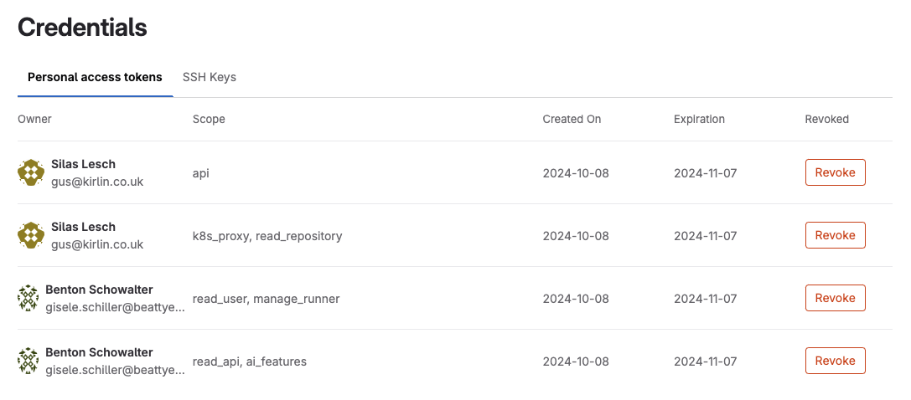
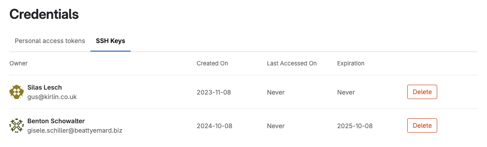

DETAILS:
**Tier:** Ultimate
**Offering:** GitLab.com

> - [Introduced](https://gitlab.com/gitlab-org/gitlab/-/issues/297441) on GitLab.com in GitLab 17.5.

As a GitLab.com top-level group owner, you are responsible for the overall security of your groups and projects.
To assist, GitLab provides an inventory of all the credentials that can be used to access your groups and projects.

This page describes how to manage the credentials inventory for GitLab.com. To manage credentials on GitLab Self-Managed, see [Credentials inventory for GitLab Self-Managed](../../administration/credentials_inventory.md).

In the credentials inventory, you can view:

- For [enterprise users](../enterprise_user/_index.md):
  - Personal access tokens (PATs).
  - SSH keys.

You can also:

- [Revoke a personal access token](#revoke-a-users-personal-access-token).
- [Delete a user's SSH key](#delete-a-users-ssh-key).
- View the following information about access tokens:
  - Who they belong to.
  - Their access scope.
  - Their usage pattern.
  - When they:
    - Expire.
    - Were revoked.

## Revoke a user's personal access token

You can revoke an enterprise user's personal access token.

1. On the left sidebar, select **Secure**.
1. Select **Credentials**.
1. By the personal access token, select **Revoke**.

If a **Revoke** option is not available, the token might already be revoked or have expired, or have an expiration date set.

| Token state | **Revoke** option displayed? | Comments                                                                   |
|-------------|------------------------------|----------------------------------------------------------------------------|
| Active      | Yes                          | Allows administrators to revoke the PAT, such as for a compromised account |
| Expired     | No                           | Not applicable; token is already expired                                   |
| Revoked     | No                           | Not applicable; token is already revoked                                   |

When a PAT is revoked from the credentials inventory, the instance notifies the user by email.

## Delete a user's SSH key

1. On the left sidebar, select **Secure**.
1. Select **Credentials**.
1. Select the **SSH Keys** tab.
1. By the SSH key, select **Delete**.

The instance notifies the user.

## Revoke a project or group access token

Credentials inventory on GitLab.com does not support viewing or revoking project or group access tokens.
[Issue 498333](https://gitlab.com/gitlab-org/gitlab/-/issues/498333) proposes to add this feature.
