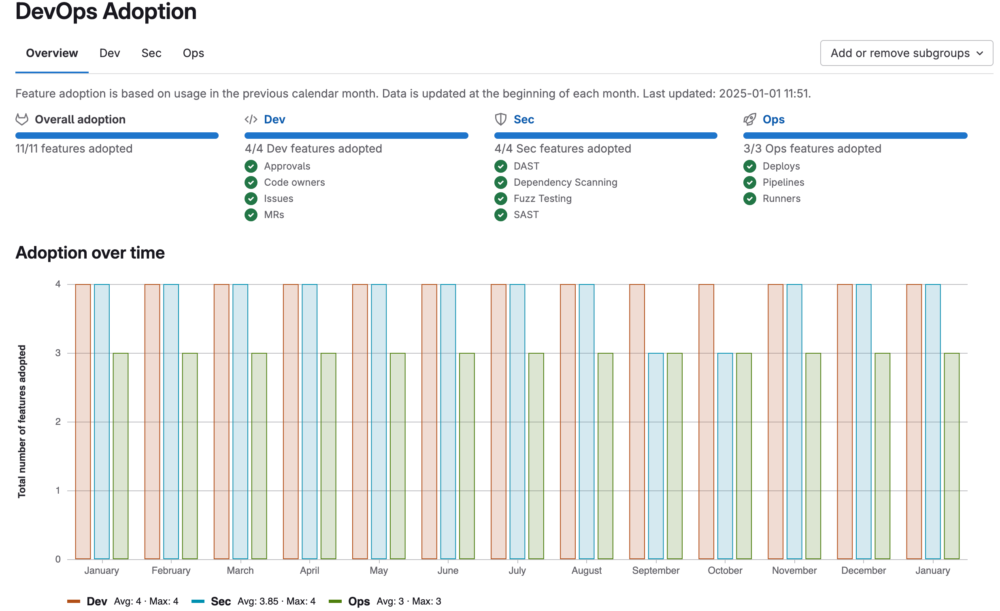

DETAILS:
**Tier:** Ultimate
**Offering:** GitLab.com, GitLab Self-Managed, GitLab Dedicated

> - [Added](https://gitlab.com/gitlab-org/gitlab/-/issues/367093) to the [Registration Features Program](../../../administration/settings/usage_statistics.md#registration-features-program) in GitLab 16.6.

DevOps adoption shows you how groups in your organization adopt and use GitLab features.
This information is available for groups and [instances](../../../administration/analytics/dev_ops_reports.md).

Use DevOps adoption for groups to:

- Identify subgroups that are lagging in their adoption of GitLab features, so you can guide them on
  their DevOps journey.
- Find subgroups that have adopted certain features, and provide guidance to other subgroups on
  how to use those features.
- Verify if you are getting the return on investment that you expected from GitLab.

## Feature adoption

DevOps adoption shows feature adoption for development, security, and operations.

| Category    | Feature |
|-------------|---------|
| Development | Approvals Code owners Issues Merge requests |
| Security    | DAST Dependency Scanning Fuzz Testing SAST |
| Operations  | Deployments Pipelines Runners |

A feature shows as **adopted** when a group or subgroup has used the feature in a project in the last full calendar month.
For example, if an issue was created in a project in a group, the group has adopted issues in that time.

The **Overview** tab illustrates the:

- Total number of features adopted.
- Features adopted in each category.
- Number of features adopted in each category by month in the **Adoption over time** bar chart.
The chart shows only data from the date you enabled DevOps adoption for the group.
- Number of features adopted in each category by subgroup in the **Adoption by subgroup** table.

The **Dev**, **Sec**, and **Ops** tabs illustrate the features adopted in development, security, and operations by subgroup.

The DevOps adoption report excludes:

- Dormant projects. The number of projects that use a feature is not considered. Having many dormant projects doesn't lower the adoption.
- New GitLab features. Adoption is the total number of features adopted, not the percent of features.

## Data processing

A weekly task processes data for DevOps adoption.
This task is disabled until you access DevOps adoption for a group for the first time.

The data processing task updates the data on the first day of each month.
If the monthly update fails, the task tries daily until it succeeds.

DevOps adoption data may take up to a minute to appear while GitLab processes the group's data.

## View DevOps adoption for groups

Prerequisites:

- You must have at least the Reporter role for the group.

To view DevOps adoption:

1. On the left sidebar, select **Search or go to** and find your group.
1. Select **Analyze > DevOps adoption**.
1. To view the features adopted by category in a month, hover over a bar.

## Add a subgroup to DevOps adoption

Prerequisites:

- You must have at least the Reporter role for the group.

To add a subgroup to the DevOps adoption report:

1. On the left sidebar, select **Search or go to** and find your group.
1. Select **Analyze > DevOps adoption**.
1. From the **Add or remove subgroups** dropdown list, select the subgroup you want to add.

## Remove a subgroup from DevOps adoption

Prerequisites:

- You must have at least the Reporter role for the group.

To remove a subgroup from the DevOps adoption report:

1. On the left sidebar, select **Search or go to** and find your group.
1. Select **Analyze > DevOps adoption**.
1. Either:

- From the **Add or remove subgroups** dropdown list, clear the subgroup you want to remove.
- From the **Adoption by subgroup** table, in the row of the group you want to remove, select
**Remove Group from the table** (**{remove}**).
