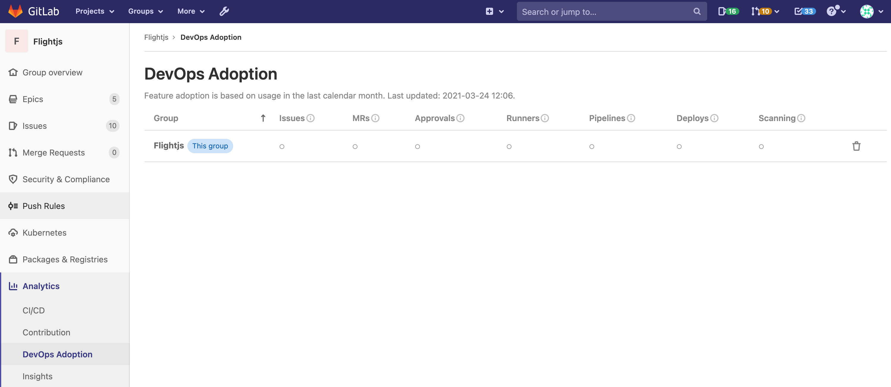

# Group DevOps Adoption **(ULTIMATE)**

> - [Introduced](https://gitlab.com/gitlab-org/gitlab/-/issues/321083) in GitLab 13.11 as a [Beta feature](https://about.gitlab.com/handbook/product/gitlab-the-product/#beta).
> - [Deployed behind a feature flag](../../../user/feature_flags.md), disabled by default.
> - [Enabled by default](https://gitlab.com/gitlab-org/gitlab/-/issues/323159) in GitLab 13.12.
> - Enabled on GitLab.com.
> - For GitLab self-managed instances, GitLab administrators can opt to [disable it](#enable-or-disable-group-devops-adoption). **(ULTIMATE SELF)**

This in-development feature might not be available for your use. There can be
[risks when enabling features still in development](../../feature_flags.md#risks-when-enabling-features-still-in-development).
Refer to this feature's version history for more details.

Prerequisites:

- A minimum of [Reporter access](../../permissions.md) to the group.

To access Group DevOps Adoption, go to your group and select **Analytics > DevOps Adoption**.

Group DevOps Adoption shows you how individual groups and sub-groups within your organization use the following features:

- Approvals
- Deployments
- Issues
- Merge Requests
- Pipelines
- Runners
- Scans

When managing groups in the UI, you can manage your sub-groups with the **Add/Remove sub-groups**
button, in the top right hand section of your Groups pages.

With DevOps Adoption you can:

- Verify whether you are getting the return on investment that you expected from GitLab.
- Identify specific sub-groups that are lagging in their adoption of GitLab so you can help them along in their DevOps journey.
- Find the sub-groups that have adopted certain features and can provide guidance to other sub-groups on how to use those features.



## Enable data processing

Group DevOps Adoption relies on data that has been gathered by a weekly data processing task.
This task is disabled by default.

To begin using Group DevOps Adoption, access the feature for the first time. GitLab automatically
enables the data processing for that group. The group data doesn't appear immediately, because
GitLab requires around a minute to process it.

## What is displayed

DevOps Adoption displays feature adoption data for the given group
and any added sub-groups for the current calendar month.
Each group appears as a separate row in the table.
For each row, a feature is considered "adopted" if it has been used in a project in the given group
during the time period (including projects in any sub-groups of the given group).

You should expect adoption to be lower at the beginning of the month,
before you have had an opportunity to use all the features listed in the table.

In the future [we plan to implement](https://gitlab.com/gitlab-org/gitlab/-/issues/329708)
a rolling 30-day perspective instead.

## When is a feature considered adopted

A feature is considered "adopted" if it has been used anywhere in the group in the specified time.
For example, if an issue was created in one project in a group, the group is considered to have
"adopted" issues in that time.

## No penalties for common adoption patterns

DevOps Adoption is designed not to penalize for any circumstances or practices that are common in DevOps.
Following this guideline, GitLab doesn't penalize for:

1. Having dormant projects. It's common for groups to have a mix of active and dormant projects,
   so we should not consider adoption to be low if there are relatively many dormant projects.
   This means we should not measure adoption by how many projects in the group have used a feature,
   only by whether a feature was used anywhere in the group.
1. GitLab adding new features over time. It's common for group feature usage to be consistent
   over time, so we should not consider adoption to have decreased if GitLab adds features.
   This means we should not measure adoption by percentages, only total counts.

## Add a sub-group

DevOps Adoption can also display data for sub-groups within the given group,
to show you differences in adoption across the group.
To add a sub-group to your Group DevOps Adoption report:

1. Select **Add/remove sub-groups**.
1. Select the sub-group you want to add and select **Save changes**.

The sub-group data might not appear immediately, because GitLab requires around a minute to collect
the data.

Please note that the sub-group data might not appear immediately,
because GitLab requires a few moments to collect the data.
Generally the data will be visible in less than one minute.

## Enable or disable Group DevOps Adoption **(ULTIMATE SELF)**

Group DevOps Adoption is under development and not ready for production use. It is
deployed behind a feature flag that is **enabled by default**.
[GitLab administrators with access to the GitLab Rails console](../../../administration/feature_flags.md)
can disable it.

To disable it:

```ruby
Feature.disable(:group_devops_adoption)
```

To re-enable it:

```ruby
Feature.enable(:group_devops_adoption)
```
