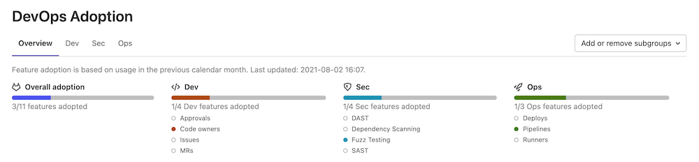

# Group DevOps Adoption

DETAILS:
**Tier:** Ultimate
**Offering:** GitLab.com, Self-managed, GitLab Dedicated

> - [Introduced](https://gitlab.com/gitlab-org/gitlab/-/issues/321083) in GitLab 13.11 as a [Beta feature](../../../policy/experiment-beta-support.md#beta).
> - [Feature flag removed](https://gitlab.com/gitlab-org/gitlab/-/issues/333556) in GitLab 14.1.
> - The Overview tab [introduced](https://gitlab.com/gitlab-org/gitlab/-/issues/330401) in GitLab 14.1.
> - DAST and SAST metrics [added](https://gitlab.com/gitlab-org/gitlab/-/issues/328033) in GitLab 14.1.
> - Fuzz Testing metrics [added](https://gitlab.com/gitlab-org/gitlab/-/issues/330398) in GitLab 14.2.
> - Dependency Scanning metrics [added](https://gitlab.com/gitlab-org/gitlab/-/issues/328034) in GitLab 14.2.
> - Multi-select [added](https://gitlab.com/gitlab-org/gitlab/-/issues/333586) in GitLab 14.2.
> - Overview table [added](https://gitlab.com/gitlab-org/gitlab/-/issues/335638) in GitLab 14.3.
> - Adoption over time chart [added](https://gitlab.com/gitlab-org/gitlab/-/issues/337561) in GitLab 14.4.

DevOps Adoption shows you how groups in your organization adopt and use the most essential features of GitLab.

You can use Group DevOps Adoption to:

- Identify specific subgroups that are lagging in their adoption of GitLab features, so you can guide them on
  their DevOps journey.
- Find subgroups that have adopted certain features, and provide guidance to other subgroups on
  how to use those features.
- Verify if you are getting the return on investment that you expected from GitLab.

## View DevOps Adoption

Prerequisites:

- You must have at least the Reporter role for the group.

To view DevOps Adoption:

1. On the left sidebar, select **Search or go to** and find your group.
1. Select **Analyze > DevOps adoption**

## DevOps Adoption categories

DevOps Adoption shows feature adoption for development, security, and operations.

| Category    | Feature |
|-------------|---------|
| Development | Approvals Code owners Issues Merge requests |
| Security    | DAST Dependency Scanning Fuzz Testing SAST |
| Operations  | Deployments Pipelines Runners |

## Feature adoption

DevOps Adoption shows feature adoption data for groups and subgroups for the previous calendar month.

A feature shows as **adopted** when a group has used the feature in a project during the time period.
This includes projects in any subgroups of the group. For example, if an issue was created in a project in a group, the group has adopted issues in that time.

### Exceptions to feature adoption data

When GitLab measures DevOps Adoption, some common DevOps information is not included:

- Dormant projects. It doesn't matter how many projects in the group use a feature. Even if you have many dormant projects, it doesn't lower the adoption.
- New GitLab features. Adoption is the total number of features adopted, not the percent of features.

## When DevOps Adoption data is gathered

A weekly task processes data for DevOps Adoption. This task is disabled until you access
DevOps Adoption for a group for the first time.

The data processing task updates the data on the first day of each month. If the monthly update
fails, the task tries daily until it succeeds.

DevOps Adoption data may take up to a minute to appear while GitLab processes the group's data.

## View feature adoption over time

The **Adoption over time** chart shows the total number of adopted features from the previous
twelve months. The chart only shows data from when you enabled DevOps Adoption for the group.

To view feature adoption over time:

1. On the left sidebar, select **Search or go to** and find your group.
1. Select **Analyze > DevOps adoption**.
1. Select the **Overview** tab.

Tooltips display information about the features tracked for individual months.

## Add or remove a subgroup

To add or remove a subgroup from the DevOps Adoption report:

1. Select **Add or remove subgroups**.
1. Select the subgroup you want to add or remove and select **Save changes**.

It may take up to a minute for subgroup data to appear while GitLab collects the data.
