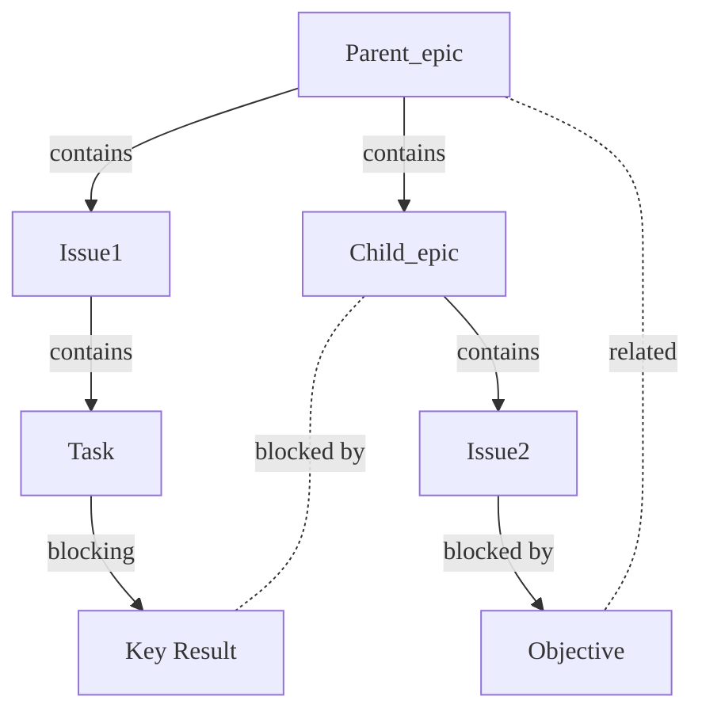



- Tier: Premium, Ultimate
- Offering: GitLab.com, GitLab Self-Managed, GitLab Dedicated



Epics in GitLab coordinate and track large initiatives by organizing work items into a work hierarchy.
Epics make complex projects manageable. They:

- Break down large features into smaller deliverables that add incremental value.
- Track the progress of related work items with scheduled start and end dates.
- Organize discussions and decisions about feature scope and requirements.
- Create hierarchical structures that connect tasks to strategic goals.
- Build visual roadmaps to monitor progress toward objectives.

Teams use epics to coordinate across multiple iterations and track progress toward long-term goals.

In the Ultimate tier, [nested epics](manage_epics.md#multi-level-child-epics) provide additional
structure through work hierarchies that align with agile frameworks.
Break down complex projects into more manageable child epics, which can further contain their own
sets of issues and tasks.
This nested structure helps maintain clarity and ensures all aspects of a project are covered without
losing sight of the overarching goals.

  See the video: <a href="https://www.youtube.com/watch?v=c0EwYYUZppw">GitLab Epics - Setting up your Organization with GitLab</a>.

<figure class="video-container">
  <iframe src="https://www.youtube-nocookie.com/embed/c0EwYYUZppw" frameborder="0" allowfullscreen> </iframe>
</figure>
<!-- Video published on 2023-10-30 -->

## Relationships between epics and other items

The possible relationships between epics and other items are:

- An epic is the parent of one or more issues.
- An epic is the parent of one or more [child epics](manage_epics.md#multi-level-child-epics). Ultimate only.
- An epic is [linked](linked_epics.md) to one or more task, objective, or key result.

Example set of relationships:

### Child issues from different group hierarchies

You can add issues from a different group hierarchy to an epic.
To do it, paste the issue URL when
[adding an existing issue](manage_epics.md#add-an-existing-issue-to-an-epic).

## Roadmap in epics



- Tier: Ultimate
- Offering: GitLab.com, GitLab Self-Managed, GitLab Dedicated



On the **Child items** section header, select **More actions** () **> View on a roadmap**.

A roadmap filtered for the parent epic opens.

## Epics as work items



- [Introduced](https://gitlab.com/groups/gitlab-org/-/epics/9290) in GitLab 17.2 [with a flag](../../../administration/feature_flags/_index.md) named `work_item_epics`. Disabled by default. Introduced in [beta](../../../policy/development_stages_support.md#beta).
- [Enabled on GitLab.com](https://gitlab.com/gitlab-org/gitlab/-/issues/470685) in GitLab 17.6.
- [Enabled by default on GitLab Self-Managed and GitLab Dedicated](https://gitlab.com/gitlab-org/gitlab/-/issues/468310) in GitLab 17.7.
- [Generally available](https://gitlab.com/gitlab-org/gitlab/-/issues/468310) in GitLab 18.1. Feature flag `work_item_epics` removed.



We have changed how epics look by migrating them to a unified framework for work items to better
meet the product needs of our Agile Planning offering.

For more information, see [epic 9290](https://gitlab.com/groups/gitlab-org/-/epics/9290) and the
following blog posts:

- [First look: The new Agile planning experience in GitLab](https://about.gitlab.com/blog/2024/06/18/first-look-the-new-agile-planning-experience-in-gitlab/) (June 2024)
- [Unveiling a new epic experience for improved Agile planning](https://about.gitlab.com/blog/2024/07/03/unveiling-a-new-epic-experience-for-improved-agile-planning/) (July 2024)

If you run into any issues while trying out this change, you can use the
[feedback issue](https://gitlab.com/gitlab-org/gitlab/-/issues/494462) to provide more details.

## Work item Markdown reference



- [Introduced](https://gitlab.com/gitlab-org/gitlab/-/issues/352861) in GitLab 18.1 [with a flag](../../../administration/feature_flags/_index.md) named `extensible_reference_filters`. Disabled by default.
- [Generally available](https://gitlab.com/gitlab-org/gitlab/-/merge_requests/197052) in GitLab 18.2. Feature flag `extensible_reference_filters` removed.



You can reference work items in GitLab Flavored Markdown fields with `[work_item:123]`.
For more information, see [GitLab-specific references](../../markdown.md#gitlab-specific-references).

## Related topics

- [Manage epics](manage_epics.md) and multi-level child epics.
- Link [related epics](linked_epics.md) based on a type of relationship.
- Create workflows with [epic boards](epic_boards.md).
- [Turn on notifications](../../profile/notifications.md) for about epic events.
- [Add an emoji reaction](../../emoji_reactions.md) to an epic or its comments.
- Collaborate on an epic by posting comments in a [thread](../../discussions/_index.md).
- Use [health status](manage_epics.md#health-status) to track your progress.
- [Create epic templates](../../project/description_templates.md#create-a-description-template) to standardize epic descriptions.
