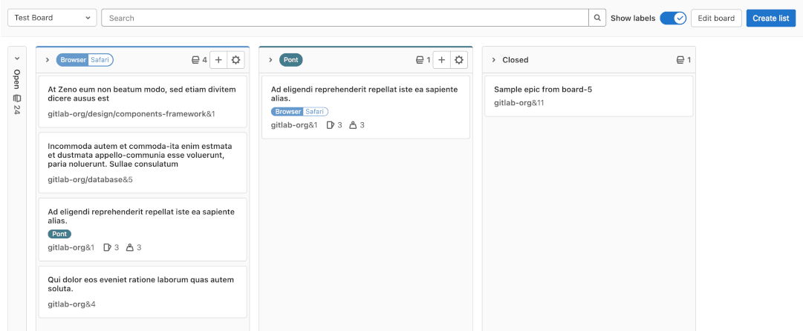
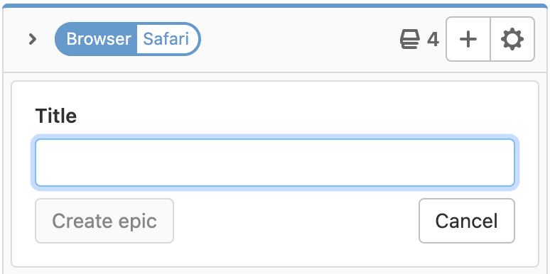

# Epic Boards **(PREMIUM)**

> - [Introduced](https://gitlab.com/groups/gitlab-org/-/epics/5067) in GitLab 13.10.
> - [Feature flag removed](https://gitlab.com/gitlab-org/gitlab/-/issues/290039) in GitLab 14.1.

Epic boards build on the existing [epic tracking functionality](index.md) and
[labels](../../project/labels.md). Your epics appear as cards in vertical lists, organized by their assigned
labels.

To view an epic board:

1. On the top bar, select **Menu > Groups** and find your group.
1. On the left sidebar, select **Epics > Boards**.

## Create an epic board

Prerequisites:

- You must have at least the [Reporter role](../../permissions.md#group-members-permissions) for a group.

To create a new epic board:

1. On the top bar, select **Menu > Groups** and find your group.
1. On the left sidebar, select **Epics > Boards**.
1. In the upper left corner, select the dropdown with the current board name.
1. Select **Create new board**.
1. Enter the new board's title.
1. Optional. To hide the Open or Closed lists, clear the **Show the Open list** and
   **Show the Closed list** checkboxes.
1. Optional. Set board scope:
   1. Next to **Scope**, select **Expand**.
   1. Next to **Labels**, select **Edit** and select the labels to use as board scope.
1. Select **Create board**.

Now you can [add some lists](#create-a-new-list).
To change these options later, [edit the board](#edit-the-scope-of-an-epic-board).

## Delete an epic board

> [Introduced](https://gitlab.com/groups/gitlab-org/-/epics/5079) in GitLab 14.0.

Prerequisites:

- You must have at least the [Reporter role](../../permissions.md#group-members-permissions) for a group.
- A minimum of two boards present in a group.

To delete the active epic board:

1. Select the dropdown with the current board name in the upper left corner of the Epic Boards page.
1. Select **Delete board**.
1. Select **Delete**.

## Actions you can take on an epic board

- [Create a new list](#create-a-new-list).
- [Remove an existing list](#remove-a-list).
- [Filter epics](#filter-epics).
- Create workflows, like when using [issue boards](../../project/issue_board.md#create-workflows).
- [Move epics and lists](#move-epics-and-lists).
- Change epic labels (by dragging an epic between lists).
- Close an epic (by dragging it to the **Closed** list).
- [Edit the scope of a board](#edit-the-scope-of-an-epic-board).

### Create a new list

Prerequisites:

- You must have at least the [Reporter role](../../permissions.md#group-members-permissions) for a group.

To create a new list:

1. On the top bar, select **Menu > Groups** and find your group.
1. On the left sidebar, select **Epics > Boards**.
1. In the upper-right corner, select **Create list**.
1. In the **New list** column expand the **Select a label** dropdown and select the label to use as
   list scope.
1. Select **Add to board**.

### Remove a list

Removing a list doesn't have any effect on epics and labels, as it's just the
list view that's removed. You can always create it again later if you need.

Prerequisites:

- You must have at least the [Reporter role](../../permissions.md#group-members-permissions) for a group.

To remove a list from an epic board:

1. On the top of the list you want to remove, select the **List settings** icon (**{settings}**).
   The list settings sidebar opens on the right.
1. Select **Remove list**. A confirmation dialog appears.
1. Select **OK**.

## Create an epic from an epic board

> [Introduced](https://gitlab.com/gitlab-org/gitlab/-/issues/233568) in GitLab 14.0.

Prerequisites:

- You must have at least the [Reporter role](../../permissions.md#group-members-permissions) for a group.
- You must have [created a list](#create-a-new-list) first.

To create an epic from a list in epic board:

1. On the top of a list, select the **New epic** (**{plus}**) icon.
1. Enter the new epic's title.
1. Select **Create epic**.

### Filter epics

> [Introduced](https://gitlab.com/groups/gitlab-org/-/epics/5079) in GitLab 14.0.

Use the filters on top of your epic board to show only
the results you want. It's similar to the filtering used in the epic list,
as the metadata from the epics and labels is re-used in the epic board.

You can filter by the following:

- Author
- Label

### View count of issues and weight in an epic

> [Introduced](https://gitlab.com/gitlab-org/gitlab/-/issues/331330) in GitLab 14.1.

Epics on an epic board show a summary of their issues and weight.
To see the number of open and closed issues and the completed and incomplete weight,
hover over the issues icon **{issues}** or weight icon **{weight}**.

### Move epics and lists

> [Introduced](https://gitlab.com/groups/gitlab-org/-/epics/5079) in GitLab 14.0.

You can move epics and lists by dragging them.

Prerequisites:

- You must have at least the [Reporter role](../../permissions.md#group-members-permissions) for a group.

To move an epic, select the epic card and drag it to another position in its current list or
into another list. Learn about possible effects in [Dragging epics between lists](#dragging-epics-between-lists).

To move a list, select its top bar, and drag it horizontally.
You can't move the **Open** and **Closed** lists, but you can hide them when editing an epic board.

#### Dragging epics between lists

When you drag epics between lists, the result is different depending on the source list
and the target list.

|                       | To Open        | To Closed  | To label B list                |
| --------------------- | -------------- | ---------- | ------------------------------ |
| **From Open**         | -              | Close epic | Add label B                    |
| **From Closed**       | Reopen epic    | -          | Reopen epic and add label B    |
| **From label A list** | Remove label A | Close epic | Remove label A and add label B |

### Edit the scope of an epic board

Prerequisites:

- You must have at least the [Reporter role](../../permissions.md#group-members-permissions) for a group.

To edit the scope of an epic board:

1. In the upper-right corner, select **Edit board**.
1. Optional:
   - Edit the board's title.
   - Show or hide the Open and Closed columns.
   - Select other labels as the board's scope.
1. Select **Save changes**.
