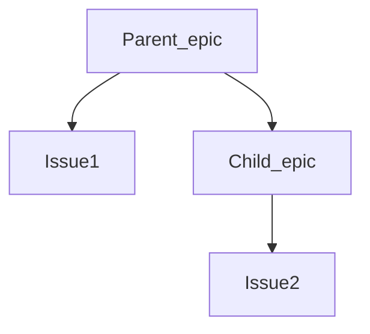

# Epics

DETAILS:
**Tier:** Premium, Ultimate
**Offering:** GitLab.com, Self-managed, GitLab Dedicated

When [issues](../../project/issues/index.md) share a theme across projects and
milestones, you can manage them by using epics.

You can also create child epics and assign start and end dates, which creates
a visual roadmap for you to view progress.

Use epics:

- When your team is working on a large feature that involves multiple discussions
  in different issues in different projects in a [group](../index.md).
- To track when the work for the group of issues is targeted to begin and end.
- To discuss and collaborate on feature ideas and scope at a high level.

  See the video: <a href="https://www.youtube.com/watch?v=c0EwYYUZppw">GitLab Epics - Setting up your Organization with GitLab</a>.

<figure class="video-container">
  <iframe src="https://www.youtube-nocookie.com/embed/c0EwYYUZppw" frameborder="0" allowfullscreen> </iframe>
</figure>

## Relationships between epics and issues

The possible relationships between epics and issues are:

- An epic is the parent of one or more issues.
- An epic is the parent of one or more [child epics](manage_epics.md#multi-level-child-epics). Ultimate only.

Also, read more about possible [planning hierarchies](../planning_hierarchy/index.md).

### Child issues from different group hierarchies

> - [Introduced](https://gitlab.com/gitlab-org/gitlab/-/issues/371081) in GitLab 15.5 [with a flag](../../../administration/feature_flags.md) named `epic_issues_from_different_hierarchies`. Disabled by default.
> - [Enabled on GitLab.com](https://gitlab.com/gitlab-org/gitlab/-/issues/373304) in GitLab 15.5.
> - Feature flag `epic_issues_from_different_hierarchies` removed in GitLab 15.6.

You can add issues from a different group hierarchy to an epic.
To do it, paste the issue URL when
[adding an existing issue](manage_epics.md#add-an-existing-issue-to-an-epic).

## Roadmap in epics

DETAILS:
**Tier:** Ultimate
**Offering:** GitLab.com, Self-managed, GitLab Dedicated

If your epic contains one or more [child epics](manage_epics.md#multi-level-child-epics) that
have a start or due date, a visual
[roadmap](../roadmap/index.md) of the child epics is listed under the parent epic.

## Related topics

- [Manage epics](manage_epics.md) and multi-level child epics.
- Link [related epics](linked_epics.md) based on a type of relationship.
- Create workflows with [epic boards](epic_boards.md).
- [Turn on notifications](../../profile/notifications.md) for about epic events.
- [Add an emoji reaction](../../emoji_reactions.md) to an epic or its comments.
- Collaborate on an epic by posting comments in a [thread](../../discussions/index.md).
- Use [health status](../../project/issues/managing_issues.md#health-status) to track your progress.

<!-- ## Troubleshooting

Include any troubleshooting steps that you can foresee. If you know beforehand what issues
one might have when setting this up, or when something is changed, or on upgrading, it's
important to describe those, too. Think of things that may go wrong and include them here.
This is important to minimize requests for support, and to avoid doc comments with
questions that you know someone might ask.

Each scenario can be a third-level heading, for example `### Getting error message X`.
If you have none to add when creating a doc, leave this section in place
but commented out to help encourage others to add to it in the future. -->
