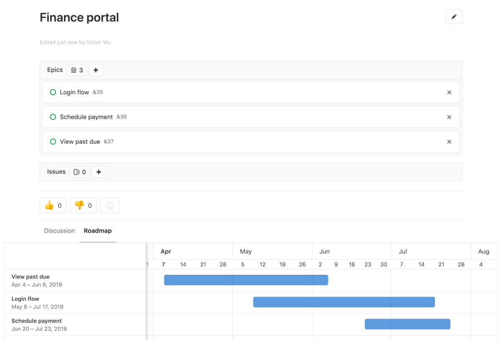

# Epics **(ULTIMATE)**

> Introduced in [GitLab Ultimate][ee] 10.2.

Epics let you manage your portfolio of projects more efficiently and with less
effort by tracking groups of issues that share a theme, across projects and
milestones.

## Use cases

- Suppose your team is working on a large feature that involves multiple discussions throughout different issues created in distinct projects within a [Group](../index.md). With Epics, you can track all the related activities that together contribute to that single feature.
- Track when the work for the group of issues is targeted to begin, and when it is targeted to end.
- Discuss and collaborate on feature ideas and scope at a high-level.

## Creating an epic

A paginated list of epics is available in each group from where you can create
a new epic. The list of epics includes also epics from all subgroups of the
selected group. From your group page:

1. Go to **Epics**
1. Click the **New epic** button at the top right
1. Enter a descriptive title and hit **Create epic**

Once created, you will be taken to the view for that newly-created epic where
you can change its title, description, start date, and due date.

## Adding an issue to an epic

An epic contains a list of issues and an issue can be associated with at most
one epic. When on an epic, you can add its associated issues:

1. Click the plus icon (<kbd>+</kbd>) under the epic description.
1. Paste the link of the issue (you can hit <kbd>Spacebar</kbd> to add more than
   one issues at a time).
1. Click **Add**.

Any issue belonging to a project in the epic's group or any of the epic's
subgroups are eligible to be added. To remove an issue from an epic, click
on the <kbd>x</kbd> button in the epic's issue list.

NOTE: **Note:**
When you add an issue or an epic to an epic that's already associated with another epic,
the issue or the epic is automatically removed from the previous epic.

## Multi-level child epics

> [Introduced](https://gitlab.com/gitlab-org/gitlab-ee/issues/8333) in GitLab Ultimate 11.7.

Much like adding issues to an epic, an epic can have multiple child epics with
the maximum depth being 5. To add a child epic:

1. Click the plus icon (<kbd>+</kbd>) under the epic description.
1. Paste the link of the epic.
1. Click **Add**.

Any epic that belongs to a group or subgroup of the parent epic's group is
eligible to be added. To remove a child epic from a parent epic,
click on the <kbd>x</kbd> button in the parent epic's epic list.

## Start date and due date

For each of the dates in the sidebar of an epic, you can choose to either:

- Enter a fixed value.
- Inherit a dynamic value called "From milestones".

If you select "From milestones" for the start date, GitLab will automatically set the
date to be earliest start date across all milestones that are currently assigned
to the issues that are attached to the epic. Similarly, if you select "From milestones"
for the due date, GitLab will set it to be the latest due date across all
milestones that are currently assigned to those issues.

These are dynamic dates in that if milestones are re-assigned to the issues, if the
milestone dates change, or if issues are added or removed from the epic, then
the re-calculation will happen immediately to set a new dynamic date.

## Roadmap in epics

> [Introduced](https://gitlab.com/gitlab-org/gitlab-ee/issues/7327) in [GitLab Ultimate](https://about.gitlab.com/pricing) 11.10.

If your epic contains one or more [child epics](#multi-level-child-epics) which
have a [start or due date](#start-date-and-due-date), then you can see a
[roadmap](../roadmap/index.md) view of the child epics under the parent epic itself.

## Reordering issues and child epics

Drag and drop to reorder issues and child epics. New issues and child epics added to an epic appear at the top of the list.

## Updating epics

### Using bulk editing

To apply labels across multiple epics:

1. Go to the Epics list.
1. Click **Edit epics**.
    - Checkboxes will appear beside each epic.
    - A sidebar on the right-hand side will appear, with an editable field for labels.
1. Check the checkbox beside each epic to be edited.
1. Select the desired labels.
1. Click **Update all**.

## Deleting an epic

NOTE: **Note:**
To delete an epic, you need to be an [Owner][permissions] of a group/subgroup.

When inside a single epic view, click the **Delete** button to delete the epic.
A modal will pop-up to confirm your action.

Deleting an epic releases all existing issues from their associated epic in the
system.

## Closing and reopening epics

### Using buttons

Whenever you decide that there is no longer need for that epic,
close the epic using the close button:

You can always reopen it using the reopen button.

### Using quick actions

You can close or reopen an epic using [Quick actions](../../project/quick_actions.md)

## Navigating to an epic from an issue

If an issue belongs to an epic, you can navigate to the containing epic with the
link in the issue sidebar.

## Promoting an issue to an epic

> [Introduced](https://gitlab.com/gitlab-org/gitlab-ee/issues/3777) in [GitLab Ultimate](https://about.gitlab.com/pricing/) 11.6.

If you have [permissions](../../permissions.md) to close an issue and create an
epic in the parent group, you can promote an issue to an epic with the `/promote`
[quick action](../../project/quick_actions.md#quick-actions-for-epics-ultimate).
Only issues from projects that are in groups can be promoted.

When the quick action is executed:

- An epic is created in the same group as the project of the issue.
- Subscribers of the issue are notified that the epic was created.

The following issue metadata will be copied to the epic:

- Title, description, activity/comment thread.
- Upvotes/downvotes.
- Participants.
- Group labels that the issue already has.

## Searching for an epic from epics list page

> Introduced in [GitLab Ultimate][ee] 10.5.

You can search for an epic from the list of epics using filtered search bar (similar to
that of Issues and Merge requests) based on following parameters:

- Title or description
- Author name / username
- Labels

To search, go to the list of epics and click on the field **Search or filter results...**.
It will display a dropdown menu, from which you can add an author. You can also enter plain
text to search by epic title or description. When done, press <kbd>Enter</kbd> on your
keyboard to filter the list.

You can also sort epics list by:

- **Created date**
- **Last updated**
- **Start date**
- **Due date**

Each option contains a button that can toggle the order between **ascending** and **descending**. The sort option and order will be persisted to be used wherever epics are browsed including the [roadmap](../roadmap/index.md).

## Permissions

If you have access to view an epic and have access to view an issue already
added to that epic, then you can view the issue in the epic issue list.

If you have access to edit an epic and have access to edit an issue, then you
can add the issue to or remove it from the epic.

Note that for a given group, the visibility of all projects must be the same as
the group, or less restrictive. That means if you have access to a group's epic,
then you already have access to its projects' issues.

You may also consult the [group permissions table][permissions].

[ee]: https://about.gitlab.com/pricing/
[permissions]: ../../permissions.md#group-members-permissions

## Thread

- Comments: collaborate on that epic by posting comments in its thread.
  These text fields also fully support
  [GitLab Flavored Markdown](../../markdown.md#gitlab-flavored-markdown-gfm).

## Comment, or start a thread

Once you wrote your comment, you can either:

- Click "Comment" and your comment will be published.
- Click "Start thread": start a thread within that epic's discussion to discuss specific points.

## Award emoji

- You can [award an emoji](../../award_emojis.md) to that epic or its comments.

## Notifications

- [Receive notifications](../../../workflow/notifications.md) for epic events.

<!-- ## Troubleshooting

Include any troubleshooting steps that you can foresee. If you know beforehand what issues
one might have when setting this up, or when something is changed, or on upgrading, it's
important to describe those, too. Think of things that may go wrong and include them here.
This is important to minimize requests for support, and to avoid doc comments with
questions that you know someone might ask.

Each scenario can be a third-level heading, e.g. `### Getting error message X`.
If you have none to add when creating a doc, leave this section in place
but commented out to help encourage others to add to it in the future. -->
