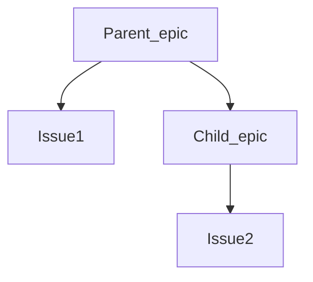
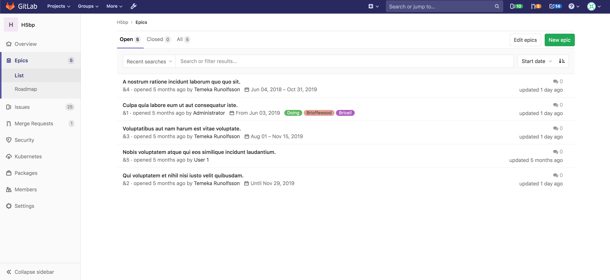
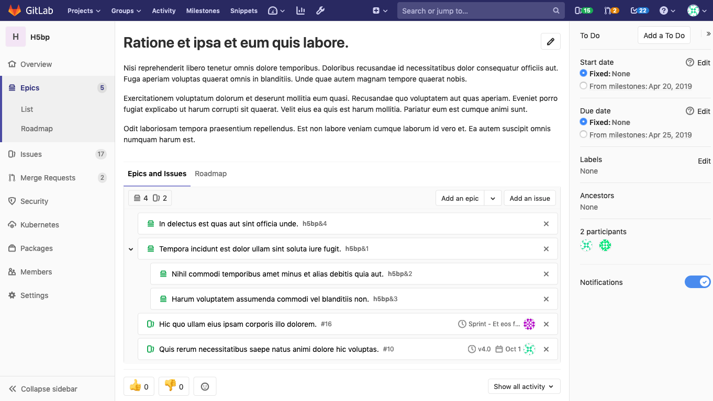
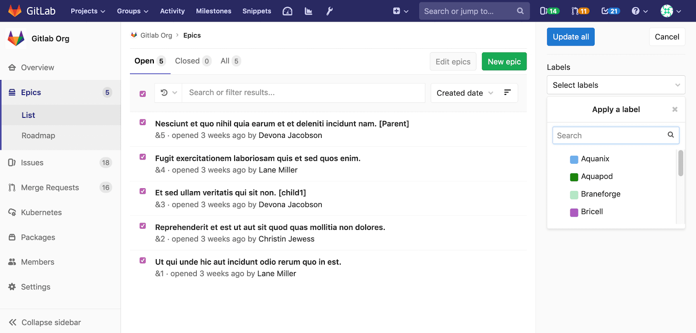

# Epics **(PREMIUM)**

> - Introduced in [GitLab Ultimate](https://about.gitlab.com/pricing/) 10.2.
> - Single-level Epics [were moved](https://gitlab.com/gitlab-org/gitlab/issues/37081) to [GitLab Premium](https://about.gitlab.com/pricing/) in 12.8.

Epics let you manage your portfolio of projects more efficiently and with less
effort by tracking groups of issues that share a theme, across projects and
milestones.

## Relationships between epics and issues

The possible relationships between epics and issues are:

- An epic is the parent of one or more issues.
- An epic is the parent of one or more child epics. For details see [Multi-level child epics](#multi-level-child-epics-ultimate). **(ULTIMATE)**

## Use cases

- Suppose your team is working on a large feature that involves multiple discussions throughout different issues created in distinct projects within a [Group](../index.md). With Epics, you can track all the related activities that together contribute to that single feature.
- Track when the work for the group of issues is targeted to begin, and when it's targeted to end.
- Discuss and collaborate on feature ideas and scope at a high level.

## Creating an epic

A paginated list of epics is available in each group from where you can create
a new epic. The list of epics includes also epics from all subgroups of the
selected group. From your group page:

1. Go to **Epics**.
1. Click **New epic**.
1. Enter a descriptive title and click **Create epic**.

You will be taken to the new epic where can edit the following details:

- Title
- Description
- Start date
- Due date
- Labels

An epic's page contains the following tabs:

- **Epics and Issues**: epics and issues added to this epic. Child epics, and their issues, are shown in a tree view.
  - Click on the <kbd>></kbd> beside a parent epic to reveal the child epics and issues.
  - Hover over the total counts to see a breakdown of open and closed items.
- **Roadmap**: a roadmap view of child epics which have start and due dates.

## Adding an issue to an epic

You can add an existing issue to an epic, or, from an epic's page, create a new issue that's automatically added to the epic.

### Adding an existing issue to an epic

Existing issues that belong to a project in an epic's group, or any of the epic's
subgroups, are eligible to be added to the epic. Newly added issues appear at the top of the list of issues in the **Epics and Issues** tab.

An epic contains a list of issues and an issue can be associated with at most
one epic. When you add an issue that's already linked to an epic,
the issue is automatically unlinked from its current parent.

To add an issue to an epic:

1. Click **Add an issue**.
1. Identify the issue to be added, using either of the following methods:
   - Paste the link of the issue.
   - Search for the desired issue by entering part of the issue's title, then selecting the desired match. ([From GitLab 12.5](https://gitlab.com/gitlab-org/gitlab/issues/9126))

   If there are multiple issues to be added, press <kbd>Spacebar</kbd> and repeat this step.
1. Click **Add**.

### Creating an issue from an epic

> [Introduced](https://gitlab.com/gitlab-org/gitlab/issues/5419) in GitLab 12.7.

Creating an issue from an epic enables you to maintain focus on the broader context of the epic while dividing work into smaller parts.

To create an issue from an epic:

1. On the epic's page, under **Epics and Issues**, click the arrow next to **Add an issue** and select **Create new issue**.
1. Under **Title**, enter the title for the new issue.
1. From the **Project** dropdown, select the project in which the issue should be created.
1. Click **Create issue**.

To remove an issue from an epic:

1. Click on the <kbd>x</kbd> button in the epic's issue list.
1. Click **Remove** in the **Remove issue** warning message.

## Issue health status in Epic tree **(ULTIMATE)**

> [Introduced](https://gitlab.com/gitlab-org/gitlab/-/issues/199184) in [GitLab Ultimate](https://about.gitlab.com/pricing/) 12.10.

You can report on and quickly respond to the health of individual issues and epics by setting a
red, amber, or green [health status on an issue](../../project/issues/index.md#health-status-ultimate),
which will appear on your Epic tree.

### Disable Issue health status in Epic tree

This feature comes with a feature flag enabled by default. For steps to disable it, see
[Disable issue health status](../../project/issues/index.md#disable-issue-health-status).

## Multi-level child epics **(ULTIMATE)**

> [Introduced](https://gitlab.com/gitlab-org/gitlab/issues/8333) in GitLab Ultimate 11.7.

Any epic that belongs to a group, or subgroup of the parent epic's group, is
eligible to be added. New child epics appear at the top of the list of epics in the **Epics and Issues** tab.

When you add an epic that's already linked to a parent epic, the link to its current parent is removed.

An epic can have multiple child epics with
the maximum depth being 5.

To add a child epic to an epic:

1. Click **Add an epic**.
1. Identify the epic to be added, using either of the following methods:
   - Paste the link of the epic.
   - Search for the desired issue by entering part of the epic's title, then selecting the desired match. ([From GitLab 12.5](https://gitlab.com/gitlab-org/gitlab/issues/9126))

   If there are multiple epics to be added, press <kbd>Spacebar</kbd> and repeat this step.
1. Click **Add**.

To remove a child epic from a parent epic:

1. Click on the <kbd>x</kbd> button in the parent epic's list of epics.
1. Click **Remove** in the **Remove epic** warning message.

## Start date and due date

To set a **Start date** and **Due date** for an epic, select one of the following:

- **Fixed**: Enter a fixed value.
- **From milestones**: Inherit a dynamic value from the milestones currently assigned to the epic's issues.
  Note that GitLab 12.5 replaced this option with **Inherited**.
- **Inherited**: Inherit a dynamic value from the epic's issues, child epics, and milestones ([Introduced](https://gitlab.com/gitlab-org/gitlab/issues/7332) in GitLab 12.5 to replace **From milestones**).

### From milestones

> [Replaced](https://gitlab.com/gitlab-org/gitlab/issues/7332) in GitLab 12.5 by **Inherited**.

If you select **From milestones** for the start date, GitLab will automatically set the date to be earliest
start date across all milestones that are currently assigned to the issues that are added to the epic.
Similarly, if you select **From milestones** for the due date, GitLab will set it to be the latest due date across
all milestones that are currently assigned to those issues.

These are dynamic dates which are recalculated if any of the following occur:

- Milestones are re-assigned to the issues.
- Milestone dates change.
- Issues are added or removed from the epic.

### Inherited

> [Introduced](https://gitlab.com/gitlab-org/gitlab/issues/7332) in GitLab 12.5 to replace **From milestones**.

If you select:

- **Inherited** for the start date, GitLab will scan all child epics and issues assigned to the epic,
  and will set the start date to match the earliest found start date or milestone.
- **Inherited** for the due date, GitLab will set the due date to match the latest due date or
  milestone found among its child epics and issues.

These are dynamic dates and recalculated if any of the following occur:

- A child epic's dates change.
- Milestones are reassigned to an issue.
- A milestone's dates change.
- Issues are added to, or removed from, the epic.

Because the epic's dates can inherit dates from its children, the start date and due date propagate from the bottom to the top.
If the start date of a child epic on the lowest level changes, that becomes the earliest possible start date for its parent epic,
then the parent epic's start date will reflect the change and this will propagate upwards to the top epic.

## Roadmap in epics

> [Introduced](https://gitlab.com/gitlab-org/gitlab/issues/7327) in [GitLab Ultimate](https://about.gitlab.com/pricing/) 11.10.

If your epic contains one or more [child epics](#multi-level-child-epics-ultimate) which
have a [start or due date](#start-date-and-due-date), a
[roadmap](../roadmap/index.md) view of the child epics is listed under the parent epic.

---

## Reordering issues and child epics

> [Introduced](https://gitlab.com/gitlab-org/gitlab/issues/9367) in GitLab 12.5.

New issues and child epics are added to the top of their respective lists in the **Epics and Issues**
tab. You can reorder the list of issues and the list of child epics. Issues and child epics cannot
be intermingled.

To reorder issues assigned to an epic:

1. Go to the **Epics and Issues** tab.
1. Drag and drop issues into the desired order.

To reorder child epics assigned to an epic:

1. Go to the **Epics and Issues** tab.
1. Drag and drop epics into the desired order.

## Moving issues and child epics between epics

> [Introduced](https://gitlab.com/gitlab-org/gitlab/-/issues/33039) in GitLab 13.0.

New issues and child epics are added to the top of their respective lists in the **Epics and Issues**
tab. You can move issues and child epics from one epic to another. Issues and child epics cannot
be intermingled.

To move an issue to another epic:

1. Go to the **Epics and Issues** tab.
1. Drag and drop issues into the desired parent epic.

To move child epics to another epic:

1. Go to the **Epics and Issues** tab.
1. Drag and drop epics into the desired parent epic.

## Updating epics

### Using bulk editing

To apply labels across multiple epics:

1. Go to the Epics list.
1. Click **Edit epics**.
    - Checkboxes will appear beside each epic.
    - A sidebar on the right-hand side will appear, with an editable field for labels.
1. Check the checkbox beside each epic to be edited.
1. Select the desired labels.
1. Click **Update all**.

## Deleting an epic

NOTE: **Note:**
To delete an epic, you need to be an [Owner](../../permissions.md#group-members-permissions) of a group/subgroup.

When editing the description of an epic, click the **Delete** button to delete the epic.
A modal will pop-up to confirm your action.

Deleting an epic releases all existing issues from their associated epic in the
system.

## Closing and reopening epics

### Using buttons

Whenever you decide that there is no longer need for that epic,
close the epic using the close button:

You can always reopen it using the reopen button.

---

### Using quick actions

You can close or reopen an epic using [Quick actions](../../project/quick_actions.md)

## Navigating to an epic from an issue

If an issue belongs to an epic, you can navigate to the containing epic with the
link in the issue sidebar.

---

## Promoting an issue to an epic

> - [Introduced](https://gitlab.com/gitlab-org/gitlab/issues/3777) in [GitLab Ultimate](https://about.gitlab.com/pricing/) 11.6.
> - In [GitLab 12.8](https://gitlab.com/gitlab-org/gitlab/issues/37081), it was moved to the Premium tier.

If you have [permissions](../../permissions.md) to close an issue and create an
epic in the parent group, you can promote an issue to an epic with the `/promote`
[quick action](../../project/quick_actions.md#quick-actions-for-issues-merge-requests-and-epics).
Only issues from projects that are in groups can be promoted. When attempting to promote a confidential
issue, a warning will display. Promoting a confidential issue to an epic will make all information
related to the issue public as epics are public to group members.

When the quick action is executed:

- An epic is created in the same group as the project of the issue.
- Subscribers of the issue are notified that the epic was created.

The following issue metadata will be copied to the epic:

- Title, description, activity/comment thread.
- Upvotes/downvotes.
- Participants.
- Group labels that the issue already has.

## Searching for an epic from epics list page

> - Introduced in [GitLab Ultimate](https://about.gitlab.com/pricing/) 10.5.
> - In [GitLab 12.8](https://gitlab.com/gitlab-org/gitlab/issues/37081), it was moved to the Premium tier.

You can search for an epic from the list of epics using filtered search bar (similar to
that of Issues and Merge Requests) based on following parameters:

- Title or description
- Author name / username
- Labels

To search, go to the list of epics and click on the field **Search or filter results**.
It will display a dropdown menu, from which you can add an author. You can also enter plain
text to search by epic title or description. When done, press <kbd>Enter</kbd> on your
keyboard to filter the list.

You can also sort epics list by:

- Created date
- Last updated
- Start date
- Due date

Each option contains a button that can toggle the order between **Ascending** and **Descending**.
The sort option and order is saved and used wherever you browse epics, including the
[Roadmap](../roadmap/index.md).

---

## Permissions

If you have access to view an epic and have access to view an issue already
added to that epic, then you can view the issue in the epic issue list.

If you have access to edit an epic and have access to edit an issue, then you
can add the issue to or remove it from the epic.

Note that for a given group, the visibility of all projects must be the same as
the group, or less restrictive. That means if you have access to a group's epic,
then you already have access to its projects' issues.

You can also consult the [group permissions table](../../permissions.md#group-members-permissions).

## Thread

- Comments: collaborate on that epic by posting comments in its thread.
  These text fields also fully support
  [GitLab Flavored Markdown](../../markdown.md#gitlab-flavored-markdown-gfm).

## Comment or start a thread

Once you write your comment, you can either:

- Click **Comment**, and your comment will be published.
- Click **Start thread**, and you will start a thread within that epic's discussion.

## Award emoji

You can [award an emoji](../../award_emojis.md) to that epic or its comments.

## Notifications

You can [turn on notifications](../../profile/notifications.md) to be alerted about epic events.

<!-- ## Troubleshooting

Include any troubleshooting steps that you can foresee. If you know beforehand what issues
one might have when setting this up, or when something is changed, or on upgrading, it's
important to describe those, too. Think of things that may go wrong and include them here.
This is important to minimize requests for support, and to avoid doc comments with
questions that you know someone might ask.

Each scenario can be a third-level heading, e.g. `### Getting error message X`.
If you have none to add when creating a doc, leave this section in place
but commented out to help encourage others to add to it in the future. -->
