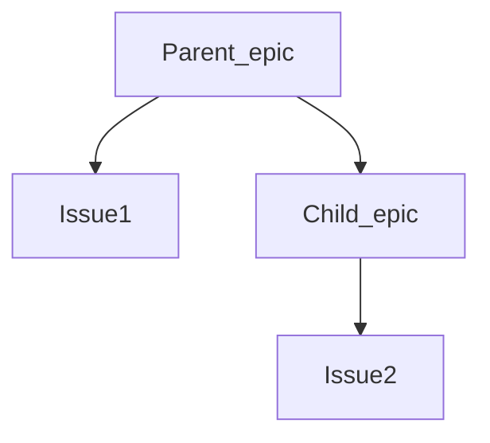

# Epics **(PREMIUM)**

> - Introduced in [GitLab Ultimate](https://about.gitlab.com/pricing/) 10.2.
> - Single-level Epics [were moved](https://gitlab.com/gitlab-org/gitlab/-/issues/37081) to [GitLab Premium](https://about.gitlab.com/pricing/) in 12.8.

Epics let you manage your portfolio of projects more efficiently by tracking groups of [issues](../../project/issues/index.md)
that share a theme across projects and milestones.

An epic's page contains the following tabs:

- **Epics and Issues**: epics and issues added to this epic. Child epics, and their issues, are
  shown in a tree view.
  - Click the chevron (**>**) next to a parent epic to reveal the child epics and issues.
  - Hover over the total counts to see a breakdown of open and closed items.

  NOTE: **Note:**
  The number provided here includes all epics associated with this project. The number includes epics for which users may not yet have permission.

- **Roadmap**: a roadmap view of child epics which have start and due dates.

## Use cases

- Suppose your team is working on a large feature that involves multiple discussions throughout different issues created in distinct projects within a [Group](../index.md). With Epics, you can track all the related activities that together contribute to that single feature.
- Track when the work for the group of issues is targeted to begin, and when it's targeted to end.
- Discuss and collaborate on feature ideas and scope at a high level.

## Manage epics

To learn what you can do with an epic, see [Manage epics](manage_epics.md). Possible actions include:

- [Create an epic](manage_epics.md#create-an-epic)
- [Edit an epic](manage_epics.md#edit-an-epic)
- [Bulk-edit epics](../bulk_editing/index.md#bulk-edit-epics)
- [Delete an epic](manage_epics.md#delete-an-epic)
- [Close an epic](manage_epics.md#close-an-epic)
- [Reopen a closed epic](manage_epics.md#reopen-a-closed-epic)
- [Go to an epic from an issue](manage_epics.md#go-to-an-epic-from-an-issue)
- [Search for an epic from epics list page](manage_epics.md#search-for-an-epic-from-epics-list-page)
- [Make an epic confidential](manage_epics.md#make-an-epic-confidential)
- [Manage issues assigned to an epic](manage_epics.md#manage-issues-assigned-to-an-epic)
- [Manage multi-level child epics **(ULTIMATE)**](manage_epics.md#manage-multi-level-child-epics)

## Relationships between epics and issues

The possible relationships between epics and issues are:

- An epic is the parent of one or more issues.
- An epic is the parent of one or more child epics. For details see [Multi-level child epics](#multi-level-child-epics). **(ULTIMATE)**

See [Manage issues assigned to an epic](manage_epics.md#manage-issues-assigned-to-an-epic) for steps
to:

- Add an issue to an epic
- Reorder issues
- Move an issue between epics
- Promote an issue to an epic

## Issue health status in Epic tree **(ULTIMATE)**

> - [Introduced](https://gitlab.com/gitlab-org/gitlab/-/issues/199184) in [GitLab Ultimate](https://about.gitlab.com/pricing/) 12.10.
> - The health status of a closed issue [is hidden](https://gitlab.com/gitlab-org/gitlab/-/issues/220867) in [GitLab Ultimate](https://about.gitlab.com/pricing/) 13.3 or later.

Report or respond to the health of issues and epics by setting a red, amber, or green [health status](../../project/issues/index.md#health-status), which then appears on your Epic tree.

### Disable Issue health status in Epic tree

This feature comes with a feature flag enabled by default. For steps to disable it, see
[Disable issue health status](../../project/issues/index.md#disable-issue-health-status).

## Multi-level child epics **(ULTIMATE)**

> [Introduced](https://gitlab.com/gitlab-org/gitlab/-/issues/8333) in GitLab Ultimate 11.7.

Any epic that belongs to a group, or subgroup of the parent epic's group, is eligible to be added.
New child epics appear at the top of the list of epics in the **Epics and Issues** tab.

When you add an epic that's already linked to a parent epic, the link to its current parent is removed.

An epic can have multiple child epics up to the maximum depth of five.

See [Manage multi-level child epics](manage_epics.md#manage-multi-level-child-epics) for
steps to create, move, reorder, or delete child epics.

## Start date and due date

To set a **Start date** and **Due date** for an epic, select one of the following:

- **Fixed**: Enter a fixed value.
- **From milestones**: Inherit a dynamic value from the milestones that are assigned to the epic's issues.
  Note that GitLab 12.5 replaced this option with **Inherited**.
- **Inherited**: Inherit a dynamic value from the epic's issues, child epics, and milestones ([Introduced](https://gitlab.com/gitlab-org/gitlab/-/issues/7332) in GitLab 12.5 to replace **From milestones**).

### From milestones

> [Replaced](https://gitlab.com/gitlab-org/gitlab/-/issues/7332) in GitLab 12.5 by **Inherited**.

If you select **From milestones** for the start date, GitLab automatically sets the date to be earliest
start date across all milestones that are assigned to the issues that belong to the epic.
If you select **From milestones** for the due date, GitLab sets the date to be the latest due date across
all milestones that are assigned to those issues.

These are dynamic dates which are recalculated if any of the following occur:

- Milestones are re-assigned to the issues.
- Milestone dates change.
- Issues are added or removed from the epic.

### Inherited

> [Introduced](https://gitlab.com/gitlab-org/gitlab/-/issues/7332) in GitLab 12.5 to replace **From milestones**.

If you select:

- **Inherited** for the start date, GitLab scans all child epics and issues assigned to the epic,
  and sets the start date to match the earliest found start date or milestone.
- **Inherited** for the due date, GitLab sets the due date to match the latest due date or
  milestone found among its child epics and issues.

These are dynamic dates and recalculated if any of the following occur:

- A child epic's dates change.
- Milestones are reassigned to an issue.
- A milestone's dates change.
- Issues are added to, or removed from, the epic.

Because the epic's dates can inherit dates from its children, the start date and due date propagate from the bottom to the top.
If the start date of a child epic on the lowest level changes, that becomes the earliest possible start date for its parent epic.
The parent epic's start date then reflects this change and propagates upwards to the top epic.

## Roadmap in epics

> [Introduced](https://gitlab.com/gitlab-org/gitlab/-/issues/7327) in [GitLab Ultimate](https://about.gitlab.com/pricing/) 11.10.

If your epic contains one or more [child epics](#multi-level-child-epics) which
have a [start or due date](#start-date-and-due-date), a
[roadmap](../roadmap/index.md) view of the child epics is listed under the parent epic.

## Permissions

If you have access to view an epic and an issue added to that epic, you can view the issue in the
epic's issue list.

If you have access to edit an epic and an issue added to that epic, you can add the issue to or
remove it from the epic.

Note that for a given group, the visibility of all projects must be the same as
the group, or less restrictive. That means if you have access to a group's epic,
then you already have access to its projects' issues.

You can also consult the [group permissions table](../../permissions.md#group-members-permissions).

## Thread

- Comments: collaborate on that epic by posting comments in its thread.
  These text fields also fully support
  [GitLab Flavored Markdown](../../markdown.md#gitlab-flavored-markdown-gfm).

## Comment or start a thread

Once you write your comment, you can either:

- Click **Comment** to publish your comment.
- Click **Start thread** to start a thread within that epic's discussion.

### Activity sort order

> [Introduced](https://gitlab.com/gitlab-org/gitlab/-/issues/214364) in [GitLab Premium](https://about.gitlab.com/pricing/) 13.2.

You can reverse the default order and interact with the activity feed sorted by most recent items
at the top. Your preference is saved via local storage and automatically applied to every issue
you view.

To change the activity sort order, click the **Oldest first** dropdown menu and select either oldest
or newest items to be shown first.

## Award emoji

You can [award an emoji](../../award_emojis.md) to that epic or its comments.

## Notifications

You can [turn on notifications](../../profile/notifications.md) to be alerted about epic events.

<!-- ## Troubleshooting

Include any troubleshooting steps that you can foresee. If you know beforehand what issues
one might have when setting this up, or when something is changed, or on upgrading, it's
important to describe those, too. Think of things that may go wrong and include them here.
This is important to minimize requests for support, and to avoid doc comments with
questions that you know someone might ask.

Each scenario can be a third-level heading, e.g. `### Getting error message X`.
If you have none to add when creating a doc, leave this section in place
but commented out to help encourage others to add to it in the future. -->
