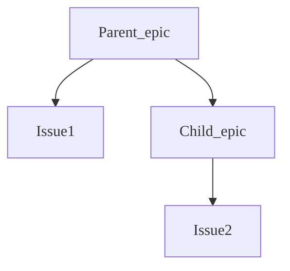

# Epics

DETAILS:
**Tier:** Premium, Ultimate
**Offering:** GitLab.com, Self-managed, GitLab Dedicated

An epic in GitLab represents a significant body of work that can be broken down into smaller,
manageable parts.
Epics help organize user stories and features into a high-level theme or goal, making them a flexible
tool for managing projects of all sizes.

Epics often span multiple iterations or a longer period of time, reaching their conclusion when the
defined goals are met.
Teams use epics to stay focused and aligned with their project timelines.

In the Ultimate tier, create hierarchical structures to align with various agile frameworks using
[nested epics](manage_epics.md#multi-level-child-epics).
Break down complex projects into more manageable child epics, which can further contain their own
sets of issues and tasks.
This nested structure helps maintain clarity and ensures all aspects of a project are covered without
losing sight of the overarching goals.

Use epics to:

- Break down large features into smaller deliverables that incrementally add user value.
- Track the progress of a group of related issues, specifying when the work is scheduled to start
  and end.
- Facilitate high-level discussions and collaboration on feature ideas and scope, ensuring alignment
  with the broader project objectives.
- Organize complex projects into a hierarchy of work with nested epics, providing a clear structure
- while connecting items to the larger goals of the project.
- Collect smaller issues (user stories) for detailed tracking and efficient task management.

By using epics effectively, teams can create visual roadmaps, monitor progress, and achieve their
goals in the set time frames, driving successful project outcomes.

  See the video: <a href="https://www.youtube.com/watch?v=c0EwYYUZppw">GitLab Epics - Setting up your Organization with GitLab</a>.

<figure class="video-container">
  <iframe src="https://www.youtube-nocookie.com/embed/c0EwYYUZppw" frameborder="0" allowfullscreen> </iframe>
</figure>

## Relationships between epics and issues

The possible relationships between epics and issues are:

- An epic is the parent of one or more issues.
- An epic is the parent of one or more [child epics](manage_epics.md#multi-level-child-epics). Ultimate only.

Also, read more about possible [planning hierarchies](../planning_hierarchy/index.md).

### Child issues from different group hierarchies

> - [Introduced](https://gitlab.com/gitlab-org/gitlab/-/issues/371081) in GitLab 15.5 [with a flag](../../../administration/feature_flags.md) named `epic_issues_from_different_hierarchies`. Disabled by default.
> - [Enabled on GitLab.com](https://gitlab.com/gitlab-org/gitlab/-/issues/373304) in GitLab 15.5.
> - Feature flag `epic_issues_from_different_hierarchies` removed in GitLab 15.6.

You can add issues from a different group hierarchy to an epic.
To do it, paste the issue URL when
[adding an existing issue](manage_epics.md#add-an-existing-issue-to-an-epic).

## Roadmap in epics

DETAILS:
**Tier:** Ultimate
**Offering:** GitLab.com, Self-managed, GitLab Dedicated

If your epic contains one or more [child epics](manage_epics.md#multi-level-child-epics) that
have a start or due date, a visual
[roadmap](../roadmap/index.md) of the child epics is listed under the parent epic.

<!-- When epics as work items are GA, the steps below should be the only ones here. -->

If your administrator [enabled the new look for epics](epic_work_items.md):

- On the Child issues and epics section header, select **More actions** (**{ellipsis_v}**) **> View on a roadmap**.

A roadmap filtered for the parent epic opens.

## Related topics

- [Manage epics](manage_epics.md) and multi-level child epics.
- Link [related epics](linked_epics.md) based on a type of relationship.
- Create workflows with [epic boards](epic_boards.md).
- [Turn on notifications](../../profile/notifications.md) for about epic events.
- [Add an emoji reaction](../../emoji_reactions.md) to an epic or its comments.
- Collaborate on an epic by posting comments in a [thread](../../discussions/index.md).
- Use [health status](../../project/issues/managing_issues.md#health-status) to track your progress.

<!-- ## Troubleshooting

Include any troubleshooting steps that you can foresee. If you know beforehand what issues
one might have when setting this up, or when something is changed, or on upgrading, it's
important to describe those, too. Think of things that may go wrong and include them here.
This is important to minimize requests for support, and to avoid doc comments with
questions that you know someone might ask.

Each scenario can be a third-level heading, for example `### Getting error message X`.
If you have none to add when creating a doc, leave this section in place
but commented out to help encourage others to add to it in the future. -->
