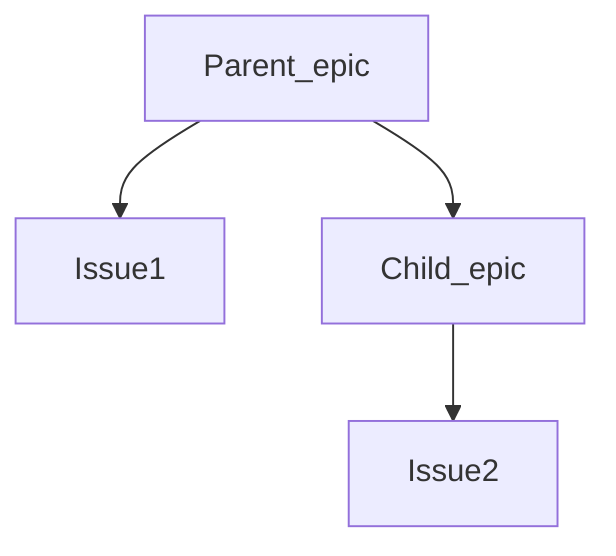
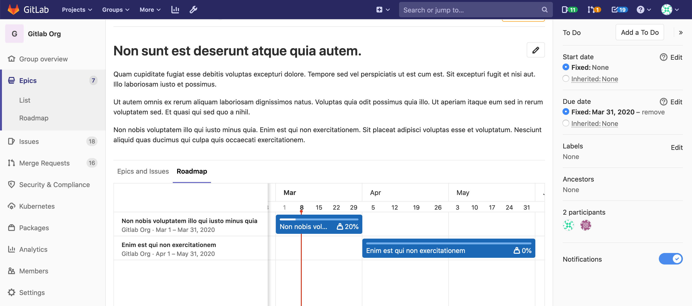

# Epics **(PREMIUM)**

> - Introduced in [GitLab Ultimate](https://about.gitlab.com/pricing/) 10.2.
> - Single-level epics [were moved](https://gitlab.com/gitlab-org/gitlab/-/issues/37081) to [GitLab Premium](https://about.gitlab.com/pricing/) in 12.8.

When [issues](../../project/issues/index.md) share a theme across projects and milestones,
you can manage them by using epics.

You can also create child epics, and assign start and end dates,
which creates a visual roadmap for you to view progress.

Use epics:

- When your team is working on a large feature that involves multiple discussions
  in different issues in different projects in a [group](../index.md).
- To track when the work for the group of issues is targeted to begin and end.
- To discuss and collaborate on feature ideas and scope at a high level.

## Relationships between epics and issues

The possible relationships between epics and issues are:

- An epic is the parent of one or more issues.
- An epic is the parent of one or more child epics. For details see [Multi-level child epics](manage_epics.md#multi-level-child-epics).

## Roadmap in epics **(ULTIMATE)**

> [Introduced](https://gitlab.com/gitlab-org/gitlab/-/issues/7327) in [GitLab Ultimate](https://about.gitlab.com/pricing/) 11.10.

If your epic contains one or more [child epics](manage_epics.md#multi-level-child-epics) that
have a start or due date, a visual
[roadmap](../roadmap/index.md) of the child epics is listed under the parent epic.

## Permissions

If you have access to view an epic and an issue added to that epic, you can view the issue in the
epic's issue list.

If you have access to edit an epic and an issue added to that epic, you can add the issue to or
remove it from the epic.

For a given group, the visibility of all projects must be the same as
the group, or less restrictive. That means if you have access to a group's epic,
then you already have access to its projects' issues.

You can also consult the [group permissions table](../../permissions.md#group-members-permissions).

## Related topics

- [Manage epics](manage_epics.md) and multi-level child epics.
- Create workflows with [Epic Boards](epic_boards.md).
- [Turn on notifications](../../profile/notifications.md) for about epic events.
- [Award an emoji](../../award_emojis.md) to an epic or its comments.
- Collaborate on an epic by posting comments in a [thread](../../discussions/index.md).
- Use [health status](../../project/issues/managing_issues.md#health-status) to track your progress.

<!-- ## Troubleshooting

Include any troubleshooting steps that you can foresee. If you know beforehand what issues
one might have when setting this up, or when something is changed, or on upgrading, it's
important to describe those, too. Think of things that may go wrong and include them here.
This is important to minimize requests for support, and to avoid doc comments with
questions that you know someone might ask.

Each scenario can be a third-level heading, e.g. `### Getting error message X`.
If you have none to add when creating a doc, leave this section in place
but commented out to help encourage others to add to it in the future. -->
