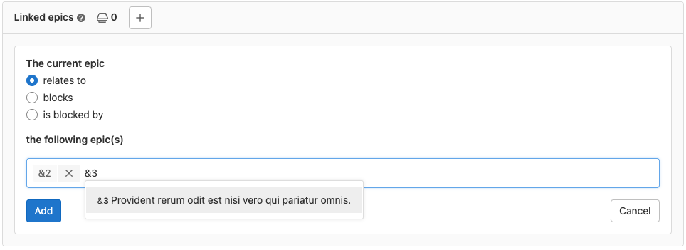
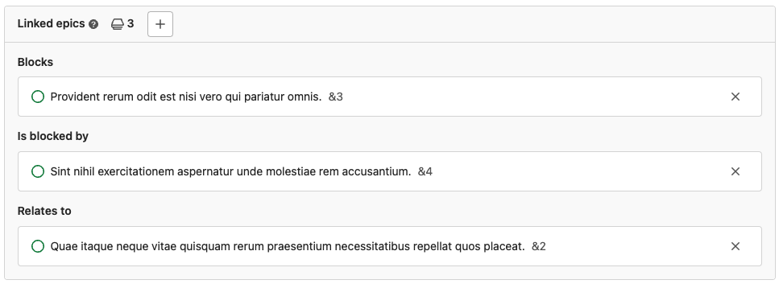
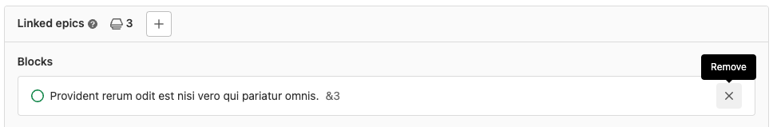

DETAILS:
**Tier:** Ultimate
**Offering:** GitLab.com, GitLab Self-Managed, GitLab Dedicated

Linked epics are a bi-directional relationship between any two epics and appear in a block below
the epic description. You can link epics in different groups.

The relationship only shows up in the UI if the user can see both epics.
When you try to close an epic that has open blockers, a warning is displayed.

To manage linked epics through our API, see [Linked epics API](../../../api/linked_epics.md).

## Ways to use linked epics

You can use linked epics to solve several planning and coordination challenges.
The following examples show how linked epics help teams work together more effectively.

### Cross-functional initiatives

Use linked epics to coordinate work between multiple teams and track interdependent deliverables.
When teams work together on a large initiative, each team can manage their own epic while maintaining
visibility into related work.

For example, when launching a new feature, development and marketing teams often work in parallel.
The development team tracks technical implementation in their epic, while the marketing team plans
promotional activities in a separate epic.

By linking these epics:

- Teams can track dependencies between technical and promotional work.
- Each team maintains autonomy while staying aligned on the broader initiative.
- Stakeholders get visibility into the full scope of the launch.
- Teams can identify and resolve blockers across organizational boundaries.

This coordination helps break down silos and ensures all aspects of the initiative stay in sync.

When you link epics across groups:

- Each team keeps their work in their own group.
- Teams can see related work without switching between groups.
- Status updates automatically flow between linked epics.

### Dependency management

Use linked epics to manage and track work dependencies.
When development can't begin until infrastructure changes are complete, linked epics help teams
manage these dependencies.

For example, when building a new feature, teams often need infrastructure updates
before development can start. The infrastructure team tracks their database migration work
in one epic, while the development team plans feature implementation in another epic.

By linking these epics:

- Teams can track when infrastructure work is ready for development.
- Development teams can better plan their sprint capacity.
- Product managers can identify potential workflow delays.
- Teams stay informed of progress without constant meetings.

This visibility helps teams complete work in the right sequence and avoid blocked tasks.

When you link epics to show dependencies:

- Infrastructure and development work stays connected.
- Teams know when they can start their work.
- Status updates flow automatically between epics.

### Higher-level planning

Use linked epics to connect short-term execution with long-term planning.
When managing a series of releases, you can organize high-level goals and track individual feature
deliverables.

For example, when planning multiple releases over several quarters, you can create separate epics
for each release.
Then link these release epics to a central roadmap epic that tracks the overall project.

By linking these epics:

- Teams can understand how their work fits into the larger strategy.
- Product managers can track progress across multiple releases.
- Teams stay focused on current work while seeing future plans.
- Stakeholders can monitor both granular and high-level progress.

This structure helps teams progress on current work while maintaining broader goals.

When you link epics for planning:

- Each release's progress is visible in the roadmap.
- Teams can see upcoming work early.
- Status updates roll up to the higher-level view.

## Add a linked epic

> - Minimum required role for the group [changed](https://gitlab.com/gitlab-org/gitlab/-/issues/381308) from Reporter to Guest in GitLab 15.8.

Prerequisites:

- You must have at least the Guest role for both groups.
- For GitLab SaaS: the epic that you're editing must be in a group on GitLab Ultimate.
  The epics you're linking can be in a group on a lower tier.

To link one epic to another:

1. In the **Linked epics** section of an epic,
   select the add linked epic button (**{plus}**).
1. Select the relationship between the two epics. Either:

   - **relates to**
   - **[blocks](#blocking-epics)**
   - **[is blocked by](#blocking-epics)**

1. To enter the linked epic, either:

   - Enter `&`, followed by the epic's number. For example, `&123`.
   - Enter `&`, followed by a word from the epic's title. For example, `&Deliver`.
   - Paste in the epic's full URL.

   

   Epics of the same group can be specified just by the reference number.
   Epics from a different group require additional information like the
   group name. For example:

   - The same group: `&44`
   - Different group: `group&44`

   Valid references are added to a temporary list that you can review.

1. Select **Add**.

The linked epics are then displayed on the epic grouped by relationship.

## Remove a linked epic

> - Minimum required role for the group [changed](https://gitlab.com/gitlab-org/gitlab/-/issues/381308) from Reporter to Guest in GitLab 15.8.

Prerequisites:

- You must have at least the Guest role for the epic's group.

To remove a linked epic:

- In the **Linked epics** section of an epic, next to each epic, select **Remove** (**{close}**).

The relationship is removed from both epics.

## Blocking epics

When you [add a linked epic](#add-a-linked-epic), you can show that it **blocks** or
**is blocked by** another epic.

If you try to close a blocked epic using the "Close epic" button, a confirmation message appears.

## When using the new look for epics

> - Linking epics to issues, tasks, and OKRs [introduced](https://gitlab.com/groups/gitlab-org/-/epics/9290) in GitLab 17.5. Your administrator must have [enabled the new look for epics](epic_work_items.md).

<!-- When epics as work items are GA, integrate this and below sections with the ones above. -->

If your administrator [enabled the new look for epics](epic_work_items.md), you can also link epics
and the following items:

- Issues
- Tasks
- Objectives
- Key results

Linked items appear in the **Linked items** section, under the **Child items** section on the epic.
You can link epics to work items in different groups.

The relationship only shows up in the UI if the user can see both items.
When you try to close an epic linked to an open blocker, a warning is displayed.

To manage linked epics through our API, see the
[Work Items API](https://handbook.gitlab.com/handbook/engineering/architecture/design-documents/work_items/).

### Add a linked item

Prerequisites:

- Your administrator must have [enabled the new look for epics](epic_work_items.md).
- You must have at least the Guest role for both groups or group and project.
- For GitLab SaaS: the epic that you're editing must be in a group on GitLab Ultimate.
  The item you're linking can be in a group on a lower tier.

To link an epic to another item:

1. In the **Linked items** section of an epic, select **Add**.
1. Select the relationship between the two items. Either:

   - **relates to**
   - **blocks**
   - **is blocked by**

1. To enter the linked item, either:

   - Enter `#`, followed by the item's number. For example, `#123`.
   - Enter `#`, followed by a word from the item's title. For example, `#Deliver`.
   - Paste in the item's full URL.

   Items of the same group can be specified just by the reference number.
   Items from a different group require additional information like the
   group name. For example:

   - The same group: `#44`
   - Different group: `group#44`

   Valid references are added to a temporary list that you can review.

1. Select **Add**.

The linked items are then displayed on the epic grouped by relationship.

### Remove a linked item

Prerequisites:

- Your administrator must have [enabled the new look for epics](epic_work_items.md).
- You must have at least the Guest role for the epic's group.

To remove a linked item:

- In the **Linked items** section of an epic, next to each item, select **Remove** (**{close}**).

The relationship is removed from both items.
