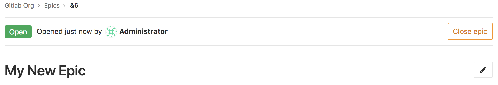
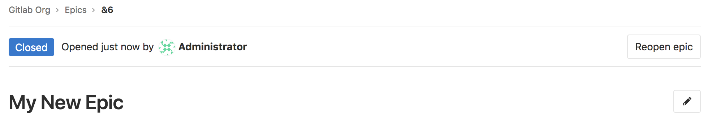
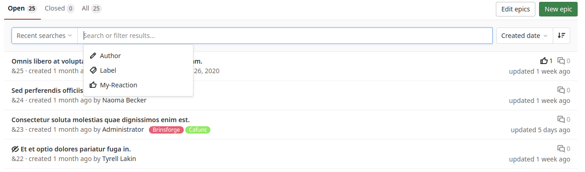
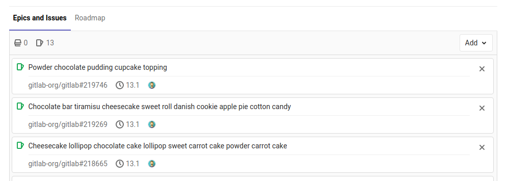

# Manage epics **(PREMIUM)**

This page collects instructions for all the things you can do with [epics](index.md) or in relation
to them.

## Create an epic

> - The New Epic form [introduced](https://gitlab.com/gitlab-org/gitlab/-/issues/211533) in [GitLab Premium](https://about.gitlab.com/pricing/) 13.2.
> - In [GitLab 13.7](https://gitlab.com/gitlab-org/gitlab/-/issues/229621) and later, the New Epic button on the Epics list opens the New Epic form.
> - In [GitLab 13.9](https://gitlab.com/gitlab-org/gitlab/-/merge_requests/45948) and later, you can create a new epic from an empty roadmap.

To create an epic in the group you're in:

1. Get to the New Epic form:
   - Go to your group and from the left sidebar select **Epics**. Then select **New epic**.
   - From an epic in your group, select **New epic**.
   - From anywhere, in the top menu, select **New...** (**{plus-square}**) **> New epic**.
   - In an empty [roadmap](../roadmap/index.md), select **New epic**.

1. Enter a title.
1. Optional. Enter a description.
1. Optional. To make the epic confidential, select the [Confidentiality checkbox](#make-an-epic-confidential).
1. Optional. Choose labels.
1. Optional. Select a start and due date, or [inherit](#start-and-due-date-inheritance) them.
1. Select **Create epic**.

The newly created epic opens.

### Start and due date inheritance

> [Introduced](https://gitlab.com/gitlab-org/gitlab/-/issues/7332) in GitLab 12.5 to replace **From milestones**.

If you select **Inherited**:

- For the **start date**: GitLab scans all child epics and issues assigned to the epic,
  and sets the start date to match the earliest found start date or milestone.
- For the **due date**: GitLab sets the due date to match the latest due date or
  milestone found among its child epics and issues.

These are dynamic dates and recalculated if any of the following occur:

- A child epic's dates change.
- Milestones are reassigned to an issue.
- A milestone's dates change.
- Issues are added to, or removed from, the epic.

Because the epic's dates can inherit dates from its children, the start date and due date propagate from the bottom to the top.
If the start date of a child epic on the lowest level changes, that becomes the earliest possible start date for its parent epic.
The parent epic's start date then reflects this change and propagates upwards to the top epic.

## Edit an epic

After you create an epic, you can edit the following details:

- Title
- Description
- Start date
- Due date
- Labels

To edit an epic's title or description:

1. Select the **Edit title and description** **{pencil}** button.
1. Make your changes.
1. Select **Save changes**.

To edit an epic's start date, due date, or labels:

1. Select **Edit** next to each section in the epic sidebar.
1. Select the dates or labels for your epic.

## Bulk edit epics

> [Introduced](https://gitlab.com/gitlab-org/gitlab/-/issues/7250) in [GitLab Premium](https://about.gitlab.com/pricing/) 12.2.

Users with permission level of [Reporter or higher](../../permissions.md) can manage epics.

When bulk editing epics in a group, you can edit their labels.

To update multiple epics at the same time:

1. In a group, go to **Epics > List**.
1. Click **Edit epics**. A sidebar on the right-hand side of your screen appears with editable fields.
1. Check the checkboxes next to each epic you want to edit.
1. Select the appropriate fields and their values from the sidebar.
1. Click **Update all**.

## Delete an epic

NOTE:
To delete an epic, you need to be an [Owner](../../permissions.md#group-members-permissions) of a group/subgroup.

When editing the description of an epic, select the **Delete** button to delete the epic.
A modal appears to confirm your action.

Deleting an epic releases all existing issues from their associated epic in the system.

WARNING:
If you delete an epic, all its child epics and their descendants are deleted as well. If needed, you can [remove child epics](#remove-a-child-epic-from-a-parent-epic) from the parent epic before you delete it.

## Close an epic

Whenever you decide that there is no longer need for that epic,
close the epic by:

- Selecting the **Close epic** button.

  

- Using a [quick action](../../project/quick_actions.md).

## Reopen a closed epic

You can reopen an epic that was closed by:

- Clicking the **Reopen epic** button.

  

- Using a [quick action](../../project/quick_actions.md).

## Go to an epic from an issue

If an issue belongs to an epic, you can navigate to the containing epic with the
link in the issue sidebar.

## Search for an epic from epics list page

> - Introduced in [GitLab Ultimate](https://about.gitlab.com/pricing/) 10.5.
> - [Moved](https://gitlab.com/gitlab-org/gitlab/-/issues/37081) to the [Premium](https://about.gitlab.com/pricing/) tier in GitLab 12.8.
> - Searching by the user's reaction emoji [introduced](https://gitlab.com/gitlab-org/gitlab/-/issues/325630) in GitLab 13.11.
> - Sorting by epic titles [introduced](https://gitlab.com/gitlab-org/gitlab/-/issues/331625) in GitLab 14.1.

You can search for an epic from the list of epics using filtered search bar (similar to
that of issues and merge requests) based on following parameters:

- Title or description
- Author name / username
- Labels
- Reaction emoji

To search, go to the list of epics and select the field **Search or filter results**.
It displays a dropdown menu, from which you can add an author. You can also enter plain
text to search by epic title or description. When done, press <kbd>Enter</kbd> on your
keyboard to filter the list.

You can also sort epics list by:

- Created date
- Last updated
- Start date
- Due date
- Title

Each option contains a button that can toggle the order between **Ascending** and **Descending**.
The sort option and order is saved and used wherever you browse epics, including the
[Roadmap](../roadmap/index.md).

## Change activity sort order

> [Introduced](https://gitlab.com/gitlab-org/gitlab/-/issues/214364) in [GitLab Premium](https://about.gitlab.com/pricing/) 13.2.

You can reverse the default order and interact with the activity feed sorted by most recent items
at the top. Your preference is saved via local storage and automatically applied to every epic and issue
you view.

To change the activity sort order, click the **Oldest first** dropdown menu and select either oldest
or newest items to be shown first.

## Make an epic confidential

> - [Introduced](https://gitlab.com/gitlab-org/gitlab/-/issues/213068) in [GitLab Premium](https://about.gitlab.com/pricing/) 13.0 behind a feature flag, disabled by default.
> - [Became enabled by default](https://gitlab.com/gitlab-org/gitlab/-/issues/224513) in [GitLab Premium](https://about.gitlab.com/pricing/) 13.2.
> - You can [use the Confidentiality option in the epic sidebar](https://gitlab.com/gitlab-org/gitlab/-/issues/197340) in GitLab [Premium](https://about.gitlab.com/pricing/) 13.3 and later.

If you're working on items that contain private information, you can make an epic confidential.

NOTE:
A confidential epic can only contain confidential issues and confidential child epics.

To make an epic confidential:

- **When creating an epic:** select the checkbox **Make this epic confidential**.
- **In an existing epic:** in the epic's sidebar, select **Edit** next to **Confidentiality** then
  select **Turn on**.

## Manage issues assigned to an epic

This section collects instructions for all the things you can do with [issues](../../project/issues/index.md)
in relation to epics.

### View count of issues in an epic

On the **Epics and Issues** tab, under each epic name, hover over the total counts.

The number indicates all epics associated with the project, including issues
you might not have permission to.

### Add a new issue to an epic

You can add an existing issue to an epic, or create a new issue that's
automatically added to the epic.

#### Add an existing issue to an epic

Existing issues that belong to a project in an epic's group, or any of the epic's
subgroups, are eligible to be added to the epic. Newly added issues appear at the top of the list of
issues in the **Epics and Issues** tab.

An epic contains a list of issues and an issue can be associated with at most one epic.
When you add a new issue that's already linked to an epic, the issue is automatically unlinked from its
current parent.

To add a new issue to an epic:

1. On the epic's page, under **Epics and Issues**, select the **Add** dropdown button.
1. Select **Add an existing issue**.
1. Identify the issue to be added, using either of the following methods:
   - Paste the link of the issue.
   - Search for the desired issue by entering part of the issue's title, then selecting the desired
     match (introduced in [GitLab 12.5](https://gitlab.com/gitlab-org/gitlab/-/issues/9126)).

   If there are multiple issues to be added, press <kbd>Space</kbd> and repeat this step.
1. Select **Add**.

#### Create an issue from an epic

> [Introduced](https://gitlab.com/gitlab-org/gitlab/-/issues/5419) in GitLab 12.7.

Creating an issue from an epic enables you to maintain focus on the broader context of the epic
while dividing work into smaller parts.

To create an issue from an epic:

1. On the epic's page, under **Epics and Issues**, select the **Add** dropdown button.
1. Select **Add a new issue**.
1. Under **Title**, enter the title for the new issue.
1. From the **Project** dropdown, select the project in which the issue should be created.
1. Select **Create issue**.

### Remove an issue from an epic

You can remove issues from an epic when you're on the epic's details page.
After you remove an issue from an epic, the issue is no longer associated with this epic.

To remove an issue from an epic:

1. Select the **Remove** (**{close}**) button next to the issue you want to remove.
   The **Remove issue** warning appears.
1. Select **Remove**.

### Reorder issues assigned to an epic

> [Introduced](https://gitlab.com/gitlab-org/gitlab/-/issues/9367) in GitLab 12.5.

New issues appear at the top of the list in the **Epics and Issues** tab.
You can reorder the list of issues by dragging them.

To reorder issues assigned to an epic:

1. Go to the **Epics and Issues** tab.
1. Drag issues into the desired order.

### Move issues between epics **(ULTIMATE)**

> [Introduced](https://gitlab.com/gitlab-org/gitlab/-/issues/33039) in [GitLab Ultimate](https://about.gitlab.com/pricing/) 13.0.

New issues appear at the top of the list in the **Epics and Issues**
tab. You can move issues from one epic to another.

To move an issue to another epic:

1. Go to the **Epics and Issues** tab.
1. Drag issues into the desired parent epic.

### Promote an issue to an epic

> - [Introduced](https://gitlab.com/gitlab-org/gitlab/-/issues/3777) in [GitLab Ultimate](https://about.gitlab.com/pricing/) 11.6.
> - [Moved](https://gitlab.com/gitlab-org/gitlab/-/issues/37081) to [GitLab Premium](https://about.gitlab.com/pricing/) in 12.8.

If you have the necessary [permissions](../../permissions.md) to close an issue and create an
epic in the immediate parent group, you can promote an issue to an epic with the `/promote`
[quick action](../../project/quick_actions.md#issues-merge-requests-and-epics).
Only issues from projects that are in groups can be promoted. When you attempt to promote a confidential
issue, a warning is displayed. Promoting a confidential issue to an epic makes all information
related to the issue public as epics are public to group members.

When the quick action is executed:

- An epic is created in the same group as the project of the issue.
- Subscribers of the issue are notified that the epic was created.

The following issue metadata is copied to the epic:

- Title, description, activity/comment thread.
- Upvotes/downvotes.
- Participants.
- Group labels that the issue already has.
- Parent epic. **(ULTIMATE)**

### Use an epic template for repeating issues

You can create a spreadsheet template to manage a pattern of consistently repeating issues.

<i class="fa fa-youtube-play youtube" aria-hidden="true"></i>
For an introduction to epic templates, see [GitLab Epics and Epic Template Tip](https://www.youtube.com/watch?v=D74xKFNw8vg).

For more on epic templates, see [Epic Templates - Repeatable sets of issues](https://about.gitlab.com/handbook/marketing/strategic-marketing/getting-started/104/).

## Multi-level child epics **(ULTIMATE)**

> [Introduced](https://gitlab.com/gitlab-org/gitlab/-/issues/8333) in GitLab Ultimate 11.7.

You can add any epic that belongs to a group or subgroup of the parent epic's group.
New child epics appear at the top of the list of epics in the **Epics and Issues** tab.

When you add an epic that's already linked to a parent epic, the link to its current parent is removed.

Epics can contain multiple nested child epics, up to a total of seven levels deep.

### Add a child epic to an epic

To add a child epic to an epic:

1. Select the **Add** dropdown button.
1. Select **Add a new epic**.
1. Identify the epic to be added, using either of the following methods:
   - Paste the link of the epic.
   - Search for the desired issue by entering part of the epic's title, then selecting the desired
     match (introduced in [GitLab 12.5](https://gitlab.com/gitlab-org/gitlab/-/issues/9126)).

   If there are multiple epics to be added, press <kbd>Space</kbd> and repeat this step.
1. Select **Add**.

### Move child epics between epics

> [Introduced](https://gitlab.com/gitlab-org/gitlab/-/issues/33039) in [GitLab Ultimate](https://about.gitlab.com/pricing/) 13.0.

New child epics appear at the top of the list in the **Epics and Issues** tab.
You can move child epics from one epic to another.
When you add a new epic that's already linked to a parent epic, the link to its current parent is removed.
Issues and child epics cannot be intermingled.

To move child epics to another epic:

1. Go to the **Epics and Issues** tab.
1. Drag epics into the desired parent epic.

### Reorder child epics assigned to an epic

> [Introduced](https://gitlab.com/gitlab-org/gitlab/-/issues/9367) in GitLab 12.5.

New child epics appear at the top of the list in the **Epics and Issues** tab.
You can reorder the list of child epics.

To reorder child epics assigned to an epic:

1. Go to the **Epics and Issues** tab.
1. Drag epics into the desired order.

### Remove a child epic from a parent epic

To remove a child epic from a parent epic:

1. Select the <kbd>x</kbd> button in the parent epic's list of epics.
1. Select **Remove** in the **Remove epic** warning message.

## Cached epic count

> - [Introduced](https://gitlab.com/gitlab-org/gitlab/-/issues/299540) in GitLab 13.11.
> - [Feature flag removed](https://gitlab.com/gitlab-org/gitlab/-/issues/327320) in GitLab 14.0.

In a group, the sidebar displays the total count of open epics and this value is cached if higher
than 1000. The cached value is rounded to thousands (or millions) and updated every 24 hours.
