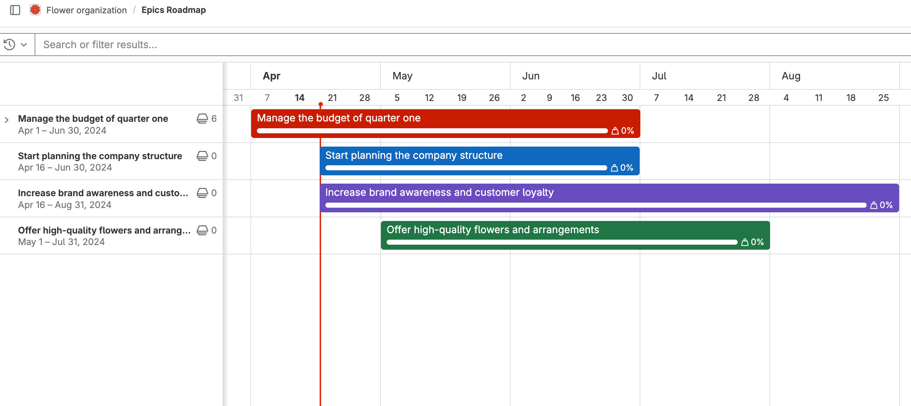
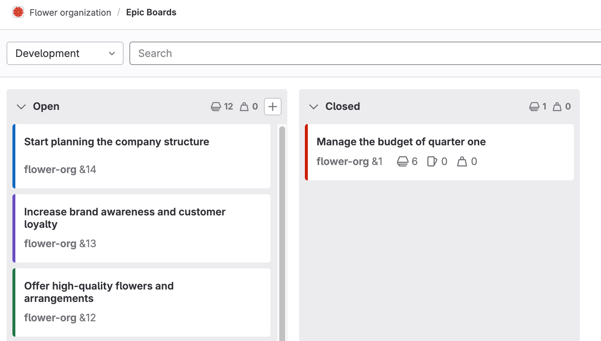
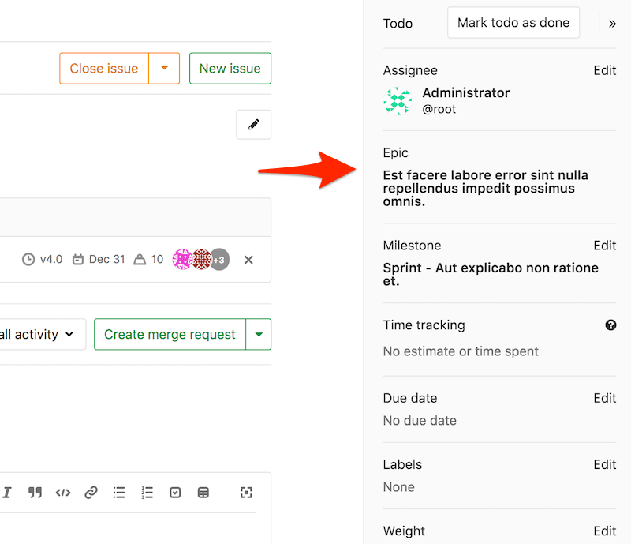
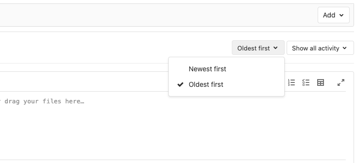
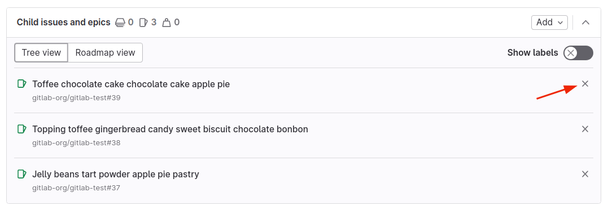

DETAILS:
**Tier:** Premium, Ultimate
**Offering:** GitLab.com, GitLab Self-Managed, GitLab Dedicated

This page collects instructions for all the things you can do with [epics](_index.md) or in relation
to them.

## Create an epic

> - [Changed](https://gitlab.com/gitlab-org/gitlab/-/merge_requests/169256) the minimum user role from Reporter to Planner in GitLab 17.7.

Prerequisites:

- You must have at least the Planner role for the epic's group.

To create an epic in the group you're in:

1. Get to the New Epic form:
   - Go to your group and from the left sidebar select **Epics**. Then select **New epic**.
   - From an epic in your group, select **Epic actions** (**{ellipsis_v}**). Then select **New epic**.
   - From anywhere, in the top menu, select **New** (**{plus-square}**). Then select **New epic**.
   - In an empty [roadmap](../roadmap/_index.md), select **New epic**.

1. Enter a title.
1. Complete the fields.
   - Enter a description.
   - To [make the epic confidential](#make-an-epic-confidential), select the checkbox under **Confidentiality**.
   - Choose labels.
   - Select a start and due date, or [inherit](#start-and-due-date-inheritance) them.
   - Select a [color](#epic-color).
1. Select **Create epic**.

The newly created epic opens.

### Start and due date inheritance

If you select **Inherited**:

- For the **start date**: GitLab scans all child epics and issues assigned to the epic,
  and sets the start date to match the earliest start date found in the child epics or the milestone
  assigned to the issues.
- For the **due date**: GitLab scans all child epics and issues assigned to the epic,
  and sets the due date to match the latest due date found in the child epics or the milestone
  assigned to the issues.

These dates are dynamic and recalculated if any of the following occur:

- A child epic's dates change.
- Milestones are reassigned to an issue.
- A milestone's dates change.
- Issues are added to, or removed from, the epic.

Because the epic's dates can inherit dates from its children, the start date and due date propagate from the bottom to the top.
If the start date of a child epic on the lowest level changes, that becomes the earliest possible start date for its parent epic.
The parent epic's start date then reflects this change and propagates upwards to the top epic.

## Edit an epic

> - [Changed](https://gitlab.com/gitlab-org/gitlab/-/merge_requests/169256) the minimum user role from Reporter to Planner in GitLab 17.7.

After you create an epic, you can edit the following details:

- Title
- Description
- Start date
- Due date
- Labels
- [Color](#epic-color)

Prerequisites:

- You must have at least the Planner role for the epic's group.

To edit an epic's title or description:

1. Select **Edit**.
1. Make your changes.
1. Select **Save changes**.

To edit an epic's start date, due date, or labels:

1. Next to each section in the right sidebar, select **Edit**.
1. Select the dates or labels for your epic.

### Reorder list items in the epic description

> - [Introduced](https://gitlab.com/gitlab-org/gitlab/-/issues/15260) in GitLab 15.1.
> - [Changed](https://gitlab.com/gitlab-org/gitlab/-/merge_requests/169256) the minimum user role from Reporter to Planner in GitLab 17.7.

When you view an epic that has a list in the description, you can also reorder the list items.

Prerequisites:

- You must have at least the Planner role for the project, be the author of the epic, or be
  assigned to the epic.
- The epic's description must have an [ordered, unordered](../../markdown.md#lists), or
  [task](../../markdown.md#task-lists) list.

To reorder list items, when viewing an epic:

1. Hover over the list item row to make the grip icon (**{grip}**) visible.
1. Select and hold the grip icon.
1. Drag the row to the new position in the list.
1. Release the grip icon.

### Bulk edit epics

> - [Changed](https://gitlab.com/gitlab-org/gitlab/-/merge_requests/169256) the minimum user role from Reporter to Planner in GitLab 17.7.

Users with at least the Planner role can manage epics.

When bulk editing epics in a group, you can edit their labels.

Prerequisites:

- You must have at least the Planner role for the parent epic's group.

To update multiple epics at the same time:

1. In a group, go to **Epics > List**.
1. Select **Bulk edit**. A sidebar on the right appears with editable fields.
1. Select the checkboxes next to each epic you want to edit.
1. Select the appropriate fields and their values from the sidebar.
1. Select **Update selected**.

### Open epics in a drawer

DETAILS:
**Offering:** GitLab Self-Managed

> - [Introduced](https://gitlab.com/gitlab-org/gitlab/-/issues/464063) in GitLab 17.4 [with a flag](../../../administration/feature_flags.md) named `issues_list_drawer`. Disabled by default.
> - Feature flag [changed](https://gitlab.com/gitlab-org/gitlab/-/merge_requests/170066) from `issues_list_drawer` to `epics_list_drawer` in GitLab 17.6.

FLAG:
The availability of this feature is controlled by a feature flag.
For more information, see the history.
This feature is available for testing, but not ready for production use.

When this feature is enabled, when you select an epic from the list or epic board, it opens in a drawer.
You can then edit the epic or create comments.

To open the epic in full view, either:

- Open the epic in a new tab. From the list of epics, you can either:
  - Right-click the epic and open it in a new browser tab.
  - Hold <kbd>Cmd</kbd> or <kbd>Ctrl</kbd> and select the epic.
- From the drawer, in the top-left corner, select **Open in full view**.

## Assignees

DETAILS:
**Status:** Beta
**Offering:** GitLab.com, GitLab Self-Managed

> - [Introduced](https://gitlab.com/groups/gitlab-org/-/epics/4231) in GitLab 17.4 [with a flag](../../../administration/feature_flags.md) named `work_items_beta`. Disabled by default. This feature is in [beta](../../../policy/development_stages_support.md#beta).

FLAG:
The availability of this feature is controlled by a feature flag.
For more information, see the history.
This feature is available for testing, but not ready for production use.

If your administrator [enabled the new look for epics](epic_work_items.md),
an epic can be assigned to one or more users.

The assignees can be changed as often as needed.
The idea is that the assignees are people responsible for the epic.

If a user is not a member of a group, an epic can only be assigned to them if another group member
assigns them.

This feature is in [beta](../../../policy/development_stages_support.md).
If you find a bug, use the
[feedback issue](https://gitlab.com/gitlab-org/gitlab/-/issues/463598) to provide more details.

### Change assignee on an epic

> - [Changed](https://gitlab.com/gitlab-org/gitlab/-/merge_requests/169256) the minimum user role from Reporter to Planner in GitLab 17.7.

Prerequisites:

- Your administrator must have [enabled the new look for epics](epic_work_items.md).
- You must have at least the Planner role for the group.

To change the assignee on an epic:

1. On the left sidebar, select **Search or go to** and find your group.
1. Select **Plan > Epics**, then select your epic to view it.
1. On the right sidebar, in the **Assignees** section, select **Edit**.
1. From the dropdown list, select the users to add as an assignee.
1. Select any area outside the dropdown list.

The assignee is changed without having to refresh the page.

## Epic color

DETAILS:
**Tier:** Premium, Ultimate

> - [Introduced](https://gitlab.com/gitlab-org/gitlab/-/merge_requests/79940) in GitLab 14.9 [with a flag](../../../administration/feature_flags.md) named `epic_color_highlight`. Disabled by default.
> - [Generally available](https://gitlab.com/gitlab-org/gitlab/-/issues/365336) in GitLab 16.11. Feature flag `epic_color_highlight` removed.
> - Customizable color [introduced](https://gitlab.com/gitlab-org/gitlab/-/issues/394864) in GitLab 17.5.

You can set a color for an epic to categorize and prioritize tasks visually.
Use colors to:

- Associate epics with teams or company initiatives.
- Indicate levels in the epic hierarchy.
- Group related epics together.

Epic colors are visible in [roadmaps](../roadmap/_index.md) and [epic boards](epic_boards.md).

On roadmaps, the timeline bars match the epic's color:

On epic boards, the color shows on the epic's card accent:

### Change an epic's color

> - [Changed](https://gitlab.com/gitlab-org/gitlab/-/merge_requests/169256) the minimum user role from Reporter to Planner in GitLab 17.7.

Prerequisites:

- You must have at least the Planner role for the epic's group.

To change an epic's color:

1. On the left sidebar, select **Search or go to** and find your group.
1. Select **Plan > Epics**.
1. Select **New epic** or select an existing epic.
1. On the right sidebar, in the **Color** section, select **Edit**.
1. Select an existing color or enter an RGB or hex value.
1. Select any area outside the dialog.

The epic's color is updated.

## Delete an epic

> - [Changed](https://gitlab.com/gitlab-org/gitlab/-/issues/452189) in GitLab 16.11. In GitLab 16.10 and earlier, if you delete an epic, all its child epics and their descendants are deleted as well. If needed, you can [remove child epics](#remove-a-child-epic-from-a-parent-epic) from the parent epic before you delete it.
> - [Allowed](https://gitlab.com/gitlab-org/gitlab/-/merge_requests/169256) Planner role to delete an epic in GitLab 17.7.

Prerequisites:

- You must have the Planner or Owner role for the epic's group.

To delete an epic:

1. Select **Epic actions** (**{ellipsis_v}**), then **Delete epic**.
1. Select **Delete**. On the confirmation dialog, select **Delete epic**.

Deleting an epic releases all existing issues from their associated epic in the system.

## Close an epic

> - [Changed](https://gitlab.com/gitlab-org/gitlab/-/merge_requests/169256) the minimum user role from Reporter to Planner in GitLab 17.7.

Prerequisites:

- You must have at least the Planner role for the epic's group.

To close an epic:

- In the upper-right corner, select **Epic actions** (**{ellipsis_v}**), then **Close epic**.

You can also use the `/close` [quick action](../../project/quick_actions.md).

## Reopen a closed epic

> - [Changed](https://gitlab.com/gitlab-org/gitlab/-/merge_requests/169256) the minimum user role from Reporter to Planner in GitLab 17.7.

You can reopen an epic that was closed.

Prerequisites:

- You must have at least the Planner role for the epic's group.

To do so, either:

- In the upper-right corner, select **Epic actions** (**{ellipsis_v}**) and then **Reopen epic**.
- Use the `/reopen` [quick action](../../project/quick_actions.md).

You can also create an epic by
[promoting an issue](../../project/issues/managing_issues.md#promote-an-issue-to-an-epic).

## Go to an epic from an issue

If an issue belongs to an epic, you can go to the parent epic with the
link in the right sidebar.

## View epics list

In a group, the left sidebar displays the total count of open epics.
This number indicates all epics associated with the group and its subgroups, including epics you
might not have permission to view.

Prerequisites:

- You must be a member of either:
  - The group
  - A project in the group
  - A project in one of the group's subgroups

To view epics in a group:

1. On the left sidebar, select **Search or go to** and find your group.
1. Select **Plan > Epics**.

### Who can view an epic

> - [Changed](https://gitlab.com/gitlab-org/gitlab/-/merge_requests/169256) the minimum user role from Reporter to Planner in GitLab 17.7.

Whether you can view an epic depends on the [group visibility level](../../public_access.md) and
the epic's [confidentiality status](#make-an-epic-confidential):

- Public group and a non-confidential epic: Anyone can view the epic.
- Private group and non-confidential epic: You must have at least the Guest role for the group.
- Confidential epic (regardless of group visibility): You must have at least the Planner
  role for the group.

### Cached epic count

The total count of open epics displayed in the sidebar is cached if higher
than 1000. The cached value is rounded to thousands or millions and updated every 24 hours.

## Filter the list of epics

> - Filtering by group was [introduced](https://gitlab.com/gitlab-org/gitlab/-/issues/385191) in GitLab 15.9.

You can filter the list of epics by:

- Title or description
- Author name / username
- Labels
- Milestones
- Confidentiality
- Reaction emoji
- Groups

To filter:

1. On the left sidebar, select **Search or go to** and find your group.
1. Select **Plan > Epics**.
1. Select the field **Search or filter results**.
1. From the dropdown list, select the scope or enter plain text to search by epic title or description.
1. Press <kbd>Enter</kbd> on your keyboard. The list is filtered.

### Filter with the OR operator

> - OR filtering for labels and authors was [introduced](https://gitlab.com/gitlab-org/gitlab/-/issues/382969) in GitLab 15.9 [with a flag](../../../administration/feature_flags.md) named `or_issuable_queries`. Disabled by default.
> - [Enabled on GitLab.com and GitLab Self-Managed](https://gitlab.com/gitlab-org/gitlab/-/merge_requests/104292) in GitLab 15.9.
> - [Generally available](https://gitlab.com/gitlab-org/gitlab/-/issues/296031) in GitLab 17.0. Feature flag `or_issuable_queries` removed.

You can use the OR operator (**is one of: `||`**) when you [filter the list of epics](#filter-the-list-of-epics) by:

- Authors
- Labels

`is one of` represents an inclusive OR. For example, if you filter by `Label is one of Deliverable` and
`Label is one of UX`, GitLab shows epics with either `Deliverable`, `UX`, or both labels.

## Sort the list of epics

You can sort the epics list by:

- Start date
- Due date
- Title

Each option contains a button that can toggle the order between **Ascending** and **Descending**.
The sort option and order is saved and used wherever you browse epics, including the
[Roadmap](../roadmap/_index.md).

## Change activity sort order

You can reverse the default order and interact with the activity feed sorted by most recent items
at the top. Your preference is saved in local storage and automatically applied to every epic and issue
you view.

To change the activity sort order, select the **Oldest first** dropdown list and select either oldest
or newest items to be shown first.

## Make an epic confidential

> - [Changed](https://gitlab.com/gitlab-org/gitlab/-/merge_requests/169256) the minimum user role from Reporter to Planner in GitLab 17.7.

If you're working on items that contain private information, you can make an epic confidential.

NOTE:
A confidential epic can only contain [confidential issues](../../project/issues/confidential_issues.md)
and confidential child epics. However, merge requests are public, if created in a public project.
Read [Merge requests for confidential issues](../../project/merge_requests/confidential.md)
to learn how to create a confidential merge request.

Prerequisites:

- You must have at least the Planner role for the epic's group.

To make an epic confidential:

- **When creating an epic:** select the checkbox under **Confidentiality**.
- **In an existing epic:** on the right sidebar, select **Edit** next to **Confidentiality**, and then
  select **Turn on**.

In GitLab 15.6 and later, you can also use the `/confidential` [quick action](../../project/quick_actions.md).

## Manage issues assigned to an epic

This section collects instructions for all the things you can do with [issues](../../project/issues/_index.md)
in relation to epics.

### View issues assigned to an epic

On the **Child issues and epics** section, you can see epics and issues assigned to this epic.
Only epics and issues that you can access show on the list.

You can always view the issues assigned to the epic if they are in the group's child project.
It's possible because the visibility setting of a project must be the same as or less restrictive than
of its parent group.

<!-- When epics as work items are generally available and feature flag `work_item_epics` is removed,
use the info below in the main body. -->

If your administrator [enabled the new look for epics](epic_work_items.md), this section is named
**Child items**.
You can also see any epics, issues, and tasks inherited by descendant items.
Only epics, issues, and tasks that you can access show on the list.

### View count and weight of issues in an epic

On the **Child issues and epics** section header, the number of descendant epics and issues and their total
weight is displayed.

To see the number of open and closed epics and issues:

- In the section header or under each epic name, hover over the total counts.

The numbers reflect all child issues and epics associated with the epic, including those you might
not have permission to view.

<!-- When epics as work items are generally available and feature flag `work_item_epics` is removed,
use the info below in the main body. -->

If your administrator [enabled the new look for epics](epic_work_items.md), this section is named
**Child items**.
Tasks are not included in these counts.

### View epic progress

> - [Introduced](https://gitlab.com/gitlab-org/gitlab/-/issues/5163) in GitLab 17.1.

On the **Child issues and epics** section header, the epic progress percentage is displayed.

To see the completed and total weight of child issues:

- In the section header, hover over the percentage.

The weights and progress reflect all issues associated with the epic, including issues you might
not have permission to view.

<!-- When epics as work items are generally available and feature flag `work_item_epics` is removed,
use the info below in the main body. -->

If your administrator [enabled the new look for epics](epic_work_items.md), this section is named
**Child items**.
Tasks are not included in this calculation.

### Health status

DETAILS:
**Tier:** Ultimate

> - [Introduced](https://gitlab.com/groups/gitlab-org/-/epics/9002) in GitLab 17.5.

Use health status on epics to gain quick insight into project progress.
Health status helps you communicate and manage potential issues proactively.

You can view an epic's health status in the epic view and in the **Child items** and **Linked items** sections.

You can set the health status to:

- On track (green)
- Needs attention (amber)
- At risk (red)

To address risks to timely delivery of your planned work, incorporate a review of epic health status into your:

- Daily stand-up meetings
- Project status reports
- Weekly meetings

#### Change health status of an epic

> - [Changed](https://gitlab.com/gitlab-org/gitlab/-/merge_requests/169256) the minimum user role from Reporter to Planner in GitLab 17.7.

Prerequisites:

- Your administrator must have [enabled the new look for epics](epic_work_items.md).
- You must have at least the Planner role for the group.

To change the health status of an epic:

1. On the left sidebar, select **Search or go to** and find your group.
1. Select **Plan > Epics**.
1. Select an epic.
1. In the right sidebar, in the **Health status** section, select **Edit**.
1. From the dropdown list, select a status.

The epic's health status is updated.

You can also set and clear health statuses using the `/health_status` and `/clear_health_status` [quick actions](../../project/quick_actions.md#issues-merge-requests-and-epics).

### Add an issue to an epic

> - Maximum number of child issues and epics [changed](https://gitlab.com/gitlab-org/gitlab/-/issues/452111) to 5000 in GitLab 17.1.

Add an existing issue to an epic, or create a new issue that's automatically
added to the epic.

The maximum number of direct child issues and epics is 5000.

#### Add an existing issue to an epic

> - Minimum required role for the project [changed](https://gitlab.com/gitlab-org/gitlab/-/issues/382506) from Reporter to Guest in GitLab 15.8.

You can add existing issues to an epic, including issues in a project from a [different group hierarchy](_index.md#child-issues-from-different-group-hierarchies).
Newly added issues appear at the top of the list of issues in the **Child issues and epics** section.

An epic contains a list of issues and an issue can be set as a child item of at most one epic.
When you add a new issue that's already linked to an epic, the issue is automatically unlinked from its
current parent.

Prerequisites:

- You must have at least the Guest role for the issue's project and the epic's group.

To add an existing issue to an epic:

1. On the epic's page, under **Child issues and epics**, select **Add**.
1. Select **Add an existing issue**.
1. Identify the issue to be added, using either of the following methods:
   - Paste the link of the issue.
   - Search for the desired issue by entering part of the issue's title, then selecting the desired
     match. Issues from different group hierarchies do not appear in search results.
     To add such an issue, enter its full URL.

   If there are multiple issues to be added, press <kbd>Space</kbd> and repeat this step.
1. Select **Add**.

<!-- When epics as work items are generally available and feature flag `work_item_epics` is removed,
use the info below in the main body. -->

If your administrator [enabled the new look for epics](epic_work_items.md), this section is named
**Child items**.

#### Create an issue from an epic

> - Minimum required role for the project [changed](https://gitlab.com/gitlab-org/gitlab/-/issues/382506) from Reporter to Guest in GitLab 15.8.

Creating an issue from an epic enables you to maintain focus on the broader context of the epic
while dividing work into smaller parts.

You can create a new issue from an epic only in projects that are in the epic's group or one of its
descendant subgroups.
To create a new issue in a [project that was shared with the epic's group](../../project/members/sharing_projects_groups.md),
first [create the issue directly in the project](../../project/issues/create_issues.md#from-a-project), and
then [add an existing issue to an epic](#add-an-existing-issue-to-an-epic).

Prerequisites:

- You must have at least the Guest role for the issue's project and the epic's group.

To create an issue from an epic:

1. On the epic's page, under **Child issues and epics**, select **Add**.
1. Select **Add a new issue**.
1. Under **Title**, enter the title for the new issue.
1. From the **Project** dropdown list, select the project in which the issue should be created.
1. Select **Create issue**.

The new issue is assigned to the epic.

<!-- When epics as work items are generally available and feature flag `work_item_epics` is removed,
use the info below in the main body. -->

If your administrator [enabled the new look for epics](epic_work_items.md), this section is named
**Child items**.

### Remove an issue from an epic

> - Minimum required role for the project [changed](https://gitlab.com/gitlab-org/gitlab/-/issues/382506) from Reporter to Guest in GitLab 15.8.

You can remove issues from an epic when you're on the epic's details page.
After you remove an issue from an epic, the issue is no longer associated with this epic.

Prerequisites:

- You must have at least the Guest role for the issue's project and the epic's group.

To remove an issue from an epic:

1. Next to the issue you want to remove, select **Remove** (**{close}**).
   The **Remove issue** warning appears.
1. Select **Remove**.

### Reorder issues assigned to an epic

> - Minimum required role for the project [changed](https://gitlab.com/gitlab-org/gitlab/-/issues/382506) from Reporter to Guest in GitLab 15.8.

New issues show at the top of the list in the **Child issues and epics** section.
You can reorder the list of issues by dragging them.

Prerequisites:

- You must have at least the Guest role for the issue's project and the epic's group.

To reorder issues assigned to an epic:

1. Go to the **Child issues and epics** section.
1. Drag issues into the desired order.

<!-- When epics as work items are generally available and feature flag `work_item_epics` is removed,
use the info below in the main body. -->

If your administrator [enabled the new look for epics](epic_work_items.md), this section is named
**Child items**.

### Move issues between epics

DETAILS:
**Tier:** Ultimate
**Offering:** GitLab.com, GitLab Self-Managed, GitLab Dedicated

> - Minimum required role for the project [changed](https://gitlab.com/gitlab-org/gitlab/-/issues/382506) from Reporter to Guest in GitLab 15.8.

New issues appear at the top of the list in the **Child issues and epics**
tab. You can move issues from one epic to another.

Prerequisites:

- You must have at least the Guest role for the issue's project and the epic's group.

To move an issue to another epic:

1. Go to the **Child issues and epics** section.
1. Drag issues into the desired parent epic in the visible hierarchy.

<!-- When epics as work items are generally available and feature flag `work_item_epics` is removed,
use the info below in the main body. -->

If your administrator [enabled the new look for epics](epic_work_items.md), this section is named
**Child items**.

### Use an epic template for repeating issues

You can create a spreadsheet template to manage a pattern of consistently repeating issues.

<i class="fa fa-youtube-play youtube" aria-hidden="true"></i>
For an introduction to epic templates, see [GitLab Epics and Epic Template Tip](https://www.youtube.com/watch?v=D74xKFNw8vg).

For more on epic templates, see [Epic Templates - Repeatable sets of issues](https://handbook.gitlab.com/handbook/marketing/brand-and-product-marketing/product-and-solution-marketing/getting-started/104/).

## Multi-level child epics

DETAILS:
**Tier:** Ultimate
**Offering:** GitLab.com, GitLab Self-Managed, GitLab Dedicated

You can add any epic that belongs to a group or subgroup of the parent epic's group.
New child epics appear at the top of the list of epics in the **Child issues and epics** section.
<!-- When epics as work items are generally available and feature flag `work_item_epics` is removed,
use the info below in the main body. -->
If your administrator [enabled the new look for epics](epic_work_items.md), this section is named
**Child items**.

When you add an epic that's already linked to a parent epic, the link to its current parent is removed.

Epics can contain multiple nested child epics, up to a total of 7 levels deep.

### Add a parent epic to an epic

> - [Introduced](https://gitlab.com/groups/gitlab-org/-/epics/11198) in GitLab 17.5.

To create a hierarchy of epics, add a parent epic to an existing epic.
This helps organize and track related work across multiple epics.

Prerequisites:

- Your administrator must have [enabled the new look for epics](epic_work_items.md).
- You must have at least the Guest role for either the parent epic's group or the child epic's group.

To add a parent epic:

1. On the left sidebar, select **Search or go to** and find your group.
1. Select **Plan > Epics**.
1. Select an epic.
1. In the right sidebar, in the **Parent** section, select **Edit**.
1. In the search box, enter part of the parent epic's title.
   You can only search for epics in the same group hierarchy.
1. From the search results, select the epic you want to add as the parent.

The parent epic is added.

### Child epics from other groups

> - [Introduced](https://gitlab.com/groups/gitlab-org/-/epics/8502) in GitLab 15.6 [with a flag](../../../administration/feature_flags.md) named `child_epics_from_different_hierarchies`. Disabled by default.
> - Minimum required role for the group [changed](https://gitlab.com/gitlab-org/gitlab/-/issues/382503) from Reporter to Guest in GitLab 15.7.
> - Cross-group child epics [enabled on GitLab.com and GitLab Self-Managed](https://gitlab.com/gitlab-org/gitlab/-/issues/375622) in GitLab 15.9. Enabled by default.
> - [Feature flag `child_epics_from_different_hierarchies`](https://gitlab.com/gitlab-org/gitlab/-/issues/382719) removed in GitLab 15.10.

Add a child epic that belongs to a group that is different from the parent epic's group.

Prerequisites:

- You must have at least the Guest role for both the child and parent epics' groups.
- Multi-level child epics must be available for both the child and parent epics' groups.

To add a child epic from another group, paste the epic's URL when [adding an existing epic](#add-a-child-epic-to-an-epic).

### View child epics on a roadmap

From an epic, view its child epics and related milestones on the [roadmap](../roadmap/_index.md).

Prerequisites:

- You must have at least the Guest role for the parent epic's group.

To view child epics from the parent:

- In an epic, in the **Child issues and epics** section, select **Roadmap view**.

<!-- When epics as work items are generally available and feature flag `work_item_epics` is removed,
use the info below in the main body. -->

If your administrator [enabled the new look for epics](epic_work_items.md), this section is named
**Child items**.

### Add a child epic to an epic

> - Minimum required role for the group [changed](https://gitlab.com/gitlab-org/gitlab/-/issues/382503) from Reporter to Guest in GitLab 15.7.

Prerequisites:

- You must have at least the Guest role for the parent epic's group.

#### New epic

To add a new epic as child epic:

1. In an epic, in the **Child issues and epics** section, select **Add > Add a new epic**.
1. Select a group from the dropdown list. The epic's group is selected by default.
1. Enter a title for the new epic.
1. Select **Create epic**.

<!-- When epics as work items are generally available and feature flag `work_item_epics` is removed,
use the info below in the main body. -->

If your administrator [enabled the new look for epics](epic_work_items.md), this section is named
**Child items**.

#### Existing epic

To add an existing epic as child epic:

1. In an epic, in the **Child issues and epics** section, select **Add > Add an existing epic**.
1. Identify the epic to be added, using either of the following methods:
   - Paste the link of the epic.
   - Search for the desired issue by entering part of the epic's title, then selecting the desired match. This search is only available for epics in the same group hierarchy.

   If there are multiple epics to be added, press <kbd>Space</kbd> and repeat this step.
1. Select **Add**.

<!-- When epics as work items are generally available and feature flag `work_item_epics` is removed,
use the info below in the main body. -->

If your administrator [enabled the new look for epics](epic_work_items.md), this section is named
**Child items**.

### Move child epics between epics

> - Minimum required role for the group [changed](https://gitlab.com/gitlab-org/gitlab/-/issues/382503) from Reporter to Guest in GitLab 15.7.

New child epics appear at the top of the list in the **Child issues and epics** section.
You can move child epics from one epic to another.
When you add a new epic that's already linked to a parent epic, the link to its current parent is removed.
Issues and child epics cannot be intermingled.

Prerequisites:

- You must have at least the Guest role for the parent epic's group.

To move child epics to another epic:

1. Go to the **Child issues and epics** section.
1. Drag epics into the desired parent epic.

<!-- When epics as work items are generally available and feature flag `work_item_epics` is removed,
use the info below in the main body. -->

If your administrator [enabled the new look for epics](epic_work_items.md), this section is named
**Child items**.

### Reorder child epics assigned to an epic

> - Minimum required role for the group [changed](https://gitlab.com/gitlab-org/gitlab/-/issues/382503) from Reporter to Guest in GitLab 15.7.

New child epics appear at the top of the list in the **Child issues and epics** section.
You can reorder the list of child epics.

Prerequisites:

- You must have at least the Guest role for the parent epic's group.

To reorder child epics assigned to an epic:

1. Go to the **Child issues and epics** section.
1. Drag epics into the desired order.

<!-- When epics as work items are generally available and feature flag `work_item_epics` is removed,
use the info below in the main body. -->

If your administrator [enabled the new look for epics](epic_work_items.md), this section is named
**Child items**.

### Remove a child epic from a parent epic

> - Minimum required role for the group [changed](https://gitlab.com/gitlab-org/gitlab/-/issues/382503) from Reporter to Guest in GitLab 15.7.

Prerequisites:

- You must have at least the Guest role for the parent epic's group.

To remove a child epic from a parent epic:

1. Select **Remove** (**{close}**) in the parent epic's list of epics.
   The **Remove epic** warning appears.
1. Select **Remove**.
