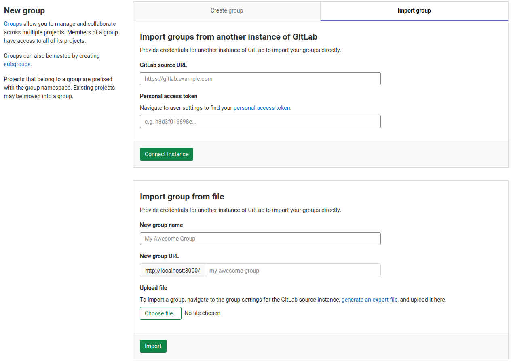
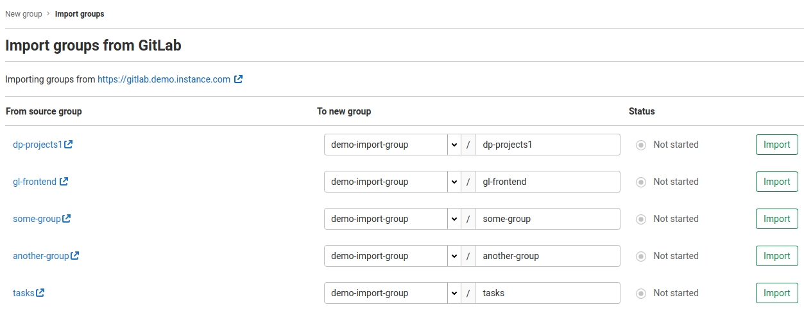

# Import groups from another instance of GitLab **(FREE)**

> - [Introduced](https://gitlab.com/gitlab-org/gitlab/-/issues/249160) in GitLab 13.7.
> - It's [deployed behind a feature flag](../../feature_flags.md), disabled by default.
> - It's enabled on GitLab.com.

## Overview

WARNING:
This feature is [under construction](https://gitlab.com/groups/gitlab-org/-/epics/2771) and currently migrates only some of the Group data. Please see below for the full list of what is included in the migration at this time.

Using GitLab Group Migration, you can migrate existing top-level groups from GitLab.com or a self-managed instance. Groups can be migrated to a target instance, as a top-level group, or as a sub-group of any existing top-level group.

The following resources are migrated to the target instance:

- Groups
  - description
  - attributes
  - subgroups
- Epics
  - title
  - description
  - state (open / closed)
  - start date
  - due date
  - epic order on boards
  - confidentiality

Any other items are **not** migrated.

## Enable or disable GitLab Group Migration

Support for GitLab Group Migration is under development and not ready for production use. It is
deployed behind a feature flag that is **disabled by default**.
[GitLab administrators with access to the GitLab Rails console](../../../administration/feature_flags.md) can enable it.

To enable it:

```ruby
Feature.enable(:bulk_import)
```

To disable it:

```ruby
Feature.disable(:bulk_import)
```

## Import your groups into GitLab

Before you begin, ensure that the target instance of GitLab can communicate with the source
over HTTPS (HTTP is not supported).

NOTE:
This might involve reconfiguring your firewall to prevent blocking connection on the side of self-managed instance.

### Connect to the remote GitLab instance

1. Navigate to the New Group page, either via the `+` button in the top navigation bar, or the **New subgroup** button
on an existing group's page.

   

1. On the New Group page, select the **Import group** tab.

   

1. Fill in source URL of your GitLab.
1. Fill in [personal access token](../../../user/profile/personal_access_tokens.md) for remote GitLab instance.
1. Click "Connect instance".

### Selecting which groups to import

After you have authorized access to GitLab instance, you are redirected to the GitLab Group Migration importer page and your remote GitLab groups are listed.

1. By default, the proposed group namespaces match the names as they exist in remote instance, but based on your permissions, you can choose to edit these names before you proceed to import any of them.

1. Select the **Import** button next to any number of groups.

1. The **Status** column shows the import status of each group. You can choose to leave the page open and it will update in real-time.

1. Once a group has been imported, click its GitLab path to open its GitLab URL.


