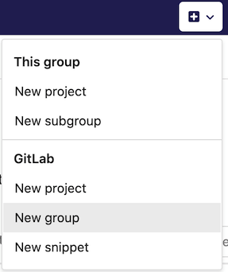
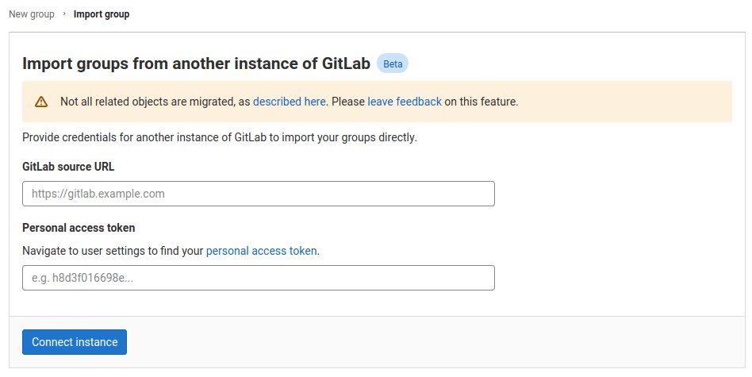
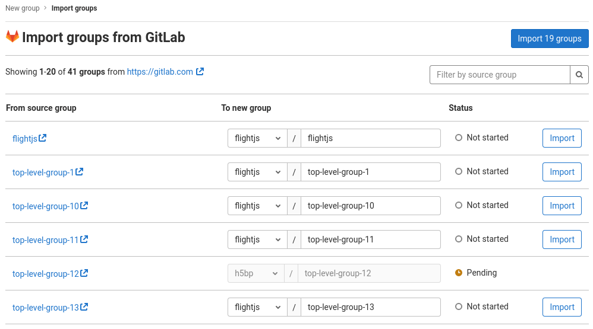

# Import groups from another instance of GitLab **(FREE)**

> - [Introduced](https://gitlab.com/gitlab-org/gitlab/-/issues/249160) in GitLab 13.7.
> - [Deployed behind a feature flag](../../feature_flags.md), disabled by default.
> - Enabled on GitLab.com.

WARNING:
This feature is [under construction](https://gitlab.com/groups/gitlab-org/-/epics/2771), and migrates only some of the group data. Refer to the following information for the list of what's included in the migration.

Using GitLab Group Migration, you can migrate existing top-level groups from GitLab.com or a self-managed instance. Groups can be migrated to a target instance, as a top-level group, or as a subgroup of any existing top-level group.

The following resources are migrated to the target instance:

- Groups ([Introduced in 13.7](https://gitlab.com/groups/gitlab-org/-/epics/4374))
  - description
  - attributes
  - subgroups
  - avatar ([Introduced in 14.0](https://gitlab.com/gitlab-org/gitlab/-/issues/322904))
- Group Labels ([Introduced in 13.9](https://gitlab.com/gitlab-org/gitlab/-/issues/292429))
  - title
  - description
  - color
  - created_at ([Introduced in 13.10](https://gitlab.com/gitlab-org/gitlab/-/issues/300007))
  - updated_at ([Introduced in 13.10](https://gitlab.com/gitlab-org/gitlab/-/issues/300007))
- Members ([Introduced in 13.9](https://gitlab.com/gitlab-org/gitlab/-/issues/299415))
  Group members are associated with the imported group if:
  - The user already exists in the target GitLab instance and
  - The user has a public email in the source GitLab instance that matches a
    confirmed email in the target GitLab instance
    confirmed email in the target GitLab instance
- Epics ([Introduced in 13.7](https://gitlab.com/gitlab-org/gitlab/-/issues/250281))
  - title
  - description
  - state (open / closed)
  - start date
  - due date
  - epic order on boards
  - confidentiality
  - labels ([Introduced in 13.9](https://gitlab.com/gitlab-org/gitlab/-/issues/297460))
  - author ([Introduced in 13.9](https://gitlab.com/gitlab-org/gitlab/-/issues/298745))
  - parent epic ([Introduced in 13.9](https://gitlab.com/gitlab-org/gitlab/-/issues/297459))
  - emoji award ([Introduced in 13.9](https://gitlab.com/gitlab-org/gitlab/-/issues/297466))
  - events ([Introduced in 13.10](https://gitlab.com/gitlab-org/gitlab/-/issues/297465))
- Milestones ([Introduced in 13.10](https://gitlab.com/gitlab-org/gitlab/-/issues/292427))
  - title
  - description
  - state (active / closed)
  - start date
  - due date
  - created at
  - updated at
  - iid ([Introduced in 13.11](https://gitlab.com/gitlab-org/gitlab/-/issues/326157))
- Iterations ([Introduced in 13.10](https://gitlab.com/gitlab-org/gitlab/-/issues/292428))
  - iid
  - title
  - description
  - state (upcoming / started / closed)
  - start date
  - due date
  - created at
  - updated at
- Badges ([Introduced in 13.11](https://gitlab.com/gitlab-org/gitlab/-/issues/292431))
  - name
  - link URL
  - image URL
- Boards
- Board Lists

Any other items are **not** migrated.

## Enable or disable GitLab Group Migration

Support for GitLab Group Migration is under development and not ready for production use. It is
deployed behind a feature flag that is **disabled by default**.
[GitLab administrators with access to the GitLab Rails console](../../../administration/feature_flags.md) can enable it.

To enable it:

```ruby
Feature.enable(:bulk_import)
```

To disable it:

```ruby
Feature.disable(:bulk_import)
```

## Import your groups into GitLab

Before you begin, ensure that the target instance of GitLab can communicate with the source
over HTTPS (HTTP is not supported).

NOTE:
This might involve reconfiguring your firewall to prevent blocking connection on the side of self-managed instance.

### Connect to the remote GitLab instance

1. Navigate to the New Group page, either via the `+` button in the top navigation bar, or the **New subgroup** button
on an existing group's page.

   

1. On the New Group page, select **Import group**.

   

1. Fill in source URL of your GitLab.
1. Fill in [personal access token](../../../user/profile/personal_access_tokens.md) for remote GitLab instance.
1. Click "Connect instance".

### Selecting which groups to import

After you have authorized access to the GitLab instance, you are redirected to the GitLab Group
Migration importer page. Listed are the remote GitLab groups to which you have the Owner role.

1. By default, the proposed group namespaces match the names as they exist in remote instance, but based on your permissions, you can choose to edit these names before you proceed to import any of them.

1. Select the **Import** button next to any number of groups.

1. The **Status** column shows the import status of each group. You can choose to leave the page open and it updates in real-time.

1. Once a group has been imported, click its GitLab path to open its GitLab URL.


