# Groups

With GitLab Groups, you can:

- Assemble related projects together.
- Grant members access to several projects at once.

For a video introduction to GitLab Groups, see [GitLab University: Repositories, Projects and Groups](https://www.youtube.com/watch?v=4TWfh1aKHHw).

Groups can also be nested in [subgroups](subgroups/index.md).

Find your groups by clicking **Groups > Your Groups** in the top navigation.

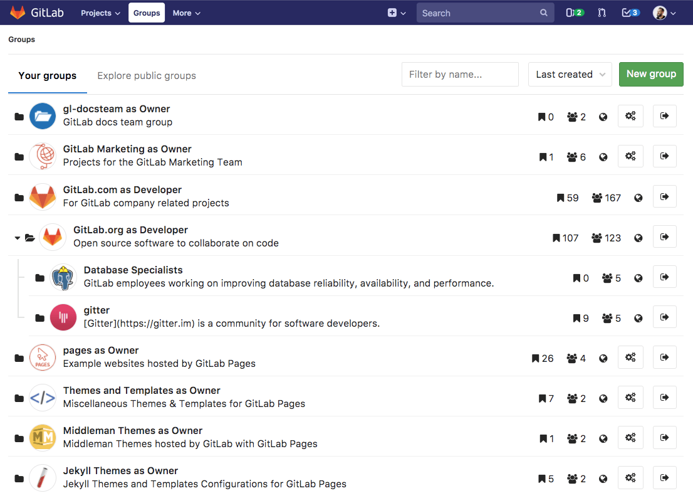

> The **Groups** dropdown in the top navigation was [introduced](https://gitlab.com/gitlab-org/gitlab-foss/issues/36234) in [GitLab 11.1](https://about.gitlab.com/blog/2018/07/22/gitlab-11-1-released/#groups-dropdown-in-navigation).

The **Groups** page displays:

- All groups you are a member of, when **Your groups** is selected.
- A list of public groups, when **Explore public groups** is selected.

Each group on the **Groups** page is listed with:

- How many subgroups it has.
- How many projects it contains.
- How many members the group has, not including members inherited from parent groups.
- The group's visibility.
- A link to the group's settings, if you have sufficient permissions.
- A link to leave the group, if you are a member.

## Use cases

You can create groups for numerous reasons. To name a couple:

- Grant access to multiple projects and multiple team members in fewer steps by organizing related projects under the same [namespace](#namespaces) and adding members to the top-level group.
- Make it easier to `@mention` all of your team at once in issues and merge requests by creating a group and including the appropriate members.

For example, you could create a group for your company members, and create a [subgroup](subgroups/index.md) for each individual team. Let's say you create a group called `company-team`, and you create subgroups in this group for the individual teams `backend-team`, `frontend-team`, and `production-team`.

- When you start a new implementation from an issue, you add a comment:
  _"`@company-team`, let's do it! `@company-team/backend-team` you're good to go!"_
- When your backend team needs help from frontend, they add a comment:
  _"`@company-team/frontend-team` could you help us here please?"_
- When the frontend team completes their implementation, they comment:
  _"`@company-team/backend-team`, it's done! Let's ship it `@company-team/production-team`!"_

## Namespaces

In GitLab, a namespace is a unique name to be used as a user name, a group name, or a subgroup name.

- `http://gitlab.example.com/username`
- `http://gitlab.example.com/groupname`
- `http://gitlab.example.com/groupname/subgroup_name`

For example, consider a user named Alex:

1. Alex creates an account on GitLab.com with the username `alex`;
   their profile will be accessed under `https://gitlab.example.com/alex`
1. Alex creates a group for their team with the group name `alex-team`;
   the group and its projects will be accessed under `https://gitlab.example.com/alex-team`
1. Alex creates a subgroup of `alex-team` with the subgroup name `marketing`;
   this subgroup and its projects will be accessed under `https://gitlab.example.com/alex-team/marketing`

By doing so:

- Any team member mentions Alex with `@alex`
- Alex mentions everyone from their team with `@alex-team`
- Alex mentions only the marketing team with `@alex-team/marketing`

## Issues and merge requests within a group

Issues and merge requests are part of projects. For a given group, you can view all of the
[issues](../project/issues/index.md#issues-list) and [merge requests](../project/merge_requests/reviewing_and_managing_merge_requests.md#view-merge-requests-for-all-projects-in-a-group) across all projects in that group,
together in a single list view.

### Bulk editing issues and merge requests

For details, see [bulk editing issues and merge requests](../group/bulk_editing/index.md).

## Create a new group

> For a list of words that are not allowed to be used as group names see the
> [reserved names](../reserved_names.md).

To create a new Group, either:

- In the top menu, click **Groups** and then **Your Groups**, and click the green button **New group**.

  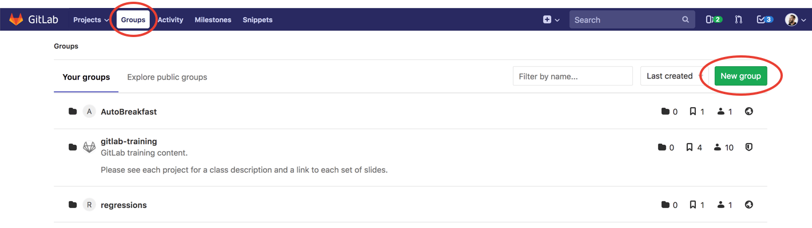

- Or, in the top menu, expand the `plus` sign and choose **New group**.

  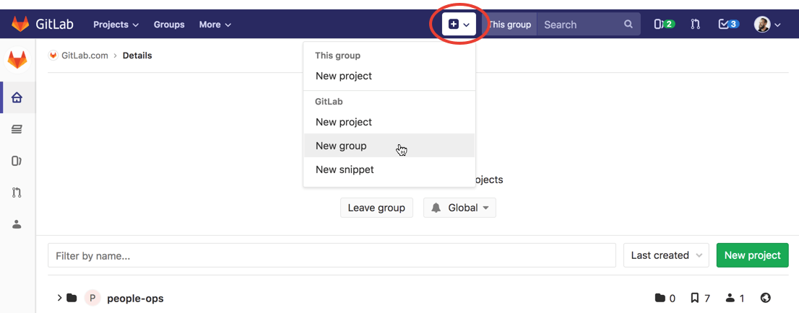

Add the following information:

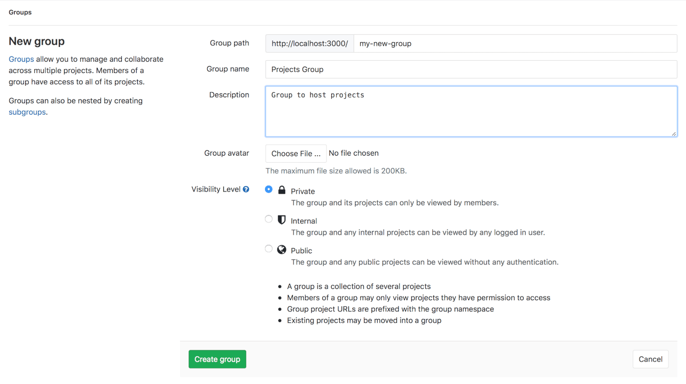

1. The **Group name** will automatically populate the URL. Optionally, you can change it.
   This is the name that displays in group views.
   The name can contain only:
   - Alphanumeric characters
   - Underscores
   - Dashes and dots
   - Spaces
1. The **Group URL** is the namespace under which your projects will be hosted.
   The URL can contain only:
   - Alphanumeric characters
   - Underscores
   - Dashes and dots (it cannot start with dashes or end in a dot)
1. Optionally, you can add a brief description to tell others
   what this group is about.
1. Optionally, choose an avatar for your group.
1. Choose the [visibility level](../../public_access/public_access.md).

For more details on creating groups, watch the video [GitLab Namespaces (users, groups and subgroups)](https://youtu.be/r0sJgjR2f5A).

## Add users to a group

A benefit of putting multiple projects in one group is that you can
give a user access to all projects in the group with one action.

Add members to a group by navigating to the group's dashboard and clicking **Members**.

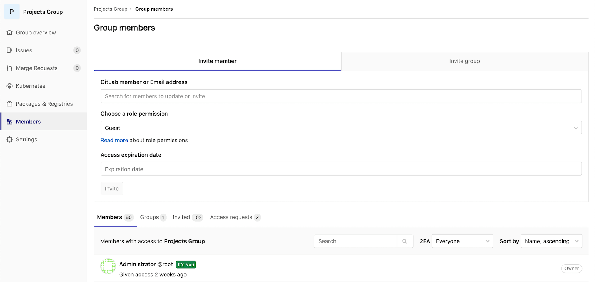

Select the [permission level](../permissions.md#permissions), and add the new member. You can also set the expiring date for that user; this is the date on which they will no longer have access to your group.

Consider a group with two projects:

- On the **Group Members** page, you can now add a new user to the group.
- Now, because this user is a **Developer** member of the group, they automatically
  get **Developer** access to **all projects** within that group.

To increase the access level of an existing user for a specific project,
add them again as a new member to the project with the desired permission level.

## Request access to a group

As a group owner, you can enable or disable the ability for non-members to request access to
your group. Go to the group settings, and click **Allow users to request access**.

As a user, you can request to be a member of a group, if that setting is enabled. Go to the group for which you'd like to be a member, and click the **Request Access** button on the right
side of your screen.

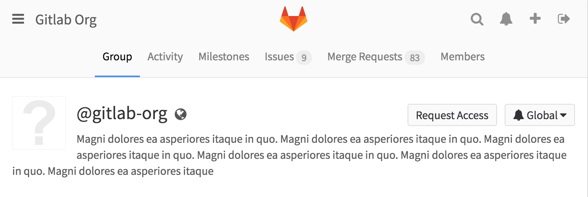

Once access is requested:

- Up to ten group owners are notified of your request via email.
  Email is sent to the most recently active group owners.
- Any group owner can approve or decline your request on the members page.

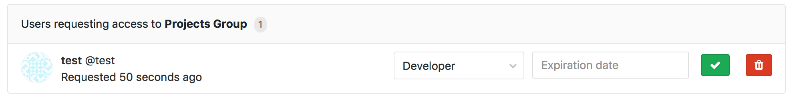

If you change your mind before your request is approved, just click the
**Withdraw Access Request** button.

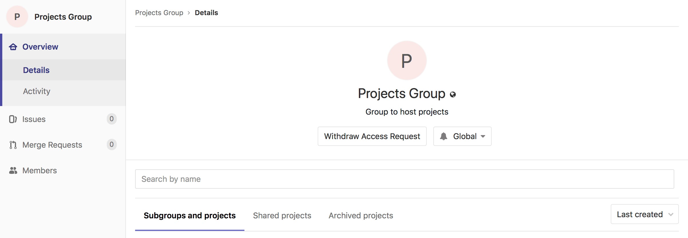

## Add projects to a group

There are two different ways to add a new project to a group:

- Select a group, and then click **New project**. You can then continue [creating your project](../../gitlab-basics/create-project.md).

  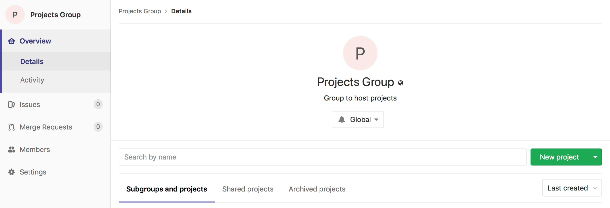

- While you are creating a project, select a group namespace
  you've already created from the dropdown menu.

  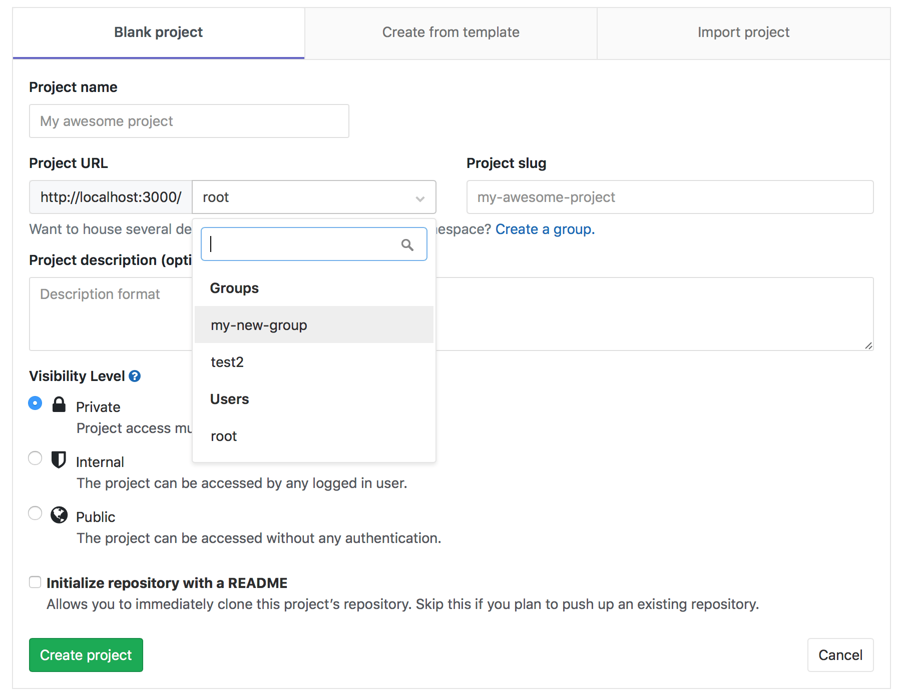

### Default project-creation level

> - [Introduced][ee-2534] in [GitLab Premium][ee] 10.5.
> - Brought to [GitLab Starter][ee] in 10.7.
> - [Moved](https://gitlab.com/gitlab-org/gitlab-foss/merge_requests/25975) to [GitLab Core](https://about.gitlab.com/pricing/) in 11.10.

By default, [Developers and Maintainers](../permissions.md#group-members-permissions) can create projects under a group.

To change this setting for a specific group:

1. Go to the group's **Settings > General** page.
1. Expand the **Permissions, LFS, 2FA** section.
1. Select the desired option in the **Allowed to create projects** dropdown list.
1. Click **Save changes**.

To change this setting globally, see [Default project creation protection](../admin_area/settings/visibility_and_access_controls.md#default-project-creation-protection).

## Transfer projects into groups

Learn how to [transfer a project into a group](../project/settings/index.md#transferring-an-existing-project-into-another-namespace).

## Sharing a project with a group

You can [share your projects with a group](../project/members/share_project_with_groups.md)
and give all group members access to the project at once.

Alternatively, you can [lock the sharing with group feature](#share-with-group-lock).

## Manage group memberships via LDAP

In GitLab Enterprise Edition, it is possible to manage GitLab group memberships using LDAP groups.
See [the GitLab Enterprise Edition documentation](../../integration/ldap.md) for more information.

## Epics **(ULTIMATE)**

> Introduced in [GitLab Ultimate][ee] 10.2.

Epics let you manage your portfolio of projects more efficiently and with less
effort by tracking groups of issues that share a theme, across projects and
milestones.

[Learn more about Epics.](epics/index.md)

## Group Security Dashboard **(ULTIMATE)**

Get an overview of the vulnerabilities of all the projects in a group and its subgroups.

[Learn more about the Group Security Dashboard.](security_dashboard/index.md)

## Insights **(ULTIMATE)**

> [Introduced](https://gitlab.com/groups/gitlab-org/-/epics/725) in [GitLab Ultimate](https://about.gitlab.com/pricing/) 12.0.

Configure the Insights that matter for your groups or projects, allowing users
to explore data such as:

- Triage hygiene
- Issues created/closed per a given period
- Average time for merge requests to be merged
- Much more

[Learn more about Insights](insights/index.md).

## Transferring groups

From GitLab 10.5, you can transfer groups in the following ways:

- Transfer a subgroup to a new parent group.
- Convert a top-level group into a subgroup by transferring it to the desired group.
- Convert a subgroup into a top-level group by transferring it out of its current group.

When transferring groups, note:

- Changing a group's parent can have unintended side effects. See [Redirects when changing repository paths](../project/index.md#redirects-when-changing-repository-paths).
- You can only transfer groups to groups you manage.
- You must update your local repositories to point to the new location.
- If the parent group's visibility is lower than the group's current visibility, visibility levels for subgroups and projects will change to match the new parent group's visibility.
- Only explicit group membership is transferred, not inherited membership. If the group's owners have only inherited membership, this leaves the group without an owner. In this case, the user transferring the group becomes the group's owner.

## Group settings

After creating a group, you can manage its settings by navigating to
the group's dashboard, and clicking **Settings**.

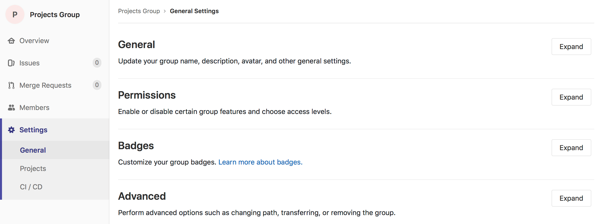

### General settings

In addition to editing any settings you previously
set when [creating the group](#create-a-new-group), you can also
access further configurations for your group.

#### Changing a group's path

Changing a group's path can have unintended side effects. Read
[how redirects will behave](../project/index.md#redirects-when-changing-repository-paths)
before proceeding.

If you are vacating the path so it can be claimed by another group or user,
you may need to rename the group, too, since both names and paths must
be unique.

To change your group path:

1. Navigate to your group's **Settings > General** page.
1. Expand the **Path, transfer, remove** section.
1. Enter a new name under **Change group path**.
1. Click **Change group path**.

CAUTION: **Caution:**
It is currently not possible to rename a namespace if it contains a
project with [Container Registry](../packages/container_registry/index.md) tags,
because the project cannot be moved.

TIP: **TIP:**
If you want to retain ownership over the original namespace and
protect the URL redirects, then instead of changing a group's path or renaming a
username, you can create a new group and transfer projects to it.

#### Enforce 2FA to group members

Add a security layer to your group by
[enforcing two-factor authentication (2FA)](../../security/two_factor_authentication.md#enforcing-2fa-for-all-users-in-a-group)
for all group members.

#### Share with group lock

Prevent projects in a group from [sharing
a project with another group](../project/members/share_project_with_groups.md) to enable tighter control over project access.

For example, let's say you have two distinct teams (Group A and Group B) working together in a project, and to inherit the group membership, you share the project between the
two groups A and B. **Share with group lock** prevents any project within
the group from being shared with another group,
guaranteeing that only the right group members have access to those projects.

To enable this feature, navigate to the group settings page. Select
**Share with group lock** and **Save the group**.

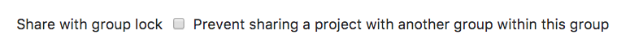

#### Member Lock **(STARTER)**

Member lock lets a group owner prevent any new project membership to all of the
projects within a group, allowing tighter control over project membership.

For example, if you want to lock the group for an [Audit Event](../../administration/audit_events.md),
enable Member lock to guarantee that project membership cannot be modified during that audit.

To enable this feature:

1. Navigate to the group's **Settings > General** page.
1. Expand the **Permissions, LFS, 2FA** section, and select **Member lock**.
1. Click **Save changes**.

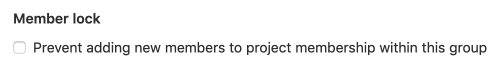

This will disable the option for all users who previously had permissions to
operate project memberships, so no new users can be added. Furthermore, any
request to add a new user to a project through API will not be possible.

#### IP access restriction **(ULTIMATE)**

> [Introduced](https://gitlab.com/gitlab-org/gitlab/issues/1985) in [GitLab Ultimate and Gold](https://about.gitlab.com/pricing/) 12.0.

To make sure only people from within your organization can access particular
resources, you have the option to restrict access to groups and their
underlying projects, issues, etc, by IP address. This can help ensure that
particular content doesn't leave the premises, while not blocking off access to
the entire instance.

Add one or more whitelisted IP subnets using CIDR notation in comma separated format to the group settings and anyone
coming from a different IP address won't be able to access the restricted
content.

Restriction currently applies to:

- UI.
- [From GitLab 12.3](https://gitlab.com/gitlab-org/gitlab/issues/12874), API access.
- [From GitLab 12.4](https://gitlab.com/gitlab-org/gitlab/issues/32113), Git actions via SSH.

To avoid accidental lock-out, admins and group owners are able to access
the group regardless of the IP restriction.

#### Allowed domain restriction **(PREMIUM)**

> [Introduced](https://gitlab.com/gitlab-org/gitlab/issues/7297) in [GitLab Premium and Silver](https://about.gitlab.com/pricing/) 12.2.

You can restrict access to groups by
allowing only users with email addresses in particular domains to be added to the group.

Add email domains you want to whitelist and users with emails from different
domains won't be allowed to be added to this group.

Some domains cannot be restricted. These are the most popular public email domains, such as:

- `gmail.com`
- `yahoo.com`
- `hotmail.com`
- `aol.com`
- `msn.com`
- `hotmail.co.uk`
- `hotmail.fr`
- `live.com`
- `outlook.com`
- `icloud.com`

To enable this feature:

1. Navigate to the group's **Settings > General** page.
1. Expand the **Permissions, LFS, 2FA** section, and enter the domain name into **Restrict membership by email** field.
1. Click **Save changes**.

This will enable the domain-checking for all new users added to the group from this moment on.

#### Group file templates **(PREMIUM)**

Group file templates allow you to share a set of templates for common file
types with every project in a group. It is analogous to the
[instance template repository](../admin_area/settings/instance_template_repository.md)
feature, and the selected project should follow the same naming conventions as
are documented on that page.

You can only choose projects in the group as the template source.
This includes projects shared with the group, but it **excludes** projects in
subgroups or parent groups of the group being configured.

You can configure this feature for both subgroups and parent groups. A project
in a subgroup will have access to the templates for that subgroup, as well as
any parent groups.

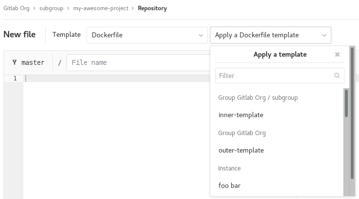

To enable this feature, navigate to the group settings page, expand the
**Templates** section, choose a project to act as the template repository, and
**Save group**.

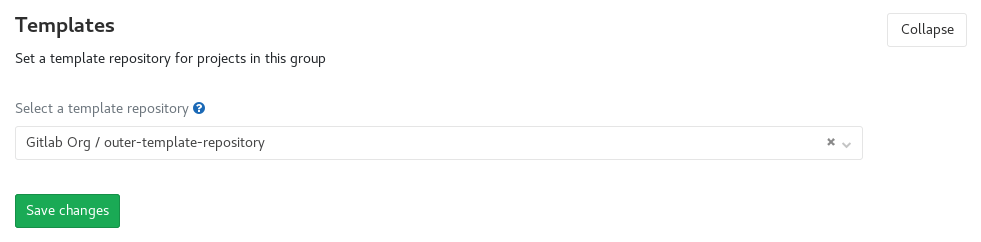

#### Group-level project templates **(PREMIUM)**

Define project templates at a group level by setting a group as the template source.
[Learn more about group-level project templates](custom_project_templates.md).

#### Disabling email notifications

> [Introduced](https://gitlab.com/gitlab-org/gitlab/issues/23585) in GitLab 12.2.

You can disable all email notifications related to the group, which includes its subgroups and projects.

To enable this feature:

1. Navigate to the group's **Settings > General** page.
1. Expand the **Permissions, LFS, 2FA** section, and select **Disable email notifications**.
1. Click **Save changes**.

#### Disabling group mentions

> [Introduced](https://gitlab.com/gitlab-org/gitlab/issues/21301) in GitLab 12.6.

You can prevent users from being added to a conversation and getting notified when
anyone mentions a group in which those users are members.

Groups with disabled mentions are visualized accordingly in the autocompletion dropdown.

This is particularly helpful for groups with a large number of users.

To enable this feature:

1. Navigate to the group's **Settings > General** page.
1. Expand the **Permissions, LFS, 2FA** section, and select **Disable group mentions**.
1. Click **Save changes**.

### Advanced settings

- **Projects**: View all projects within that group, add members to each project,
  access each project's settings, and remove any project, all from the same screen.
- **Webhooks**: Configure [webhooks](../project/integrations/webhooks.md) for your group.
- **Kubernetes cluster integration**: Connect your GitLab group with [Kubernetes clusters](clusters/index.md).
- **Audit Events**: View [Audit Events](../../administration/audit_events.md)
  for the group. **(STARTER ONLY)**
- **Pipelines quota**: Keep track of the [pipeline quota](../admin_area/settings/continuous_integration.md) for the group.

#### Storage usage quota **(STARTER)**

> [Introduced](https://gitlab.com/gitlab-org/gitlab/merge_requests/13294) in [GitLab Starter](https://about.gitlab.com/pricing/) 12.0.

A group owner can check the aggregated storage usage for all the projects in a group, sub-groups included, in the **Storage** tab of the **Usage Quotas** page available to the group page settings list.

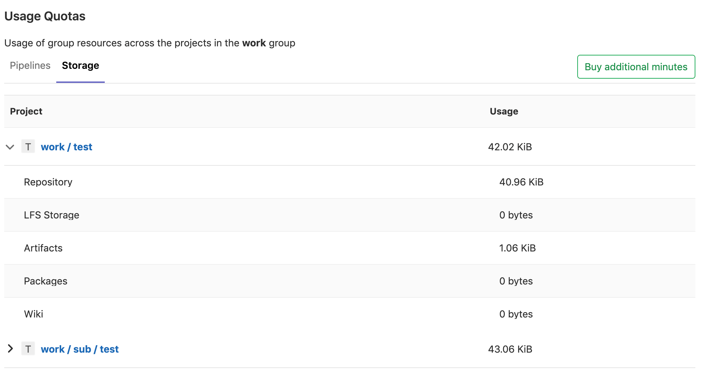

The total usage of the storage is updated if any relevant event that
will affect its value is triggered (e.g., a commit push).
For performance reasons, we may delay the update up to 1 hour and 30 minutes.

If your namespace shows `N/A` as the total storage usage, you can trigger a recalculation by pushing a commit to any project in that namespace.

### Maximum artifacts size **(CORE ONLY)**

For information about setting a maximum artifact size for a group, see
[Maximum artifacts size](../admin_area/settings/continuous_integration.md#maximum-artifacts-size-core-only).

## User contribution analysis **(STARTER)**

With [GitLab Contribution Analytics](contribution_analytics/index.md),
you have an overview of the contributions (pushes, merge requests,
and issues) performed by your group members.

## Issues analytics **(PREMIUM)**

With [GitLab Issues Analytics](issues_analytics/index.md), you can see a bar chart of the number of issues created each month in your groups.

## Dependency Proxy **(PREMIUM)**

Use GitLab as a [dependency proxy](../packages/dependency_proxy/index.md) for upstream Docker images.

<!-- ## Troubleshooting

Include any troubleshooting steps that you can foresee. If you know beforehand what issues
one might have when setting this up, or when something is changed, or on upgrading, it's
important to describe those, too. Think of things that may go wrong and include them here.
This is important to minimize requests for support, and to avoid doc comments with
questions that you know someone might ask.

Each scenario can be a third-level heading, e.g. `### Getting error message X`.
If you have none to add when creating a doc, leave this section in place
but commented out to help encourage others to add to it in the future. -->

[ee]: https://about.gitlab.com/pricing/
[ee-2534]: https://gitlab.com/gitlab-org/gitlab/issues/2534
