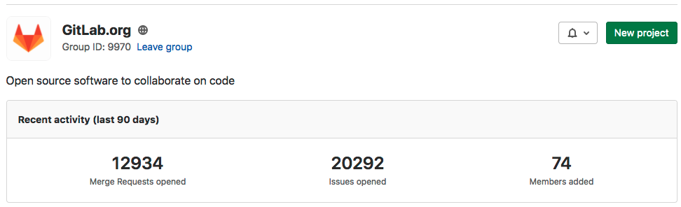
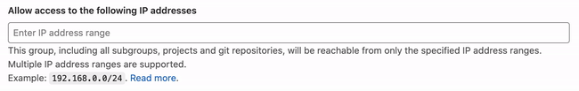
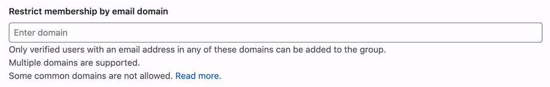

# Groups **(FREE)**

In GitLab, you use groups to manage one or more related projects at the same time.

You can use groups to manage permissions for your projects. If someone has access to
the group, they get access to all the projects in the group.

You can also view all of the issues and merge requests for the projects in the group,
and view analytics that show the group's activity.

You can use groups to communicate with all of the members of the group at once.

For larger organizations, you can also create [subgroups](subgroups/index.md).

## View groups

To view groups:

1. On the top bar, select **Menu > Groups**.
1. Select **Your Groups**. All groups you are a member of are displayed.
1. To view a list of public groups, select **Explore public groups**.

You can also view groups by namespace.

### Group visibility

Like projects, a group can be configured to limit the visibility of it to:

- Anonymous users.
- All signed-in users.
- Only explicit group members.

The restriction for [visibility levels](../admin_area/settings/visibility_and_access_controls.md#restricted-visibility-levels)
on the application setting level also applies to groups. If set to internal, the explore page is
empty for anonymous users. The group page has a visibility level icon.

Administrator users cannot create a subgroup or project with a higher visibility level than that of
the immediate parent group.

### Namespaces

In GitLab, a namespace is a unique name and URL for a user, a group, or subgroup.

- `http://gitlab.example.com/username`
- `http://gitlab.example.com/groupname`
- `http://gitlab.example.com/groupname/subgroup_name`

For example, consider a user named Alex:

1. Alex creates an account with the username `alex`: `https://gitlab.example.com/alex`
1. Alex creates a group for their team with the group name `alex-team`.
   The group and its projects are available at: `https://gitlab.example.com/alex-team`
1. Alex creates a subgroup of `alex-team` with the subgroup name `marketing`.
   The subgroup and its projects are available at: `https://gitlab.example.com/alex-team/marketing`

## Create a group

To create a group:

1. On the top bar, either:
   - Select **Menu > Groups**, and on the right, select **Create group**.
   - To the left of the search box, select the plus sign and then **New group**.
1. Select **Create group**.
1. For the **Group name**, use only:
   - Alphanumeric characters
   - Emojis
   - Underscores
   - Dashes, dots, spaces, and parentheses (however, it cannot start with any of these characters)

   For a list of words that cannot be used as group names, see [reserved names](../reserved_names.md).

1. For the **Group URL**, which is used for the [namespace](#namespaces),
   use only:
   - Alphanumeric characters
   - Underscores
   - Dashes and dots (it cannot start with dashes or end in a dot)
1. Choose the [visibility level](../../public_access/public_access.md).
1. Invite GitLab members or other users to join the group.

<i class="fa fa-youtube-play youtube" aria-hidden="true"></i>
For details about groups, watch [GitLab Namespaces (users, groups and subgroups)](https://youtu.be/r0sJgjR2f5A).

## Add users to a group

You can give a user access to all projects in a group.

1. On the top bar, select **Menu > Groups**.
1. Select **Your Groups**.
1. Find your group and select it.
1. From the left sidebar, select **Group information > Members**.
1. Fill in the fields.
   - The role applies to all projects in the group. [Learn more about permissions](../permissions.md).
   - On the **Access expiration date**, the user can no longer access projects in the group.

## Request access to a group

As a user, you can request to be a member of a group, if an administrator allows it.

1. On the top bar, select **Menu > Groups**.
1. Select **Your Groups**.
1. Find the group and select it.
1. Under the group name, select **Request Access**.

As many as ten of the most-recently-active group owners receive an email with your request.
Any group owner can approve or decline the request.

If you change your mind before your request is approved, select
**Withdraw Access Request**.

## Prevent users from requesting access to a group

As a group owner, you can prevent non-members from requesting access to
your group.

1. On the top bar, select **Menu > Groups**.
1. Select **Your Groups**.
1. Find the group and select it.
1. From the left menu, select **Settings > General**.
1. Expand the **Permissions, LFS, 2FA** section.
1. Clear the **Allow users to request access** checkbox.
1. Select **Save changes**.

## Change the owner of a group

You can change the owner of a group. Each group must always have at least one
member with the [Owner role](../permissions.md#group-members-permissions).

- As an administrator:
  1. Go to the group and from the left menu, select **Group information > Members**.
  1. Give a different member the **Owner** role.
  1. Refresh the page. You can now remove the **Owner** role from the original owner.
- As the current group's owner:
  1. Go to the group and from the left menu, select **Group information > Members**.
  1. Give a different member the **Owner** role.
  1. Have the new owner sign in and remove the **Owner** role from you.

## Remove a member from the group

Prerequisites:

- You must have the [Owner role](../permissions.md#group-members-permissions).
- The member must have direct membership in the group. If
  membership is inherited from a parent group, then the member can be removed
  from the parent group only.

To remove a member from a group:

1. Go to the group.
1. From the left menu, select **Group information > Members**.
1. Next to the member you want to remove, select **Delete**.
1. Optional. On the **Remove member** confirmation box, select the
  **Also unassign this user from linked issues and merge requests** checkbox.
1. Select **Remove member**.

## Filter and sort members in a group

> - [Introduced](https://gitlab.com/gitlab-org/gitlab/-/issues/21727) in GitLab 12.6.
> - [Improved](https://gitlab.com/gitlab-org/gitlab/-/issues/228675) in GitLab 13.7.
> - [Feature flag removed](https://gitlab.com/gitlab-org/gitlab/-/issues/289911) in GitLab 13.8.

To find members in a group, you can sort, filter, or search.

### Filter a group

Filter a group to find members. By default, all members in the group and subgroups are displayed.

1. Go to the group and select **Group information > Members**.
1. Above the list of members, in the **Filter members** box, enter filter criteria.
   - To view members in the group only, select **Membership = Direct**.
   - To view members of the group and its subgroups, select **Membership = Inherited**.
   - To view members with two-factor authentication enabled or disabled, select **2FA = Enabled** or **Disabled**.

### Search a group

You can search for members by name, username, or email.

1. Go to the group and select **Group information > Members**.
1. Above the list of members, in the **Filter members** box, enter search criteria.
1. To the right of the **Filter members** box, select the magnifying glass (**{search}**).

### Sort members in a group

You can sort members by **Account**, **Access granted**, **Max role**, or **Last sign-in**.

1. Go to the group and select **Group information > Members**.
1. Above the list of members, on the top right, from the **Account** list, select
   the criteria to filter by.
1. To switch the sort between ascending and descending, to the right of the **Account** list, select the
   arrow (**{sort-lowest}** or **{sort-highest}**).

## Mention a group in an issue or merge request

When you mention a group in a comment, every member of the group gets a to-do item
added to their To-do list.

1. Open the MR or issue.
1. In a comment, type `@` followed by the user, group, or subgroup namespace.
   For example, `@alex`, `@alex-team`, or `@alex-team/marketing`.
1. Select **Comment**.

A to-do item is created for all the group and subgroup members.

## Change the default branch protection of a group

> [Introduced](https://gitlab.com/gitlab-org/gitlab/-/issues/7583) in GitLab 12.9.

By default, every group inherits the branch protection set at the global level.

To change this setting for a specific group:

1. Go to the group's **Settings > General** page.
1. Expand the **Permissions, LFS, 2FA** section.
1. Select the desired option in the **Default branch protection** dropdown list.
1. Click **Save changes**.

To change this setting globally, see [Default branch protection](../admin_area/settings/visibility_and_access_controls.md#default-branch-protection).

NOTE:
In [GitLab Premium or higher](https://about.gitlab.com/pricing/), GitLab administrators can choose to [disable group owners from updating the default branch protection](../admin_area/settings/visibility_and_access_controls.md#disable-group-owners-from-updating-default-branch-protection).

## Add projects to a group

There are two different ways to add a new project to a group:

- Select a group, and then click **New project**. You can then continue [creating your project](../../user/project/working_with_projects.md#create-a-project).
- While you are creating a project, select a group from the dropdown menu.

  

### Specify who can add projects to a group

> - [Introduced](https://gitlab.com/gitlab-org/gitlab/-/issues/2534) in GitLab Premium 10.5.
> - [Moved](https://gitlab.com/gitlab-org/gitlab-foss/-/merge_requests/25975) to GitLab Free in 11.10.

By default, [Developers and Maintainers](../permissions.md#group-members-permissions) can create projects under a group.

To change this setting for a specific group:

1. Go to the group's **Settings > General** page.
1. Expand the **Permissions, LFS, 2FA** section.
1. Select the desired option in the **Allowed to create projects** dropdown list.
1. Click **Save changes**.

To change this setting globally, see [Default project creation protection](../admin_area/settings/visibility_and_access_controls.md#default-project-creation-protection).

## Group activity analytics **(PREMIUM)**

> - [Introduced](https://gitlab.com/gitlab-org/gitlab/-/issues/207164) in GitLab 12.10 as
a [beta feature](https://about.gitlab.com/handbook/product/#beta).

For a group, you can view how many merge requests, issues, and members were created in the last 90 days.

These Group Activity Analytics can be enabled with the `group_activity_analytics` [feature flag](../../development/feature_flags/index.md#enabling-a-feature-flag-locally-in-development).

### View group activity

You can view the most recent actions taken in a group.

1. On the top bar, select **Menu > Groups**.
1. Select **Your Groups**.
1. Find the group and select it.
1. On the left sidebar, select **Group information > Activity**.

To view the activity feed in Atom format, select the
**RSS** (**{rss}**) icon.

## Share a group with another group

> [Introduced](https://gitlab.com/gitlab-org/gitlab/-/issues/18328) in GitLab 12.7.

NOTE:
In GitLab 13.11, you can [replace this form with a modal window](#share-a-group-modal-window).

Similar to how you [share a project with a group](../project/members/share_project_with_groups.md),
you can share a group with another group. Members get direct access
to the shared group. This includes members who inherited group membership from a parent group.

To share a given group, for example, `Frontend` with another group, for example,
`Engineering`:

1. Go to the `Frontend` group.
1. From the left menu, select **Group information > Members**.
1. Select the **Invite group** tab.
1. In the **Select a group to invite** list, select `Engineering`.
1. For the **Max role**, select a [role](../permissions.md).
1. Select **Invite**.

All the members of the `Engineering` group are added to the `Frontend` group.

### Share a group modal window

> - [Introduced](https://gitlab.com/gitlab-org/gitlab/-/issues/247208) in GitLab 13.11.
> - [Deployed behind a feature flag](../feature_flags.md), disabled by default.
> - Enabled on GitLab.com.
> - Recommended for production use.
> - Replaces the existing form with buttons to open a modal window.
> - To use in GitLab self-managed instances, ask a GitLab administrator to [enable it](../project/members/index.md#enable-or-disable-modal-window). **(FREE SELF)**

WARNING:
This feature might not be available to you. Check the **version history** note above for details.

In GitLab 13.11, you can optionally replace the sharing form with a modal window.
To share a group after enabling this feature:

1. Go to your group's page.
1. In the left sidebar, go to **Group information > Members**, and then select **Invite a group**.
1. Select a group, and select a **Max role**.
1. (Optional) Select an **Access expiration date**.
1. Select **Invite**.

## Manage group memberships via LDAP **(PREMIUM SELF)**

Group syncing allows LDAP groups to be mapped to GitLab groups. This provides more control over per-group user management. To configure group syncing, edit the `group_base` **DN** (`'OU=Global Groups,OU=GitLab INT,DC=GitLab,DC=org'`). This **OU** contains all groups that will be associated with GitLab groups.

Group links can be created by using either a CN or a filter. To create these group links, go to the group's **Settings > LDAP Synchronization** page. After configuring the link, it may take more than an hour for the users to sync with the GitLab group.

For more information on the administration of LDAP and group sync, refer to the [main LDAP documentation](../../administration/auth/ldap/index.md#group-sync).

NOTE:
When you add LDAP synchronization, if an LDAP user is a group member and they are not part of the LDAP group, they are removed from the group.

### Create group links via CN **(PREMIUM SELF)**

To create group links via CN:

<!-- vale gitlab.Spelling = NO -->

1. Select the **LDAP Server** for the link.
1. As the **Sync method**, select `LDAP Group cn`.
1. In the **LDAP Group cn** field, begin typing the CN of the group. There is a dropdown menu with matching CNs in the configured `group_base`. Select your CN from this list.
1. In the **LDAP Access** section, select the [permission level](../permissions.md) for users synced in this group.
1. Select the **Add Synchronization** button.

<!-- vale gitlab.Spelling = YES -->

### Create group links via filter **(PREMIUM SELF)**

To create group links via filter:

1. Select the **LDAP Server** for the link.
1. As the **Sync method**, select `LDAP user filter`.
1. Input your filter in the **LDAP User filter** box. Follow the [documentation on user filters](../../administration/auth/ldap/index.md#set-up-ldap-user-filter).
1. In the **LDAP Access** section, select the [permission level](../permissions.md) for users synced in this group.
1. Select the **Add Synchronization** button.

### Override user permissions **(PREMIUM SELF)**

LDAP user permissions can be manually overridden by an administrator. To override a user's permissions:

1. Go to your group's **Group information > Members** page.
1. In the row for the user you are editing, select the pencil (**{pencil}**) icon.
1. Select the brown **Edit permissions** button in the modal.

Now you can edit the user's permissions from the **Members** page.

## Transfer a group

You can transfer groups in the following ways:

- Transfer a subgroup to a new parent group.
- Convert a top-level group into a subgroup by transferring it to the desired group.
- Convert a subgroup into a top-level group by transferring it out of its current group.

When transferring groups, note:

- Changing a group's parent can have unintended side effects. See [what happens when a repository path changes](../project/repository/index.md#what-happens-when-a-repository-path-changes).
- You can only transfer groups to groups you manage.
- You must update your local repositories to point to the new location.
- If the immediate parent group's visibility is lower than the group's current visibility, visibility levels for subgroups and projects change to match the new parent group's visibility.
- Only explicit group membership is transferred, not inherited membership. If the group's owners have only inherited membership, this leaves the group without an owner. In this case, the user transferring the group becomes the group's owner.
- Transfers fail if [packages](../packages/index.md) exist in any of the projects in the group, or in any of its subgroups.

## Change a group's path

Changing a group's path (group URL) can have unintended side effects. Read
[how redirects behave](../project/repository/index.md#what-happens-when-a-repository-path-changes)
before you proceed.

If you are changing the path so it can be claimed by another group or user,
you may need to rename the group too. Both names and paths must
be unique.

To retain ownership of the original namespace and protect the URL redirects,
create a new group and transfer projects to it instead.

To change your group path (group URL):

1. Go to your group's **Settings > General** page.
1. Expand the **Path, transfer, remove** section.
1. Under **Change group URL**, enter a new name.
1. Select **Change group URL**.

WARNING:
It is not possible to rename a namespace if it contains a
project with [Container Registry](../packages/container_registry/index.md) tags,
because the project cannot be moved.

## Use a custom name for the initial branch

> - [Introduced](https://gitlab.com/gitlab-org/gitlab/-/merge_requests/43290) in GitLab 13.6.

When you create a new project in GitLab, a default branch is created with the
first push. The group owner can
[customize the initial branch](../project/repository/branches/default.md#group-level-custom-initial-branch-name)
for the group's projects to meet your group's needs.

## Remove a group

To remove a group and its contents:

1. Go to your group's **Settings > General** page.
1. Expand the **Path, transfer, remove** section.
1. In the Remove group section, select **Remove group**.
1. Confirm the action.

This action removes the group. It also adds a background job to delete all projects in the group.

Specifically:

- In [GitLab 12.8 and later](https://gitlab.com/gitlab-org/gitlab/-/issues/33257), on [Premium](https://about.gitlab.com/pricing/premium/) or higher tiers, this action adds a background job to mark a group for deletion. By default, the job schedules the deletion 7 days in the future. You can modify this waiting period through the [instance settings](../admin_area/settings/visibility_and_access_controls.md#default-deletion-delay).
- In [GitLab 13.6 and later](https://gitlab.com/gitlab-org/gitlab/-/issues/39504), if the user who sets up the deletion is removed from the group before the
deletion happens, the job is cancelled, and the group is no longer scheduled for deletion.

## Restore a group **(PREMIUM)**

> [Introduced](https://gitlab.com/gitlab-org/gitlab/-/issues/33257) in GitLab 12.8.

To restore a group that is marked for deletion:

1. Go to your group's **Settings > General** page.
1. Expand the **Path, transfer, remove** section.
1. In the Restore group section, select **Restore group**.

## Prevent group sharing outside the group hierarchy

This setting is only available on top-level groups. It affects all subgroups.

When checked, any group within the top-level group hierarchy can be shared only with other groups within the hierarchy.

For example, with these groups:

- **Animals > Dogs**
- **Animals > Cats**
- **Plants > Trees**

If you select this setting in the **Animals** group:

- **Dogs** can be shared with **Cats**.
- **Dogs** cannot be shared with **Trees**.

To prevent sharing outside of the group's hierarchy:

1. Go to the group's **Settings > General** page.
1. Expand the **Permissions, LFS, 2FA** section.
1. Select **Prevent members from sending invitations to groups outside of `<group_name>` and its subgroups**.
1. Select **Save changes**.

## Prevent a project from being shared with groups

Prevent projects in a group from [sharing
a project with another group](../project/members/share_project_with_groups.md) to enable tighter control over project access.

To prevent a project from being shared with other groups:

1. Go to the group's **Settings > General** page.
1. Expand the **Permissions, LFS, 2FA** section.
1. Select **Prevent sharing a project within `<group_name>` with other groups**.
1. Select **Save changes**.

## Prevent members from being added to a group **(PREMIUM)**

As a group owner, you can prevent any new project membership for all
projects in a group, allowing tighter control over project membership.

For example, if you want to lock the group for an [Audit Event](../../administration/audit_events.md),
you can guarantee that project membership cannot be modified during the audit.

To prevent members from being added to a group:

1. Go to the group's **Settings > General** page.
1. Expand the **Permissions, LFS, 2FA** section.
1. Under **Member lock**, select **Prevent adding new members to project membership within this group**.
1. Select **Save changes**.

All users who previously had permissions can no longer add members to a group.
API requests to add a new user to a project are not possible.

## Restrict group access by IP address **(PREMIUM)**

> - [Introduced](https://gitlab.com/gitlab-org/gitlab/-/issues/1985) in [GitLab Ultimate](https://about.gitlab.com/pricing/) 12.0.
> - [Moved](https://gitlab.com/gitlab-org/gitlab/-/issues/215410) to [GitLab Premium](https://about.gitlab.com/pricing/) in 13.1.

To ensure only people from your organization can access particular
resources, you can restrict access to groups by IP address. This group-level setting
applies to:

- The GitLab UI, including subgroups, projects, and issues.
- [In GitLab 12.3 and later](https://gitlab.com/gitlab-org/gitlab/-/issues/12874), the API.

You should consider these security implications before configuring IP address restrictions:

- **SSH requests**: While you can restrict HTTP traffic on GitLab.com with IP address restrictions,
  they cause SSH requests, including Git operations over SSH, to fail. For more information,
  read [issue 271673](https://gitlab.com/gitlab-org/gitlab/-/issues/271673).
- **Administrators and group owners**: Users with these permission levels can always
  access the group settings, regardless of IP restriction, but they cannot access projects
  belonging to the group when accessing from a disallowed IP address.
- **GitLab API and runner activities**: Only the [Groups](../../api/groups.md)
  and [Projects](../../api/projects.md) APIs are protected by IP address restrictions.
  When you register a runner, it is not bound by the IP restrictions. When the runner
  requests a new job or an update to a job's state, it is also not bound by
  the IP restrictions. But when the running CI/CD job sends Git requests from a
  restricted IP address, the IP restriction prevents code from being cloned.

To restrict group access by IP address:

1. Go to the group's **Settings > General** page.
1. Expand the **Permissions, LFS, 2FA** section.
1. In the **Allow access to the following IP addresses** field, enter IP address ranges in CIDR notation.
1. Select **Save changes**.

   

## Restrict group access by domain **(PREMIUM)**

>- [Introduced](https://gitlab.com/gitlab-org/gitlab/-/issues/7297) in [GitLab Premium](https://about.gitlab.com/pricing/) 12.2.
>- Support for specifying multiple email domains [introduced](https://gitlab.com/gitlab-org/gitlab/-/issues/33143) added in GitLab 13.1.

You can prevent users with email addresses in specific domains from being added to a group.

To restrict group access by domain:

1. Go to the group's **Settings > General** page.
1. Expand the **Permissions, LFS, 2FA** section.
1. In the **Restrict membership by email** field, enter the domain names.
1. Select **Save changes**.

Any time you attempt to add a new user, they are compared against this list.

Some domains cannot be restricted. These are the most popular public email domains, such as:

- `gmail.com`, `yahoo.com`, `aol.com`, `icloud.com`
- `hotmail.com`, `hotmail.co.uk`, `hotmail.fr`
- `msn.com`, `live.com`, `outlook.com`

NOTE:
Domain restrictions apply to groups only. They do not prevent users from being added as members of projects owned by the restricted group.

## Group file templates **(PREMIUM)**

Use group file templates to share a set of templates for common file
types with every project in a group. It is analogous to the
[instance template repository](../admin_area/settings/instance_template_repository.md).
The selected project should follow the same naming conventions as
are documented on that page.

You can only choose projects in the group as the template source.
This includes projects shared with the group, but it **excludes** projects in
subgroups or parent groups of the group being configured.

You can configure this feature for both subgroups and immediate parent groups. A project
in a subgroup has access to the templates for that subgroup, as well as
any immediate parent groups.

To learn how to create templates for issues and merge requests, see
[Description templates](../project/description_templates.md).

Define project templates at a group level by setting a group as the template source.
[Learn more about group-level project templates](custom_project_templates.md). **(PREMIUM)**

### Enable group file template **(PREMIUM)**

To enable group file templates:

1. Go to the group's **Settings > General** page.
1. Expand the **Templates** section.
1. Choose a project to act as the template repository.
1. Select **Save changes**.

## Disable email notifications

> [Introduced](https://gitlab.com/gitlab-org/gitlab/-/issues/23585) in GitLab 12.2.

You can disable all email notifications related to the group, which includes its subgroups and projects.

To disable email notifications:

1. Go to the group's **Settings > General** page.
1. Expand the **Permissions, LFS, 2FA** section.
1. Select **Disable email notifications**.
1. Select **Save changes**.

## Disable group mentions

> [Introduced](https://gitlab.com/gitlab-org/gitlab/-/issues/21301) in GitLab 12.6.

You can prevent users from being added to a conversation and getting notified when
anyone mentions a group in which those users are members.

Groups with disabled mentions are visualized accordingly in the autocompletion dropdown.

This is particularly helpful for groups with a large number of users.

To disable group mentions:

1. Go to the group's **Settings > General** page.
1. Expand the **Permissions, LFS, 2FA** section.
1. Select **Disable group mentions**.
1. Select **Save changes**.

## Enable delayed project removal **(PREMIUM)**

> - [Introduced](https://gitlab.com/gitlab-org/gitlab/-/issues/220382) in GitLab 13.2.
> - [Inheritance and enforcement added](https://gitlab.com/gitlab-org/gitlab/-/issues/321724) in GitLab 13.11.

By default, projects in a group are deleted immediately.
Optionally, on [Premium](https://about.gitlab.com/pricing/) or higher tiers,
you can configure the projects in a group to be deleted after a delayed interval.

During this interval period, the projects are in a read-only state and can be restored, if required.
The interval period defaults to 7 days, and can be modified by an administrator in the [instance settings](../admin_area/settings/visibility_and_access_controls.md#default-deletion-delay).

To enable delayed deletion of projects:

1. Go to the group's **Settings > General** page.
1. Expand the **Permissions, LFS, 2FA** section.
1. Check **Enable delayed project removal**.
1. Optional. To prevent subgroups from changing this setting, select **Enforce for all subgroups**.
1. Select **Save changes**.

NOTE:
In GitLab 13.11 and above the group setting for delayed project removal is inherited by subgroups. As discussed in [Cascading settings](../../development/cascading_settings.md) inheritance can be overridden, unless enforced by an ancestor.

## Prevent project forking outside group **(PREMIUM)**

> [Introduced](https://gitlab.com/gitlab-org/gitlab/-/issues/216987) in GitLab 13.3.

By default, projects in a group can be forked.
Optionally, on [Premium](https://about.gitlab.com/pricing/) or higher tiers,
you can prevent the projects in a group from being forked outside of the current top-level group.

Previously this setting was available only for groups enforcing group managed account. This setting will be
removed from SAML setting page and migrated to group settings. In the interim period, both of these settings are taken into consideration.
If even one is set to `true` then it will be assumed the group does not allow forking projects outside.

To enable prevent project forking:

1. Go to the top-level group's **Settings > General** page.
1. Expand the **Permissions, LFS, 2FA** section.
1. Check **Prevent project forking outside current group**.
1. Select **Save changes**.

## Group push rules **(PREMIUM)**

> - [Introduced](https://gitlab.com/gitlab-org/gitlab/-/issues/34370) in GitLab 12.8.
> - [Feature flag removed](https://gitlab.com/gitlab-org/gitlab/-/issues/224129) in GitLab 13.4.

Group push rules allow group maintainers to set
[push rules](../../push_rules/push_rules.md) for newly created projects in the specific group.

To configure push rules for a group:

1. Go to the groups's **Push Rules** page.
1. Select the settings you want.
1. Select **Save Push Rules**.

The group's new subgroups have push rules set for them based on either:

- The closest parent group with push rules defined.
- Push rules set at the instance level, if no parent groups have push rules defined.

## Related topics

- [Group wikis](../project/wiki/index.md)
- [Maximum artifacts size](../admin_area/settings/continuous_integration.md#maximum-artifacts-size). **(FREE SELF)**
- [Repositories analytics](repositories_analytics/index.md): View overall activity of all projects with code coverage. **(PREMIUM)**
- [Contribution analytics](contribution_analytics/index.md): View the contributions (pushes, merge requests,
  and issues) of group members. **(PREMIUM)**
- [Issue analytics](issues_analytics/index.md): View a bar chart of your group's number of issues per month. **(PREMIUM)**
- Use GitLab as a [dependency proxy](../packages/dependency_proxy/index.md) for upstream Docker images.
- [Epics](epics/index.md): Track groups of issues that share a theme. **(ULTIMATE)**
- [Security Dashboard](../application_security/security_dashboard/index.md): View the vulnerabilities of all
  the projects in a group and its subgroups. **(ULTIMATE)**
- [Insights](insights/index.md): Configure insights like triage hygiene, issues created/closed per a given period, and
  average time for merge requests to be merged. **(ULTIMATE)**
- [Webhooks](../project/integrations/webhooks.md).
- [Kubernetes cluster integration](clusters/index.md).
- [Audit Events](../../administration/audit_events.md#group-events). **(PREMIUM)**
- [Pipelines quota](../admin_area/settings/continuous_integration.md): Keep track of the pipeline quota for the group.
- [Integrations](../admin_area/settings/project_integration_management.md).
- [Transfer a project into a group](../project/settings/index.md#transferring-an-existing-project-into-another-namespace).
- [Share a project with a group](../project/members/share_project_with_groups.md): Give all group members access to the project at once.
- [Lock the sharing with group feature](#prevent-a-project-from-being-shared-with-groups).
- [Enforce two-factor authentication (2FA)](../../security/two_factor_authentication.md#enforcing-2fa-for-all-users-in-a-group): Enforce 2FA
  for all group members.

## Troubleshooting

### Verify if access is blocked by IP restriction

If a user sees a 404 when they would normally expect access, and the problem is limited to a specific group, search the `auth.log` rails log for one or more of the following:

- `json.message`: `'Attempting to access IP restricted group'`
- `json.allowed`: `false`

In viewing the log entries, compare the `remote.ip` with the list of
[allowed IPs](#restrict-group-access-by-ip-address) for the group.
