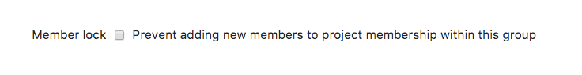

# Groups

With GitLab Groups you can assemble related projects together
and grant members access to several projects at once.

Groups can also be nested in [subgroups](subgroups/index.md).

Find your groups by expanding the left menu and clicking **Groups**:

The Groups page displays all groups you are a member of, how many projects it holds,
how many members it has, the group visibility, and, if you have enough permissions,
a link to the group settings. By clicking the last button you can leave that group.

## Use cases

You can create groups for numerous reasons. To name a few:

- Organize related projects under the same [namespace](#namespaces), add members to that
group and grant access to all their projects at once
- Create a group, include members of your team, and make it easier to
`@mention` all the team at once in issues and merge requests
  - Create a group for your company members, and create [subgroups](subgroups/index.md)
  for each individual team. Let's say you create a group called `company-team`, and among others,
      you created subgroups in this group for each individual team `backend-team`,
      `frontend-team`, and `production-team`:
        1. When you start a new implementation from an issue, you add a comment:
        _"`@company-team`, let's do it! `@company-team/backend-team` you're good to go!"_
        1. When your backend team needs help from frontend, they add a comment:
        _"`@company-team/frontend-team` could you help us here please?"_
        1. When the frontend team completes their implementation, they comment:
        _"`@company-team/backend-team`, it's done! Let's ship it `@company-team/production-team`!"_

## Namespaces

In GitLab, a namespace is a unique name to be used as a user name, a group name, or a subgroup name.

- `http://gitlab.example.com/username`
- `http://gitlab.example.com/groupname`
- `http://gitlab.example.com/groupname/subgroup_name`

For example, consider a user called John:

1. John creates his account on GitLab.com with the username `john`;
his profile will be accessed under `https://gitlab.example.com/john`
1. John creates a group for his team with the groupname `john-team`;
his group and its projects will be accessed under `https://gitlab.example.com/john-team`
1. John creates a subgroup of `john-team` with the subgroup name `marketing`;
his subgroup and its projects will be accessed under `https://gitlab.example.com/john-team/marketing`

By doing so:

- Any team member mentions John with `@john`
- John mentions everyone from his team with `@john-team`
- John mentions only his marketing team with `@john-team/marketing`

## Issues and merge requests within a group

Issues and merge requests are part of projects. For a given group, view all the
[issues](../project/issues/index.md#issues-per-group) and [merge requests](../project/merge_requests/index.md#merge-requests-per-group) across all the projects in that group,
together in a single list view.

## Create a new group

> **Notes:**
- For a list of words that are not allowed to be used as group names see the
  [reserved names](../reserved_names.md).

You can create a group in GitLab from:

1. The Groups page: expand the left menu, click **Groups**, and click the green button **New group**:

    

1. Elsewhere: expand the `plus` sign button on the top navbar and choose **New group**:

    

Add the following information:

1. Set the **Group path** which will be the **namespace** under which your projects
   will be hosted (path can contain only letters, digits, underscores, dashes
   and dots; it cannot start with dashes or end in dot).
1. The **Group name** will populate with the path. Optionally, you can change
   it. This is the name that will display in the group views.
1. Optionally, you can add a description so that others can briefly understand
   what this group is about.
1. Optionally, choose an avatar for your project.
1. Choose the [visibility level](../../public_access/public_access.md).

## Add users to a group

Add members to a group by navigating to the group's dashboard, and clicking **Members**:

Select the [permission level](../permissions.md#permissions) and add the new member. You can also set the expiring
date for that user, from which they will no longer have access to your group.

One of the benefits of putting multiple projects in one group is that you can
give a user to access to all projects in the group with one action.

Consider we have a group with two projects:

- On the **Group Members** page we can now add a new user to the group.
- Now because this user is a **Developer** member of the group, he automatically
gets **Developer** access to **all projects** within that group.

If necessary, you can increase the access level of an individual user for a specific project,
by adding them again as a new member to the project with the new permission levels.

## Request access to a group

As a group owner you can enable or disable non members to request access to
your group. Go to the group settings and click on **Allow users to request access**.

As a user, you can request to be a member of a group. Go to the group you'd
like to be a member of, and click the **Request Access** button on the right
side of your screen.

---

Group owners and masters will be notified of your request and will be able to approve or
decline it on the members page.

---

If you change your mind before your request is approved, just click the
**Withdraw Access Request** button.

## Add projects to a group

There are two different ways to add a new project to a group:

- Select a group and then click on the **New project** button.

    

    You can then continue on [creating a project](../../gitlab-basics/create-project.md).

- While you are creating a project, select a group namespace
  you've already created from the dropdown menu.

    

### Default project creation level

> [Introduced][ee-2534] in [GitLab Premium][ee] 10.5.
> Brought to [GitLab Starter][ee] in 10.7.

Group owners or administrators can set an option that will give users with the
Developer role the ability to create projects under groups.

By default, `Developers` and `Masters` are allowed to create projects under a
group, but this can be changed either within the group settings for a group, or
be set globally by a GitLab administrator in the Admin area
(**Settings > Visibility and Access Controls**).

The setting can set to "None", "Masters", or "Developers + Masters".

## Transfer projects into groups

Learn how to [transfer a project into a group](../project/index.md#transfer-an-existing-project-into-a-group).

## Sharing a project with a group

You can [share your projects with a group](../project/members/share_project_with_groups.md)
and give your group members access to the project all at once.

Alternatively, you can [lock the sharing with group feature](#share-with-group-lock).

## Manage group memberships via LDAP

In GitLab Enterprise Edition it is possible to manage GitLab group memberships using LDAP groups.
See [the GitLab Enterprise Edition documentation](../../integration/ldap.md) for more information.

## Epics

> Introduced in [GitLab Ultimate][ee] 10.2.

Epics let you manage your portfolio of projects more efficiently and with less
effort by tracking groups of issues that share a theme, across projects and
milestones.

[Learn more about Epics.](epics/index.md)

## Transfer groups to another group

From 10.5 there are two different ways to transfer a group:

- Either by transferring a group into another group (making it a subgroup of that group).
- Or by converting a subgroup into a root group (a group with no parent).

Please make sure to understand that:

- Changing a group's parent can have unintended side effects. See [Redirects when changing repository paths](https://docs.gitlab.com/ce/user/project/index.html#redirects-when-changing-repository-paths)
- You can only transfer the group to a group you manage.
- You will need to update your local repositories to point to the new location.
- If the parent group's visibility is lower than the group current visibility, visibility levels for subgroups and projects will be changed to match the new parent group's visibility.

## Group settings

Once you have created a group, you can manage its settings by navigating to
the group's dashboard, and clicking **Settings**.

### General settings

Besides giving you the option to edit any settings you've previously
set when [creating the group](#create-a-new-group), you can also
access further configurations for your group.

#### Changing a group's path

Changing a group's path can have unintended side effects. Read
[how redirects will behave](../project/index.md#redirects-when-changing-repository-paths)
before proceeding.

If you are vacating the path so it can be claimed by another group or user,
you may need to rename the group name as well since both names and paths must
be unique.

To change your group path:

1. Navigate to your group's **Settings > General**.
1. Enter a new name under "Group path".
1. Hit **Save group**.

CAUTION: **Caution:**
It is currently not possible to rename a namespace if it contains a
project with [Container Registry](../project/container_registry.md) tags,
because the project cannot be moved.

TIP: **TIP:**
If you want to retain ownership over the original namespace and
protect the URL redirects, then instead of changing a group's path or renaming a
username, you can create a new group and transfer projects to it.

#### Enforce 2FA to group members

Add a security layer to your group by
[enforcing two-factor authentication (2FA)](../../security/two_factor_authentication.md#enforcing-2fa-for-all-users-in-a-group)
to all group members.

#### Share with group lock

Prevent projects in a group from [sharing
a project with another group](../project/members/share_project_with_groups.md).
This allows for tighter control over project access.

For example, consider you have two distinct teams (Group A and Group B)
working together in a project.
To inherit the group membership, you share the project between the
two groups A and B. **Share with group lock** prevents any project within
the group from being shared with another group. By doing so, you
guarantee only the right group members have access to that projects.

To enable this feature, navigate to the group settings page. Select
**Share with group lock** and **Save the group**.

#### Member Lock **[STARTER]**

With **Member Lock** it is possible to lock membership in project to the
level of members in group.

Member Lock lets a group owner to lock down any new project membership to all the
projects within the group, allowing tighter control over project membership.
Learn more about [Member Lock](https://docs.gitlab.com/ee/user/group/index.html#member-lock).

For instance, if you want to lock the group for an [Audit Event](../../administration/audit_events.md),
you enable Member Lock to guarantee that any membership is added or changed
during the audition.

To enable this feature, navigate to group settings page, select **Member lock**
and **Save group**.

This will disable the option for all users who previously had permissions to
operate project memberships so no new users can be added. Furthermore, any
request to add new user to project through API will not be possible.

### Advanced settings

- **Projects**: view all projects within that group, add members to each project,
access each project's settings, and remove any project from the same screen.
- **Webhooks**: configure [webhooks](../project/integrations/webhooks.md)
and [push rules](https://docs.gitlab.com/ee/push_rules/push_rules.html#push-rules) to your group. **[STARTER]**
- **Audit Events**: view [Audit Events](https://docs.gitlab.com/ee/administration/audit_events.html#audit-events)
for the group. **[STARTER ONLY]**
- **Pipelines quota**: keep track of the [pipeline quota](../admin_area/settings/continuous_integration.md) for the group

## User contribution analysis

> Available in [GitLab Starter](https://about.gitlab.com/products/) and
[GitLab.com Bronze](https://about.gitlab.com/gitlab-com/).

With [GitLab Contribution Analytics](contribution_analytics/index.md)
you have an overview of the contributions (pushes, merge requests,
and issues) performed my your group members.

[ee]: https://about.gitlab.com/products/
[ee-2534]: https://gitlab.com/gitlab-org/gitlab-ee/issues/2534
