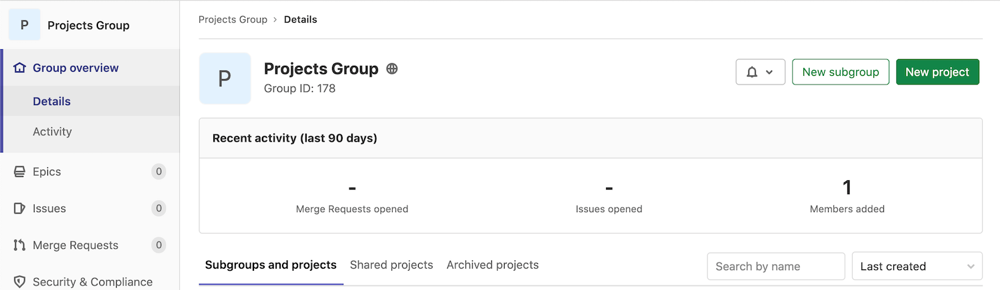
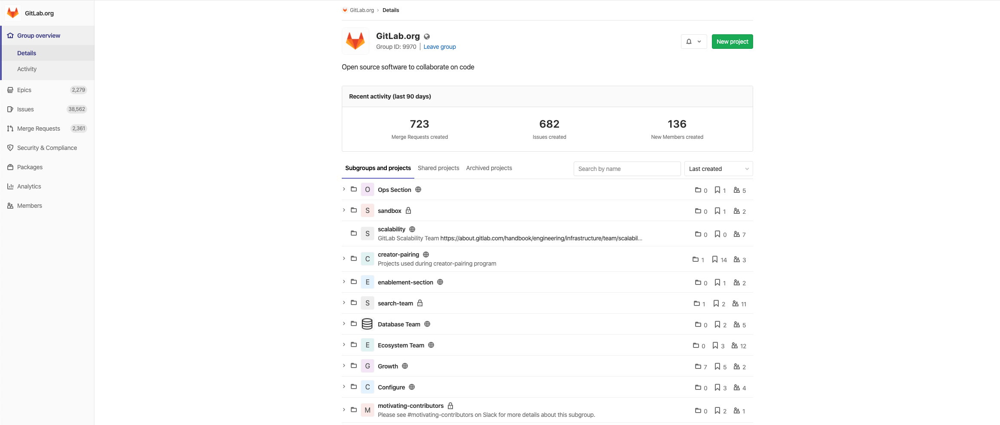
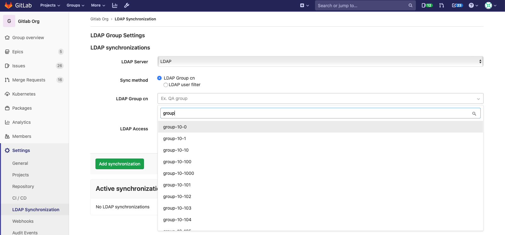
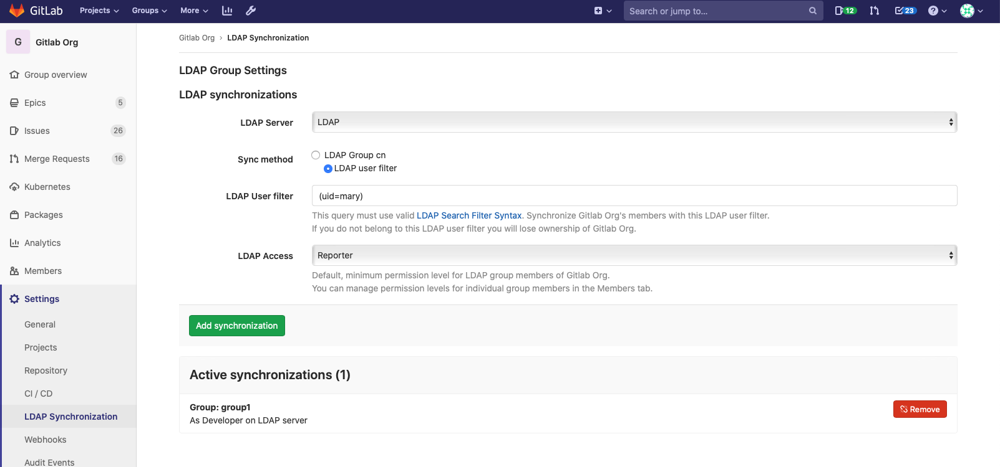
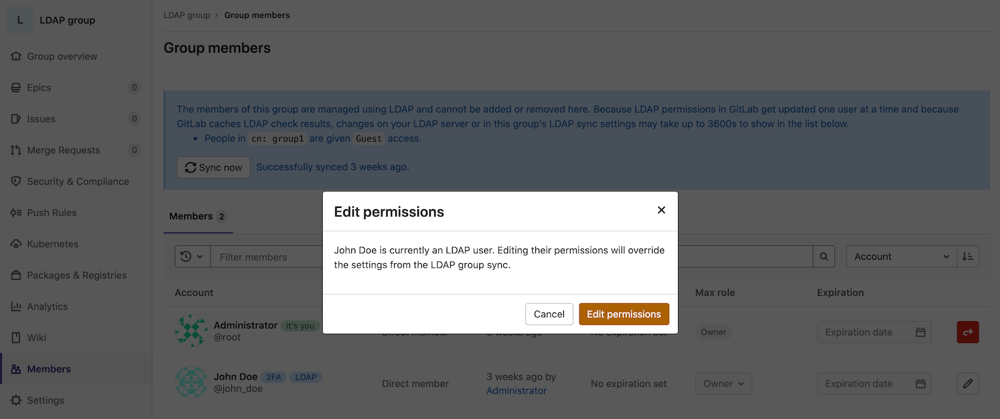

# Groups **(FREE)**

In GitLab, you can put related projects together in a group.

For example, you might create a group for your company members and a subgroup for each individual team.
You can name the group `company-team`, and the subgroups `backend-team`, `frontend-team`, and `production-team`.

Then you can:

- Grant members access to multiple projects at once.
- Add to-do items for all of the group members at once.
- View the [issues](../project/issues/index.md#issues-list) and
  [merge requests](../project/merge_requests/reviewing_and_managing_merge_requests.md#view-merge-requests-for-all-projects-in-a-group)
  for all projects in the group, together in a single list view.
- [Bulk edit](../group/bulk_editing/index.md) issues, epics, and merge requests.

You can also create [subgroups](subgroups/index.md).

## View groups

To view groups:

1. In the top menu, select **Groups > Your Groups**. All groups you are a member of are displayed.
1. To view a list of public groups, select **Explore public groups**.

You can also view groups by namespace.

### Namespaces

In GitLab, a namespace is a unique name and URL for a user, a group, or subgroup.

- `http://gitlab.example.com/username`
- `http://gitlab.example.com/groupname`
- `http://gitlab.example.com/groupname/subgroup_name`

For example, consider a user named Alex:

1. Alex creates an account with the username `alex`: `https://gitlab.example.com/alex`
1. Alex creates a group for their team with the group name `alex-team`.
   The group and its projects are available at: `https://gitlab.example.com/alex-team`
1. Alex creates a subgroup of `alex-team` with the subgroup name `marketing`.
   The subgroup and its projects are available at: `https://gitlab.example.com/alex-team/marketing`

## Create a group

To create a group:

1. From the top menu, either:
   - Select **Groups > Your Groups**, and on the right, select the **New group** button.
   - To the left of the search box, select the plus sign and then **New group**.
1. For the **Group name**, use only:
   - Alphanumeric characters
   - Emojis
   - Underscores
   - Dashes, dots, spaces and parenthesis (however, it cannot start with any of these characters)

   For a list of words that cannot be used as group names, see [reserved names](../reserved_names.md).

1. For the **Group URL**, which is used for the [namespace](#namespaces),
   use only:
   - Alphanumeric characters
   - Underscores
   - Dashes and dots (it cannot start with dashes or end in a dot)
1. Choose the [visibility level](../../public_access/public_access.md).
1. Invite GitLab members or other users to join the group.

<i class="fa fa-youtube-play youtube" aria-hidden="true"></i>
For details about groups, watch [GitLab Namespaces (users, groups and subgroups)](https://youtu.be/r0sJgjR2f5A).

## Add users to a group

You can give a user access to all projects in a group.

1. From the top menu, select **Groups > Your Groups**.
1. Find your group and select it.
1. From the left sidebar, select **Members**.
1. Fill in the fields.
   - The role applies to all projects in the group. [Learn more about permissions](../permissions.md#permissions).
   - On the **Access expiration date**, the user can no longer access projects in the group.

## Request access to a group

As a user, you can request to be a member of a group, if an administrator allows it.

1. From the top menu, select **Groups > Your Groups**.
1. Find the group and select it.
1. Under the group name, select **Request Access**.

As many as ten of the most-recently-active group owners receive an email with your request.
Any group owner can approve or decline the request.

If you change your mind before your request is approved, select
**Withdraw Access Request**.

## Prevent users from requesting access to a group

As a group owner, you can prevent non-members from requesting access to
your group.

1. From the top menu, select **Groups > Your Groups**.
1. Find the group and select it.
1. From the left menu, select **Settings > General**.
1. Expand the **Permissions, LFS, 2FA** section.
1. Clear the **Allow users to request access** checkbox.
1. Select **Save changes**.

## Change the owner of a group

You can change the owner of a group. Each group must always have at least one
member with [Owner permission](../permissions.md#group-members-permissions).

- As an administrator:
  1. Go to the group and from the left menu, select **Members**.
  1. Give a different member **Owner** permissions.
  1. Refresh the page. You can now remove **Owner** permissions from the original owner.
- As the current group's owner:
  1. Go to the group and from the left menu, select **Members**.
  1. Give a different member **Owner** permissions.
  1. Have the new owner sign in and remove **Owner** permissions from you.

## Remove a member from the group

Prerequisites:

- You must have [Owner permissions](../permissions.md#group-members-permissions).
- The member must have direct membership in the group. If
  membership is inherited from a parent group, then the member can be removed
  from the parent group only.

To remove a member from a group:

1. Go to the group.
1. From the left menu, select **Members**.
1. Next to the member you want to remove, select **Delete**.
1. Optional. On the **Remove member** confirmation box, select the
  **Also unassign this user from related issues and merge requests** checkbox.
1. Select **Remove member**.

## Filter and sort members in a group

> - [Introduced](https://gitlab.com/gitlab-org/gitlab/-/issues/21727) in GitLab 12.6.
> - [Improved](https://gitlab.com/gitlab-org/gitlab/-/issues/228675) in GitLab 13.7.
> - [Feature flag removed](https://gitlab.com/gitlab-org/gitlab/-/issues/289911) in GitLab 13.8.

To find members in a group, you can sort, filter, or search.

### Filter a group

Filter a group to find members. By default, all members in the group and subgroups are displayed.

1. Go to the group and select **Members** (**{users}**).
1. Above the list of members, in the **Filter members** box, enter filter criteria.
   - To view members in the group only, select **Membership = Direct**.
   - To view members of the group and its subgroups, select **Membership = Inherited**.
   - To view members with two-factor authentication enabled or disabled, select **2FA = Enabled** or **Disabled**.

### Search a group

You can search for members by name, username, or email.

1. Go to the group and select **Members** (**{users}**).
1. Above the list of members, in the **Filter members** box, enter search criteria.
1. To the right of the **Filter members** box, select the magnifying glass (**{search}**).

### Sort members in a group

You can sort members by **Account**, **Access granted**, **Max role**, or **Last sign-in**.

1. Go to the group and select **Members** (**{users}**).
1. Above the list of members, on the top right, from the **Account** list, select
   the criteria to filter by.
1. To switch the sort between ascending and descending, to the right of the **Account** list, select the
   arrow (**{sort-lowest}** or **{sort-highest}**).

## Mention a group in an issue or merge request

When you mention a group in a comment, every member of the group gets a to-do item
added to their To-do list.

1. Open the MR or issue.
1. In a comment, type `@` followed by the user, group, or subgroup namespace.
   For example, `@alex`, `@alex-team`, or `@alex-team/marketing`.
1. Select **Comment**.

A to-do item is created for all the group and subgroup members.

## Change the default branch protection of a group

> [Introduced](https://gitlab.com/gitlab-org/gitlab/-/issues/7583) in GitLab 12.9.

By default, every group inherits the branch protection set at the global level.

To change this setting for a specific group:

1. Go to the group's **Settings > General** page.
1. Expand the **Permissions, LFS, 2FA** section.
1. Select the desired option in the **Default branch protection** dropdown list.
1. Click **Save changes**.

To change this setting globally, see [Default branch protection](../admin_area/settings/visibility_and_access_controls.md#default-branch-protection).

NOTE:
In [GitLab Premium or higher](https://about.gitlab.com/pricing/), GitLab administrators can choose to [disable group owners from updating the default branch protection](../admin_area/settings/visibility_and_access_controls.md#disable-group-owners-from-updating-default-branch-protection).

## Add projects to a group

There are two different ways to add a new project to a group:

- Select a group, and then click **New project**. You can then continue [creating your project](../../user/project/working_with_projects.md#create-a-project).

  

- While you are creating a project, select a group namespace
  you've already created from the dropdown menu.

  

### Default project-creation level

> - [Introduced](https://gitlab.com/gitlab-org/gitlab/-/issues/2534) in [GitLab Premium](https://about.gitlab.com/pricing/) 10.5.
> - Brought to [GitLab Starter](https://about.gitlab.com/pricing/) in 10.7.
> - [Moved](https://gitlab.com/gitlab-org/gitlab-foss/-/merge_requests/25975) to [GitLab Free](https://about.gitlab.com/pricing/) in 11.10.

By default, [Developers and Maintainers](../permissions.md#group-members-permissions) can create projects under a group.

To change this setting for a specific group:

1. Go to the group's **Settings > General** page.
1. Expand the **Permissions, LFS, 2FA** section.
1. Select the desired option in the **Allowed to create projects** dropdown list.
1. Click **Save changes**.

To change this setting globally, see [Default project creation protection](../admin_area/settings/visibility_and_access_controls.md#default-project-creation-protection).

## View group details

A group's **Details** page includes tabs for:

- Subgroups and projects.
- Shared projects.
- Archived projects.

### Group activity analytics overview

> - [Introduced](https://gitlab.com/gitlab-org/gitlab/-/issues/207164) in GitLab [Starter](https://about.gitlab.com/pricing/) 12.10 as
a [beta feature](https://about.gitlab.com/handbook/product/#beta)

The group details view also shows the number of the following items created in the last 90 days: **(PREMIUM)**

- Merge requests.
- Issues.
- Members.

These Group Activity Analytics can be enabled with the `group_activity_analytics` [feature flag](../../development/feature_flags/development.md#enabling-a-feature-flag-locally-in-development).

For details, see the section on how you can [View group activity](#view-group-activity).

## View group activity

A group's **Activity** page displays the most recent actions taken in a group, including:

- **Push events**: Recent pushes to branches.
- **Merge events**: Recent merges.
- **Issue events**: Issues opened or closed.
- **Epic events**: Epics opened or closed.
- **Comments**: Comments opened or closed.
- **Team**: Team members who have joined or left the group.
- **Wiki**: Wikis created, deleted, or updated.

The entire activity feed is also available in Atom format by clicking the
**RSS** icon.

To view a group's **Activity** page:

1. Go to the group's page.
1. In the left navigation menu, go to **Group Overview** and select **Activity**.

## Transfer projects into groups

Learn how to [transfer a project into a group](../project/settings/index.md#transferring-an-existing-project-into-another-namespace).

## Sharing a project with a group

You can [share your projects with a group](../project/members/share_project_with_groups.md)
and give all group members access to the project at once.

Alternatively, you can [lock the sharing with group feature](#prevent-a-project-from-being-shared-with-groups).

## Sharing a group with another group

> [Introduced](https://gitlab.com/gitlab-org/gitlab/-/issues/18328) in GitLab 12.7.

Similarly to [sharing a project with a group](#sharing-a-project-with-a-group),
you can share a group with another group to give direct group members access
to the shared group. This is not valid for inherited members.

To share a given group, for example, 'Frontend' with another group, for example,
'Engineering':

1. Navigate to your 'Frontend' group page and use the left navigation menu to go
   to your group **Members**.
1. Select the **Invite group** tab.
1. Add 'Engineering' with the maximum access level of your choice.
1. Click **Invite**.

All the members of the 'Engineering' group will have been added to 'Frontend'.

## Manage group memberships via LDAP **(PREMIUM SELF)**

Group syncing allows LDAP groups to be mapped to GitLab groups. This provides more control over per-group user management. To configure group syncing edit the `group_base` **DN** (`'OU=Global Groups,OU=GitLab INT,DC=GitLab,DC=org'`). This **OU** contains all groups that will be associated with GitLab groups.

Group links can be created using either a CN or a filter. These group links are created on the **Group Settings -> LDAP Synchronization** page. After configuring the link, it may take over an hour for the users to sync with the GitLab group.

For more information on the administration of LDAP and group sync, refer to the [main LDAP documentation](../../administration/auth/ldap/index.md#group-sync).

NOTE:
If an LDAP user is a group member when LDAP Synchronization is added, and they are not part of the LDAP group, they will be removed from the group.

### Creating group links via CN **(PREMIUM SELF)**

To create group links via CN:

<!-- vale gitlab.Spelling = NO -->

1. Select the **LDAP Server** for the link.
1. Select `LDAP Group cn` as the **Sync method**.
1. In the **LDAP Group cn** text input box, begin typing the CN of the group. There will be a dropdown menu with matching CNs within the configured `group_base`. Select your CN from this list.
1. In the **LDAP Access** section, select the [permission level](../permissions.md) for users synced in this group.
1. Click the `Add Synchronization` button to save this group link.

<!-- vale gitlab.Spelling = YES -->

### Creating group links via filter **(PREMIUM SELF)**

To create group links via filter:

1. Select the **LDAP Server** for the link.
1. Select `LDAP user filter` as the **Sync method**.
1. Input your filter in the **LDAP User filter** box. Follow the [documentation on user filters](../../administration/auth/ldap/index.md#set-up-ldap-user-filter).
1. In the **LDAP Access** section, select the [permission level](../permissions.md) for users synced in this group.
1. Click the `Add Synchronization` button to save this group link.

### Overriding user permissions **(PREMIUM SELF)**

In GitLab [8.15](https://gitlab.com/gitlab-org/gitlab/-/merge_requests/822) and later, LDAP user permissions can now be manually overridden by an admin user. To override a user's permissions:

1. Go to your group's **Members** page.
1. Select the pencil icon in the row for the user you are editing.
1. Select the brown `Edit permissions` button in the modal.

Now you will be able to edit the user's permissions from the **Members** page.

## Epics **(ULTIMATE)**

> Introduced in [GitLab Ultimate](https://about.gitlab.com/pricing/) 10.2.

Epics let you manage your portfolio of projects more efficiently and with less
effort by tracking groups of issues that share a theme, across projects and
milestones.

[Learn more about Epics.](epics/index.md)

## Group wikis **(PREMIUM)**

> - [Introduced](https://gitlab.com/gitlab-org/gitlab/-/issues/13195) in [GitLab Premium](https://about.gitlab.com/pricing/) 13.5.

Group wikis work the same way as [project wikis](../project/wiki/index.md), please refer to those docs for details on usage.

Group wikis can be edited by members with [Developer permissions](../../user/permissions.md#group-members-permissions)
and above.

Group wiki repositories can be moved through the [Group repository storage moves API](../../api/group_repository_storage_moves.md).

### Group wikis limitations

There are a few limitations compared to project wikis:

- Git LFS is not supported.
- Group wikis are not included in global search and Geo replication.
- Changes to group wikis don't show up in the group's activity feed.

For updates, you can follow:

- [The epic tracking feature parity with project wikis](https://gitlab.com/groups/gitlab-org/-/epics/2782).

## Group Security Dashboard **(ULTIMATE)**

Get an overview of the vulnerabilities of all the projects in a group and its subgroups.

[Learn more about the Group Security Dashboard.](../application_security/security_dashboard/index.md)

## Insights **(ULTIMATE)**

> [Introduced](https://gitlab.com/groups/gitlab-org/-/epics/725) in [GitLab Ultimate](https://about.gitlab.com/pricing/) 12.0.

Configure the Insights that matter for your groups or projects, allowing users
to explore data such as:

- Triage hygiene
- Issues created/closed per a given period
- Average time for merge requests to be merged
- Much more

[Learn more about Insights](insights/index.md).

## Transfer a group

You can transfer groups in the following ways:

- Transfer a subgroup to a new parent group.
- Convert a top-level group into a subgroup by transferring it to the desired group.
- Convert a subgroup into a top-level group by transferring it out of its current group.

When transferring groups, note:

- Changing a group's parent can have unintended side effects. See [Redirects when changing repository paths](../project/repository/index.md#redirects-when-changing-repository-paths).
- You can only transfer groups to groups you manage.
- You must update your local repositories to point to the new location.
- If the immediate parent group's visibility is lower than the group's current visibility, visibility levels for subgroups and projects will change to match the new parent group's visibility.
- Only explicit group membership is transferred, not inherited membership. If the group's owners have only inherited membership, this leaves the group without an owner. In this case, the user transferring the group becomes the group's owner.
- Transfers will fail if [packages](../packages/index.md) exist in any of the projects within the group, or in any of its subgroups.

## Change a group's path

Changing a group's path (group URL) can have unintended side effects. Read
[how redirects will behave](../project/repository/index.md#redirects-when-changing-repository-paths)
before proceeding.

If you are vacating the path so it can be claimed by another group or user,
you may need to rename the group too, since both names and paths must
be unique.

To change your group path (group URL):

1. Navigate to your group's **Settings > General** page.
1. Expand the **Path, transfer, remove** section.
1. Enter a new name under **Change group URL**.
1. Click **Change group URL**.

WARNING:
It is currently not possible to rename a namespace if it contains a
project with [Container Registry](../packages/container_registry/index.md) tags,
because the project cannot be moved.

NOTE:
If you want to retain ownership over the original namespace and
protect the URL redirects, then instead of changing a group's path or renaming a
username, you can create a new group and transfer projects to it.

## Use a custom name for the initial branch

> - [Introduced](https://gitlab.com/gitlab-org/gitlab/-/merge_requests/43290) in GitLab 13.6.

By default, when you create a new project in GitLab, the initial branch is called `master`.
For groups, a group owner can customize the initial branch name to something
else. This way, every new project created under that group from then on will start from the custom branch name rather than `master`. To do so:

1. Go to the **Group page > Settings > Repository** and expand **Default initial
   branch name**.
1. Change the default initial branch to a custom name of your choice.
1. **Save Changes**.

## Remove a group

To remove a group and its contents:

1. Navigate to your group's **Settings > General** page.
1. Expand the **Path, transfer, remove** section.
1. In the Remove group section, click the **Remove group** button.
1. Confirm the action when asked to.

This action either:

- Removes the group, and also queues a background job to delete all projects in that group.
- Since [GitLab 12.8](https://gitlab.com/gitlab-org/gitlab/-/issues/33257), on [Premium](https://about.gitlab.com/pricing/premium/) or higher tiers, this action adds a background job to mark a group for deletion. By default, the job schedules the deletion 7 days in the future. You can modify this waiting period through the [instance settings](../admin_area/settings/visibility_and_access_controls.md#default-deletion-delay).

Since [GitLab 13.6](https://gitlab.com/gitlab-org/gitlab/-/issues/39504), if the user who sets up the deletion leaves or is otherwise removed from the group before the
actual deletion happens, the job is cancelled, and the group is no longer scheduled for deletion.

## Restore a group **(PREMIUM)**

> [Introduced](https://gitlab.com/gitlab-org/gitlab/-/issues/33257) in GitLab 12.8.

To restore a group that is marked for deletion:

1. Navigate to your group's **Settings > General** page.
1. Expand the **Path, transfer, remove** section.
1. In the Restore group section, click the **Restore group** button.

## Enforce two-factor authentication for group members

Add a security layer to your group by
[enforcing two-factor authentication (2FA)](../../security/two_factor_authentication.md#enforcing-2fa-for-all-users-in-a-group)
for all group members.

## Prevent a project from being shared with groups

Prevent projects in a group from [sharing
a project with another group](../project/members/share_project_with_groups.md) to enable tighter control over project access.

For example, let's say you have two distinct teams (Group A and Group B) working together in a project, and to inherit the group membership, you share the project between the
two groups A and B. **Share with group lock** prevents any project within
the group from being shared with another group,
guaranteeing that only the right group members have access to those projects.

To enable this feature, navigate to the group settings page. Select
**Share with group lock** and **Save the group**.

## Prevent members from being added to a group **(PREMIUM)**

Member lock lets a group owner prevent any new project membership to all of the
projects within a group, allowing tighter control over project membership.

For example, if you want to lock the group for an [Audit Event](../../administration/audit_events.md),
enable Member lock to guarantee that project membership cannot be modified during that audit.

To enable this feature:

1. Navigate to the group's **Settings > General** page.
1. Expand the **Permissions, LFS, 2FA** section, and select **Member lock**.
1. Click **Save changes**.

This will disable the option for all users who previously had permissions to
operate project memberships, so no new users can be added. Furthermore, any
request to add a new user to a project through API will not be possible.

## Restrict group access by IP address **(PREMIUM)**

> - [Introduced](https://gitlab.com/gitlab-org/gitlab/-/issues/1985) in [GitLab Ultimate](https://about.gitlab.com/pricing/) 12.0.
> - [Moved](https://gitlab.com/gitlab-org/gitlab/-/issues/215410) to [GitLab Premium](https://about.gitlab.com/pricing/) in 13.1.

NOTE:
IP Access Restrictions are currently not functioning as expected on GitLab.com. If enabled,
users cannot perform Git operations through SSH, or access projects via the UI. Please
review the [following bug report](https://gitlab.com/gitlab-org/gitlab/-/issues/271673) for
more information.

To make sure only people from within your organization can access particular
resources, you have the option to restrict access to groups and their
underlying subgroups, projects, issues, and so on, by IP address. This can help ensure that
particular content doesn't leave the premises, while not blocking off access to
the entire instance. IP access restrictions can only be configured at the group level.

Add one or more allowed IP subnets using CIDR notation to the group settings and anyone
coming from a different IP address won't be able to access the restricted
content.

Restriction currently applies to:

- UI.
- [From GitLab 12.3](https://gitlab.com/gitlab-org/gitlab/-/issues/12874), API access.
- [From GitLab 12.4](https://gitlab.com/gitlab-org/gitlab/-/issues/32113), Git actions via SSH.

To avoid accidental lock-out, admins and group owners are able to access
the group regardless of the IP restriction.

To enable this feature:

1. Navigate to the group’s **Settings > General** page.
1. Expand the **Permissions, LFS, 2FA** section, and enter IP address ranges into **Allow access to the following IP addresses** field.
1. Click **Save changes**.

## Restrict group access by domain **(PREMIUM)**

>- [Introduced](https://gitlab.com/gitlab-org/gitlab/-/issues/7297) in [GitLab Premium](https://about.gitlab.com/pricing/) 12.2.
>- Support for specifying multiple email domains [introduced](https://gitlab.com/gitlab-org/gitlab/-/issues/33143) in GitLab 13.1

You can restrict access to groups by allowing only users with email addresses in particular domains to be added to the group.

Add email domains you want to allow and users with emails from different domains won't be allowed to be added to this group.

Some domains cannot be restricted. These are the most popular public email domains, such as:

- `gmail.com`
- `yahoo.com`
- `hotmail.com`
- `aol.com`
- `msn.com`
- `hotmail.co.uk`
- `hotmail.fr`
- `live.com`
- `outlook.com`
- `icloud.com`

To enable this feature:

1. Navigate to the group's **Settings > General** page.
1. Expand the **Permissions, LFS, 2FA** section, and enter the domain names into **Restrict membership by email** field.
1. Click **Save changes**.

This will enable the domain-checking for all new users added to the group from this moment on.

NOTE:
Domain restrictions only apply to groups and do not prevent users from being added as members of projects owned by the restricted group.

## Group file templates **(PREMIUM)**

Group file templates allow you to share a set of templates for common file
types with every project in a group. It is analogous to the
[instance template repository](../admin_area/settings/instance_template_repository.md)
feature, and the selected project should follow the same naming conventions as
are documented on that page.

You can only choose projects in the group as the template source.
This includes projects shared with the group, but it **excludes** projects in
subgroups or parent groups of the group being configured.

You can configure this feature for both subgroups and immediate parent groups. A project
in a subgroup will have access to the templates for that subgroup, as well as
any immediate parent groups.

To enable this feature, navigate to the group settings page, expand the
**Templates** section, choose a project to act as the template repository, and
**Save group**.

To learn how to create templates for issues and merge requests, visit
[Description templates](../project/description_templates.md).

### Group-level project templates **(PREMIUM)**

Define project templates at a group level by setting a group as the template source.
[Learn more about group-level project templates](custom_project_templates.md).

## Disabling email notifications

> [Introduced](https://gitlab.com/gitlab-org/gitlab/-/issues/23585) in GitLab 12.2.

You can disable all email notifications related to the group, which includes its subgroups and projects.

To enable this feature:

1. Navigate to the group's **Settings > General** page.
1. Expand the **Permissions, LFS, 2FA** section, and select **Disable email notifications**.
1. Click **Save changes**.

## Disabling group mentions

> [Introduced](https://gitlab.com/gitlab-org/gitlab/-/issues/21301) in GitLab 12.6.

You can prevent users from being added to a conversation and getting notified when
anyone mentions a group in which those users are members.

Groups with disabled mentions are visualized accordingly in the autocompletion dropdown.

This is particularly helpful for groups with a large number of users.

To enable this feature:

1. Navigate to the group's **Settings > General** page.
1. Expand the **Permissions, LFS, 2FA** section, and select **Disable group mentions**.
1. Click **Save changes**.

## Enabling delayed project removal **(PREMIUM)**

> [Introduced](https://gitlab.com/gitlab-org/gitlab/-/issues/220382) in GitLab 13.2.

By default, projects within a group are deleted immediately.
Optionally, on [Premium](https://about.gitlab.com/pricing/) or higher tiers,
you can configure the projects within a group to be deleted after a delayed interval.

During this interval period, the projects will be in a read-only state and can be restored, if required.
The interval period defaults to 7 days, and can be modified by an admin in the [instance settings](../admin_area/settings/visibility_and_access_controls.md#default-deletion-delay).

To enable delayed deletion of projects:

1. Navigate to the group's **Settings > General** page.
1. Expand the **Permissions, LFS, 2FA** section, and check **Enable delayed project removal**.
1. Click **Save changes**.

NOTE:
The group setting for delayed deletion is not inherited by subgroups and has to be individually defined for each group.

## Prevent project forking outside group **(PREMIUM)**

> [Introduced](https://gitlab.com/gitlab-org/gitlab/-/issues/216987) in GitLab 13.3.

By default, projects within a group can be forked.
Optionally, on [Premium](https://about.gitlab.com/pricing/) or higher tiers,
you can prevent the projects within a group from being forked outside of the current top-level group.

Previously this setting was available only for groups enforcing group managed account. This setting will be
removed from SAML setting page and migrated to group setting, but in the interim period of changes both of those settings will be taken into consideration, if even one is set to `true` then it will be assumed group does not allow forking projects outside.

To enable prevent project forking:

1. Navigate to the top-level group's **Settings > General** page.
1. Expand the **Permissions, LFS, 2FA** section, and check **Prevent project forking outside current group**.
1. Click **Save changes**.

## Advanced settings

- **Projects**: View all projects within that group, add members to each project,
  access each project's settings, and remove any project, all from the same screen.
- **Webhooks**: Configure [webhooks](../project/integrations/webhooks.md) for your group.
- **Kubernetes cluster integration**: Connect your GitLab group with [Kubernetes clusters](clusters/index.md).
- **Audit Events**: View [Audit Events](../../administration/audit_events.md#group-events)
  for the group.
- **Pipelines quota**: Keep track of the [pipeline quota](../admin_area/settings/continuous_integration.md) for the group.
- **Integrations**: Configure [integrations](../admin_area/settings/project_integration_management.md) for your group.

## Group push rules **(PREMIUM)**

> - [Introduced](https://gitlab.com/gitlab-org/gitlab/-/issues/34370) in [GitLab Starter](https://about.gitlab.com/pricing/) 12.8.
> - [Feature flag removed](https://gitlab.com/gitlab-org/gitlab/-/issues/224129) in GitLab 13.4.

Group push rules allow group maintainers to set
[push rules](../../push_rules/push_rules.md) for newly created projects within the specific group.

To configure push rules for a group, navigate to **{push-rules}** on the group's
sidebar.

When set, new subgroups have push rules set for them based on either:

- The closest parent group with push rules defined.
- Push rules set at the instance level, if no parent groups have push rules defined.

## Maximum artifacts size **(FREE SELF)**

For information about setting a maximum artifact size for a group, see
[Maximum artifacts size](../admin_area/settings/continuous_integration.md#maximum-artifacts-size).

## User contribution analysis **(PREMIUM)**

With [GitLab Contribution Analytics](contribution_analytics/index.md),
you have an overview of the contributions (pushes, merge requests,
and issues) performed by your group members.

## Issue analytics **(PREMIUM)**

With [GitLab Issue Analytics](issues_analytics/index.md), you can see a bar chart of the number of issues created each month in your groups.

## Repositories analytics **(PREMIUM)**

> - [Introduced](https://gitlab.com/gitlab-org/gitlab/-/issues/263478) in GitLab 13.6.
> - [Feature flag removed](https://gitlab.com/gitlab-org/gitlab/-/issues/276003) in GitLab 13.7.

With [GitLab Repositories Analytics](repositories_analytics/index.md), you can view overall activity of all projects with code coverage.

## Dependency Proxy

Use GitLab as a [dependency proxy](../packages/dependency_proxy/index.md) for upstream Docker images.

<!-- ## Troubleshooting

Include any troubleshooting steps that you can foresee. If you know beforehand what issues
one might have when setting this up, or when something is changed, or on upgrading, it's
important to describe those, too. Think of things that may go wrong and include them here.
This is important to minimize requests for support, and to avoid doc comments with
questions that you know someone might ask.

Each scenario can be a third-level heading, e.g. `### Getting error message X`.
If you have none to add when creating a doc, leave this section in place
but commented out to help encourage others to add to it in the future. -->

## DORA4 analytics overview **(ULTIMATE ONLY)**

> [Introduced](https://gitlab.com/gitlab-org/gitlab/-/issues/291747) in GitLab [Ultimate](https://about.gitlab.com/pricing/) 13.9 as a [Beta feature](https://about.gitlab.com/handbook/product/gitlab-the-product/#beta).

Group details include the following analytics:

- Deployment Frequency

For more information, see [DORA4 Project Analytics API](../../api/dora4_group_analytics.md).
