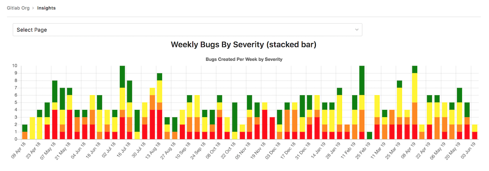
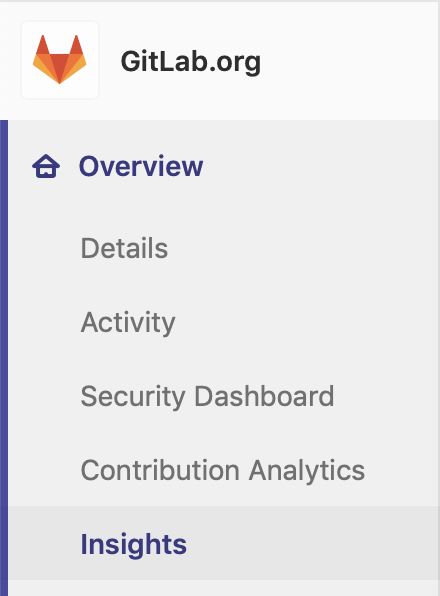
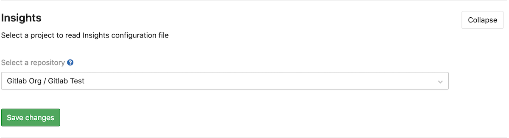

# Insights **[ULTIMATE]**

> Introduced in [GitLab Ultimate](https://about.gitlab.com/pricing/) 11.9 behind the `insights` feature flag.
> **Generally Available** (GA) in [GitLab Ultimate](https://about.gitlab.com/pricing/) 12.0.

Configure the Insights that matter for your groups to explore data such as
triage hygiene, issues created/closed per a given period, average time for merge
requests to be merged and much more.

## View your group's Insights

You can access your group's Insights by clicking the **Overview > Insights**
link in the left sidebar:

## Configure your Insights

Navigate to your group's **Settings > General**, expand **Insights**, and choose
the project that holds your `.gitlab/insights.yml` configuration file:

If no configuration was set, a [default configuration file](
https://gitlab.com/gitlab-org/gitlab-ee/blob/master/ee/fixtures/insights/default.yml)
will be used.

See the [Project's Insights documentation](../../project/insights/index.md) for
more details about the `.gitlab/insights.yml` configuration file.

## Permissions

If you have access to view a group, then you have access to view their Insights.

NOTE: **Note:**
Issues or merge requests that you don't have access to (because you don't have
access to the project they belong to, or because they are confidential) are
filtered out of the Insights charts.

You may also consult the [group permissions table](../../permissions.md#group-members-permissions).

<!-- ## Troubleshooting

Include any troubleshooting steps that you can foresee. If you know beforehand what issues
one might have when setting this up, or when something is changed, or on upgrading, it's
important to describe those, too. Think of things that may go wrong and include them here.
This is important to minimize requests for support, and to avoid doc comments with
questions that you know someone might ask.

Each scenario can be a third-level heading, e.g. `### Getting error message X`.
If you have none to add when creating a doc, leave this section in place
but commented out to help encourage others to add to it in the future. -->
