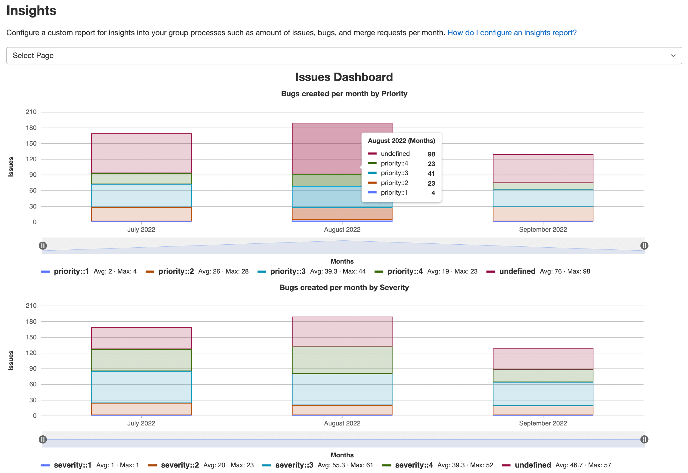

# Insights for groups **(ULTIMATE)**

> [Introduced](https://gitlab.com/groups/gitlab-org/-/epics/725) in GitLab 12.0.

Configure insights to explore data about you group's activity, such as
triage hygiene, issues created or closed in a given period, and average time for merge
requests to be merged.
You can also create custom insights reports that are relevant for your group.

## View group insights

Prerequisites:

- You must have [permission](../../permissions.md#group-members-permissions) to view the group.
- You must have access to a project to view information about its merge requests and issues,
  and permission to view them if they are confidential.

To access your group's insights:

1. On the top bar, select **Main menu > Groups** and find your group.
1. On the left sidebar, select **Analytics > Insights**.

## Interact with insights charts

You can interact with the insights charts to view details about your group's activity.

### Display different reports

To display one of the available reports on the insights page, from the **Select report** dropdown list,
select the report you want to display.

### View bar chart annotations

To view annotations, hover over each bar in the chart.

### Zoom in on chart

Insights display data from the last 90 days. You can zoom in to display data only from a subset of the 90-day range.

To do this, select the pause icons (**{status-paused}**) and slide them along the horizontal axis:

- To select a later start date, slide the left pause icon to the right.
- To select an earlier end date, slide the right pause icon to the left.

### Exclude dimensions from charts

By default, insights display all available dimensions on the chart.

To exclude a dimension, from the legend below the chart, select the name of the dimension.

## Configure group insights

GitLab reads insights from the
[default configuration file](https://gitlab.com/gitlab-org/gitlab/-/blob/master/ee/fixtures/insights/default.yml).

To configure group insights:

1. Create a new file [`.gitlab/insights.yml`](../../project/insights/index.md#configure-project-insights)
in a project that belongs to your group.
1. On the top bar, select **Main menu > Groups** and find your group.
1. On the left sidebar, select **Settings > General**.
1. Expand the **Analytics** tab and find the **Insights** section.
1. Select the project that contains your `.gitlab/insights.yml` configuration file.
1. Select **Save changes**.

<!-- ## Troubleshooting

Include any troubleshooting steps that you can foresee. If you know beforehand what issues
one might have when setting this up, or when something is changed, or on upgrading, it's
important to describe those, too. Think of things that may go wrong and include them here.
This is important to minimize requests for support, and to avoid doc comments with
questions that you know someone might ask.

Each scenario can be a third-level heading, for example `### Getting error message X`.
If you have none to add when creating a doc, leave this section in place
but commented out to help encourage others to add to it in the future. -->
