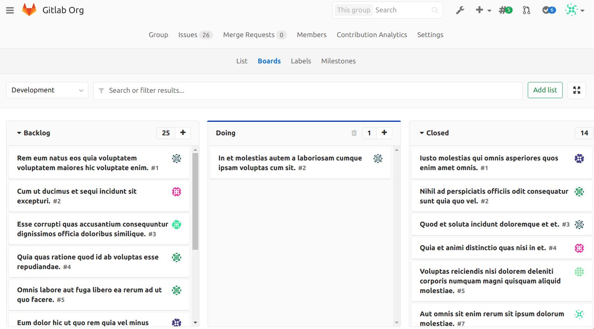

# Group issue board

> Introduced in GitLab 9.5.

Group issue boards help users manage teams in organizations
that have a team-centered or product-centered approach which spans
many projects.

The design and functionality are the same of [project boards](../project/issue_board.md) with some small differences:  

* In a group board all issues within group projects will be displayed 
on backlog or closed lists. Users don't need to filter them by project on search bar.

* Group boards can only have [group milestones](../project/milestones/index.md#creating-a-group-milestone) associated with them.

* Only group [labels](../project/labels.md) can be used to create lists inside each board.

>**Note:**

Only issues in immediate child projects of the group are available in the group board. Issues in further descendant subgroups are not shown in the group board.

