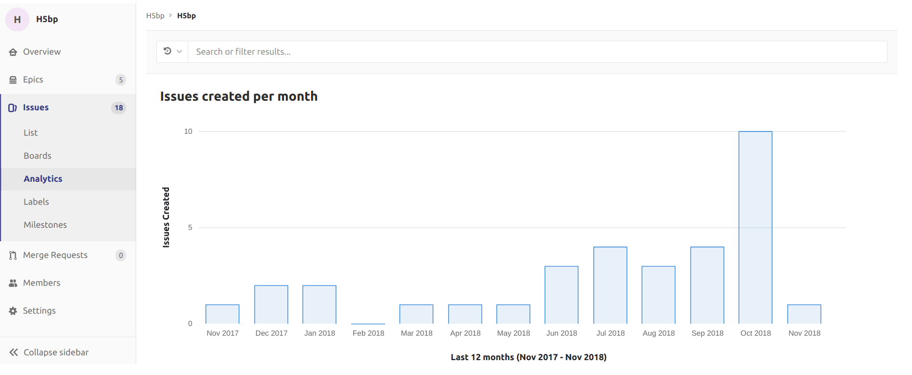

# Issues Analytics **[PREMIUM]**

> [Introduced](https://gitlab.com/gitlab-org/gitlab-ee/issues/7478) in [GitLab Premium](https://about.gitlab.com/pricing/) 11.5.

GitLab by default displays a bar chart of the number of issues created each month, for the
current month, and 12 months prior, for a total of 13 months.

You can change the total number of months displayed by setting a URL parameter. 
For example, `https://gitlab.com/groups/gitlab-org/-/issues_analytics?months_back=15`
would show a total of 15 months for the chart in the GitLab.org group.

The **Search or filter results...** field can be used for filtering the issues by any attribute. For example, labels, assignee, milestone, and author.

To access the chart, navigate to a group's sidebar and select **Issues > Analytics**.

