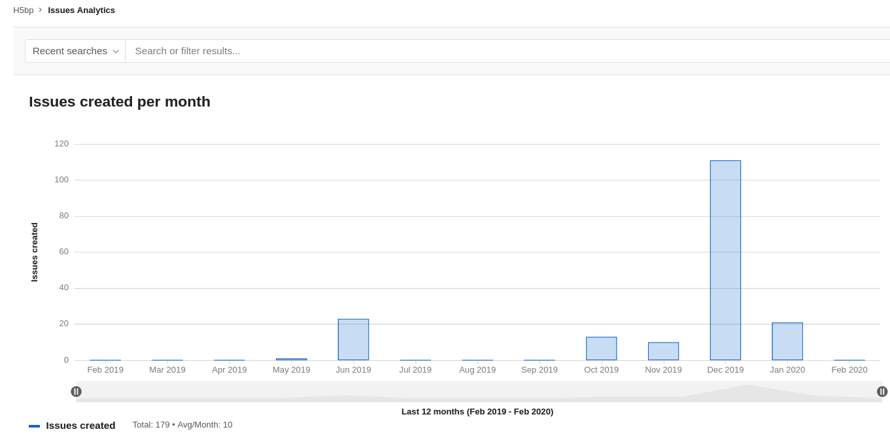
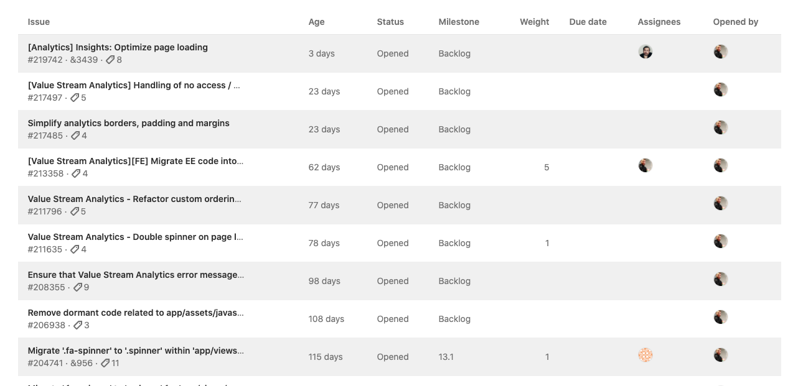

# Issue analytics

DETAILS:
**Tier:** Premium, Ultimate
**Offering:** GitLab.com, Self-managed, GitLab Dedicated

Issue analytics is a bar graph which illustrates the number of issues created each month.
The default time span is 13 months, which includes the current month, and the 12 months prior.
Issue analytics is available for projects and groups.

To access the chart:

1. On the left sidebar, select **Search or go to** and find your project or group.
1. Select **Analyze > Issue analytics**.

You can also access the chart from the [Value Streams Dashboard](../../analytics/value_streams_dashboard.md) through the **New issues** drill-down report.

Hover over each bar to see the total number of issues.

To narrow the scope of issues included in the graph, enter your criteria in the
**Search or filter results** text box. Criteria from the following list can be typed in or selected from a menu:

- Author
- Assignee
- Milestone
- Label
- My reaction
- Weight

You can change the total number of months displayed by setting a URL parameter.
For example, `https://gitlab.com/groups/gitlab-org/-/issues_analytics?months_back=15`
shows a total of 15 months for the chart in the GitLab.org group.

## Enhanced issue analytics

DETAILS:
**Tier:** Ultimate
**Offering:** GitLab.com, Self-managed, GitLab Dedicated

> - [Introduced](https://gitlab.com/gitlab-org/gitlab/-/issues/233905/) in GitLab 16.3 [with a flag](../../../administration/feature_flags.md) named `issues_completed_analytics_feature_flag`. Disabled by default.
> - [Enabled on GitLab.com and self-managed](https://gitlab.com/gitlab-org/gitlab/-/issues/437542) in GitLab 16.8.
> - [Feature flag `issues_completed_analytics_feature_flag`](https://gitlab.com/gitlab-org/gitlab/-/merge_requests/146766) removed in GitLab 16.10.

Enhanced issue analytics display the additional metric `Issues closed`, which represents the total number of resolved issues in your group over a selected period.
You can use this metric to improve the overall turn-around time and value delivered to your customers.

## Drill into the information

You can examine details of individual issues by browsing the table
located below the chart.

The chart displays the top 100 issues based on the global page filters.

<!-- ## Troubleshooting

Include any troubleshooting steps that you can foresee. If you know beforehand what issues
one might have when setting this up, or when something is changed, or on upgrading, it's
important to describe those, too. Think of things that may go wrong and include them here.
This is important to minimize requests for support, and to avoid doc comments with
questions that you know someone might ask.

Each scenario can be a third-level heading, for example `### Getting error message X`.
If you have none to add when creating a doc, leave this section in place
but commented out to help encourage others to add to it in the future. -->
