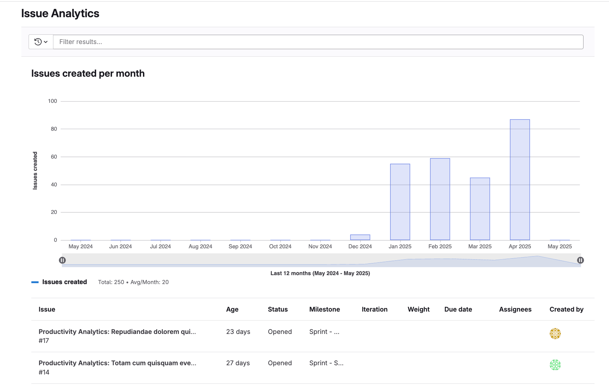

DETAILS:
**Tier:** Premium, Ultimate
**Offering:** GitLab.com, GitLab Self-Managed, GitLab Dedicated

Issue analytics provide insights into the issues created each month in a group or project.
A bar chart illustrates the number of issues opened and closed each month.
A table displays the top 100 issues based on the global page filters, with the following details about each issue:

- Name
- Age
- Status
- Milestone
- Iteration
- Weight
- Due date
- Assignee
- Author

## View issue analytics

To view issue analytics:

1. On the left sidebar, select **Search or go to** and find your project or group.
1. Select **Analyze > Issue analytics**. To view the total number of issues for a month, hover over a bar.
1. Optional. To filter the results, in **Search or filter results** text box, enter your criteria:

   - Author
   - Assignee
   - Milestone
   - Label
   - My reaction
   - Weight

1. Optional. To change the total number of months displayed, append the parameter `months_back=n` to the URL.
For example, `https://gitlab.com/groups/gitlab-org/-/issues_analytics?months_back=15`
displays a chart with data for 15 months for the GitLab.org group.

You can also access issue analytics from the [Value Streams Dashboard](../../analytics/value_streams_dashboard.md) through the **New issues** drill-down report.

### Enhanced issue analytics

DETAILS:
**Tier:** Ultimate
**Offering:** GitLab.com, GitLab Self-Managed, GitLab Dedicated

> - [Introduced](https://gitlab.com/gitlab-org/gitlab/-/issues/233905/) in GitLab 16.3 [with a flag](../../../administration/feature_flags.md) named `issues_completed_analytics_feature_flag`. Disabled by default.
> - [Enabled on GitLab.com and GitLab Self-Managed](https://gitlab.com/gitlab-org/gitlab/-/issues/437542) in GitLab 16.8.
> - [Feature flag `issues_completed_analytics_feature_flag`](https://gitlab.com/gitlab-org/gitlab/-/merge_requests/146766) removed in GitLab 16.10.

Enhanced issue analytics display the additional metric `Issues closed`, which represents the total number of resolved issues in your group over a selected period.
You can use this metric to improve the overall turn-around time and value delivered to your customers.
