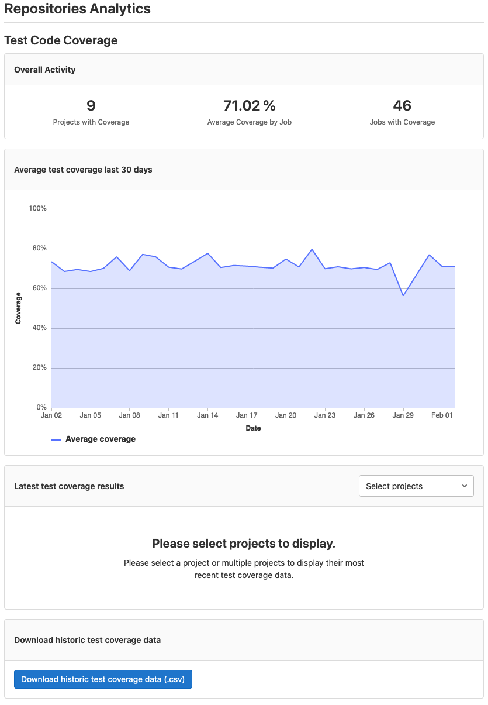

# Repositories Analytics **(PREMIUM)**

> [Introduced](https://gitlab.com/gitlab-org/gitlab/-/issues/215104) in [GitLab Premium](https://about.gitlab.com/pricing/) 13.4.

WARNING:
This feature might not be available to you. Check the **version history** note above for details.

## Current group code coverage

> - [Introduced](https://gitlab.com/gitlab-org/gitlab/-/issues/263478) in [GitLab Premium](https://about.gitlab.com/pricing/) 13.7.

The **Analytics > Repositories** group page displays the overall test coverage of all your projects in your group.
In the **Overall activity** section, you can see:

- The number of projects with coverage reports.
- The average percentage of coverage across all your projects.
- The total number of pipeline jobs that produce coverage reports.

## Average group test coverage from the last 30 days

> - [Introduced](https://gitlab.com/gitlab-org/gitlab/-/issues/215140) in [GitLab Premium](https://about.gitlab.com/pricing/) 13.9.

The **Analytics > Repositories** group page displays the average test coverage of all your projects in your group in a graph for the last 30 days.

## Latest project test coverage list

> - [Introduced](https://gitlab.com/gitlab-org/gitlab/-/issues/267624) in [GitLab Premium](https://about.gitlab.com/pricing/) 13.6.

To see the latest code coverage for each project in your group:

1. Go to **Analytics > Repositories** in the group (not from a project).
1. In the **Latest test coverage results** section, use the **Select projects** dropdown to choose the projects you want to check.

You can download code coverage data for specific projects using
[code coverage history](../../../ci/pipelines/settings.md#view-code-coverage-history).

## Download historic test coverage data

> [Introduced](https://gitlab.com/gitlab-org/gitlab/-/issues/215104) in [GitLab Premium](https://about.gitlab.com/pricing/) 13.4.

You can get a CSV of the code coverage data for all of the projects in your group. This report has a maximum of 1000 records. The code coverage data is from the default branch in each project.

To get the report:

1. Go to your group's **Analytics > Repositories** page
1. Click **Download historic test coverage data (`.csv`)**,
1. In the popup, select the projects you want to include in the report.
1. Select the date range for the report from the preset options.
1. Click **Download test coverage data (`.csv`)**.

The projects dropdown shows up to 100 projects from your group. If the project you want to check is not in the dropdown list, you can select **All projects** to download the report for all projects in your group, including any projects that are not listed. There is a plan to improve this behavior in this [related issue](https://gitlab.com/gitlab-org/gitlab/-/issues/250684).

For each day that a coverage report was generated by a job in a project's pipeline, there will be a row in the CSV which includes:

- The date when the coverage job ran
- The name of the job that generated the coverage report
- The name of the project
- The coverage value

If the project's code coverage was calculated more than once in a day, we will take the last value from that day.

NOTE:
[In GitLab 13.7 and later](https://gitlab.com/gitlab-org/gitlab/-/issues/270102), group code coverage
data is taken from the configured [default branch](../../project/repository/branches/default.md).
In earlier versions, it is taken from the `master` branch.

<!-- ## Troubleshooting

Include any troubleshooting steps that you can foresee. If you know beforehand what issues
one might have when setting this up, or when something is changed, or on upgrading, it's
important to describe those, too. Think of things that may go wrong and include them here.
This is important to minimize requests for support, and to avoid doc comments with
questions that you know someone might ask.

Each scenario can be a third-level heading, e.g. `### Getting error message X`.
If you have none to add when creating a doc, leave this section in place
but commented out to help encourage others to add to it in the future. -->
