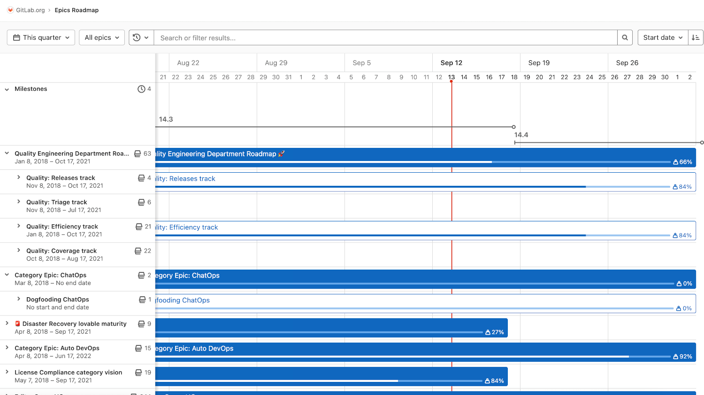
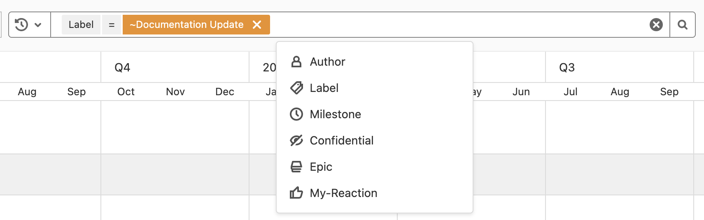
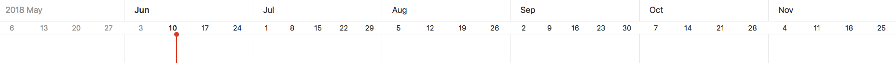
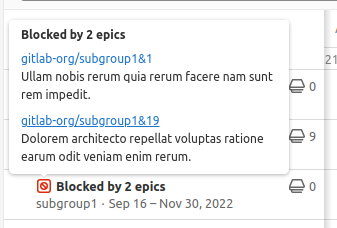

DETAILS:
**Tier:** Premium, Ultimate
**Offering:** GitLab.com, GitLab Self-Managed, GitLab Dedicated

Epics in a group containing a start date or due date can be visualized in a form
of a timeline.

The roadmap in GitLab provides a high-level overview of the planned work and progress of epics and
milestones in a timeline view (that is, a Gantt chart).
Use the roadmap to visualize and communicate the strategic direction and dependencies of your projects.

The epic roadmap offers the following benefits:

- Aligns the team around a shared vision and goals.
- Assists long-term planning and resource allocation.
- Identifies potential blockers, dependencies, and risks early.
- Provides stakeholders with a clear understanding of the project's timeline and milestones.
- Helps track and update the project's progress.

## View the roadmap

To view the roadmap in a group:

1. On the left sidebar, select **Search or go to** and find your group.
1. Select **Plan > Roadmap**.

The roadmap shows the epics and milestones in a
group, one of its subgroups, or a project in one of the groups.

On the epic bars, you can see each epic's title, progress, and completed weight percentage.
When you hover over an epic bar, a popover appears with the epic's title, start date, due date, and
weight completed.

You can expand epics that contain child epics to show their child epics in the roadmap.
You can select the chevron (**{chevron-down}**) next to the epic title to expand and collapse the
child epics.

On top of the milestone bars, you can see their title. When you point to a
milestone bar or title, a popover appears with its title, start date, and due
date. You can also select the chevron (**{chevron-down}**) next to the **Milestones**
heading to toggle the list of the milestone bars.

From an epic, you can also [view the roadmap filtered to this epic's descendants](../epics/_index.md#roadmap-in-epics).

## Sort and filter the roadmap

> - Filtering by group was [introduced](https://gitlab.com/gitlab-org/gitlab/-/issues/385191) in GitLab 15.9.
> - Sorting by title, created date, and last updated date [introduced](https://gitlab.com/gitlab-org/gitlab/-/issues/460492) in GitLab 17.0.

NOTE:
Filtering roadmaps by milestone might not be available to you. Be sure to review this section's history for details.

When you want to explore a roadmap, there are several ways to make it easier by sorting epics or
filtering them by what's important for you.

In the Roadmap view, you can sort epics by:

- Start date
- Due date
- Title
- Created date
- Last updated date

Each option contains a button that toggles the sort order between **ascending**
and **descending**. The sort option and order persist when browsing epics, including
the [epics list view](../epics/_index.md).

In the Roadmap view, you can also filter by the epics':

- Author
- Label
- Milestone
- [Confidentiality](../epics/manage_epics.md#make-an-epic-confidential)
- Epic
- Your Reaction
- Groups

From an epic, you can also [view the roadmap filtered to this epic's descendants](../epics/_index.md#roadmap-in-epics).

### Improve the performance of the roadmap

If your group contains a lot of epics, using filters can reduce the time your roadmap takes to load.
Filtering the roadmap reduces the amount of data the roadmap contains. Reducing
the data in the roadmap can also make it easier for you to find the information you're looking for.

In particular, filtering based on labels can result in a significant performance improvement.

After you set the filters you want to apply, you can save the URL as bookmark in your
browser.
In the future, you can quickly load the filtered roadmap using the bookmark.

### Roadmap settings

> - Labels visible on roadmaps [introduced](https://gitlab.com/gitlab-org/gitlab/-/issues/385231) in GitLab 15.9.

When you enable the roadmap settings sidebar, you can use it to refine epics shown in the roadmap.

You can configure the following:

- Select date range.
- Turn milestones on or off, and select whether to show all, group, subgroup, or
  project milestones.
- Show all, open, or closed epics.
- Turn progress tracking for child issues on or off and select whether
  to use issue weights or counts to calculate progress.
- Turn labels on or off.

The roadmap configuration settings aren't saved in user preferences, but are saved or
shared using URL parameters.

## Timeline duration

> - [Moved](https://gitlab.com/gitlab-org/gitlab/-/issues/198062) from GitLab Ultimate to GitLab Premium in 12.9.

### Date range presets

Roadmap provides these date range options, each with a predetermined timeline duration:

- **This quarter**: Includes the weeks present in the current quarter.
- **This year**: Includes the weeks or months present in the current year.
- **Within 3 years**: Includes the weeks, months, or quarters present both in
  the previous 18 months and the upcoming 18 months (three years in total).

### Layout presets

Depending on selected [date range preset](#date-range-presets), the roadmap supports
these layout presets:

- **Quarters**: Available only when the **Within 3 years** date range is selected.
- **Months**: Available when either **This year** or **Within 3 years** date range is selected.
- **Weeks** (default): Available for all the date range presets.

### Quarters

In the **Quarters** preset, roadmap shows epics and milestones which have start or due dates
**falling within** currently selected date range preset,
where **today**
is shown by the vertical red line in the timeline. The sub-headers underneath the quarter name on
the timeline header represent the month of the quarter.

### Months

In the **Months** preset, roadmap shows epics and milestones which have start or
due dates **falling within** or **going through** currently selected date range
preset, where **today** is shown by the vertical red line in the timeline. The
sub-headers underneath the month name on the timeline header represent the date
on the start day (Sunday) of the week. This preset is selected by default.

### Weeks

In the **Weeks** preset, roadmap shows epics and milestones which have start or due dates **falling
within** or **going through** currently selected date range preset, where **today**
is shown by the vertical red line in the timeline. The sub-headers underneath the week name on
the timeline header represent the days of the week.

## Roadmap timeline bar

The timeline bar indicates the approximate position of an epic or milestone based on its start and
due dates.

## Blocked epics

DETAILS:
**Tier:** Ultimate
**Offering:** GitLab.com, GitLab Self-Managed, GitLab Dedicated

> - [Introduced](https://gitlab.com/gitlab-org/gitlab/-/issues/33587) in GitLab 15.5: View blocking epics when hovering over the "blocked" icon.

If an epic is [blocked by another epic](../epics/linked_epics.md#blocking-epics), an icon appears next to its title to indicate its blocked status.

When you hover over the blocked icon (**{entity-blocked}**), a detailed information popover is displayed.

<!-- ## Troubleshooting

Include any troubleshooting steps that you can foresee. If you know beforehand what issues
one might have when setting this up, or when something is changed, or on upgrading, it's
important to describe those, too. Think of things that may go wrong and include them here.
This is important to minimize requests for support, and to avoid doc comments with
questions that you know someone might ask.

Each scenario can be a third-level heading, for example `### Getting error message X`.
If you have none to add when creating a doc, leave this section in place
but commented out to help encourage others to add to it in the future. -->
