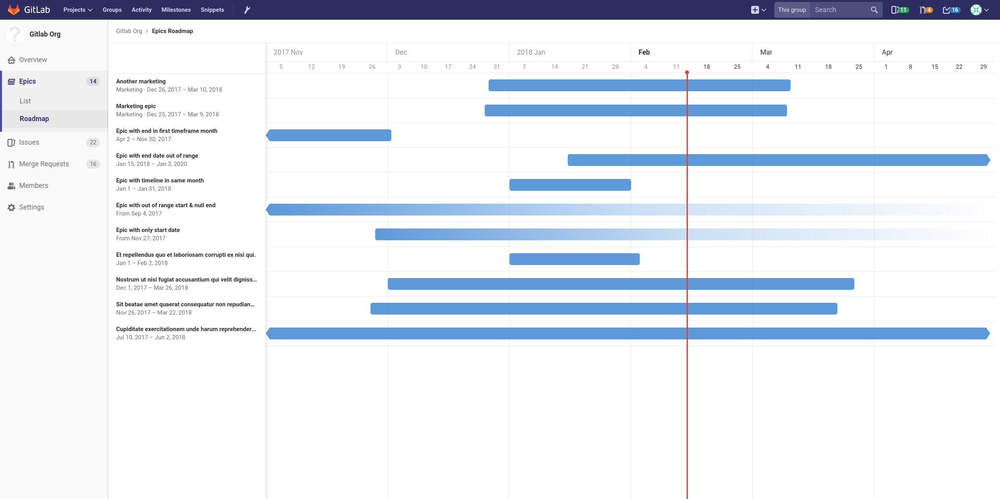
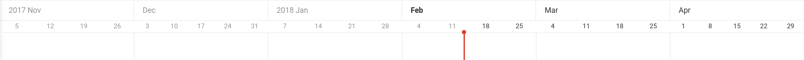

# Roadmap **[ULTIMATE]**

> Introduced in [GitLab Ultimate][ee] 10.5.

An Epic within a group containing **Planned start date** and/or **Planned finish date**
can be visualized in a form of a timeline (e.g. a Gantt chart). The Epics Roadmap page
shows such a visualization for all the epics which are under a group and/or its subgroups.

## Timeline duration

Roadmap shows epics which have planned start or finish dates _falling within_ or
_going through_ the **past 3 months** or **next 3 months** from today, where _today_
is shown by the vertical red line in the timeline. The dates underneath the month on
the timeline header represent the starting day (Sunday) of the week.

## Timeline bar for an epic

The timeline bar indicates the approximate position of an epic based on its planned start
and finish date. If an epic doesn't have a planned finish date, the timeline bar fades
away towards the future. Similarly, if an epic doesn't have a planned start date, the
timeline bar becomes more visible as it approaches the epic's planned finish date on the
timeline.

[ee]: https://about.gitlab.com/products
